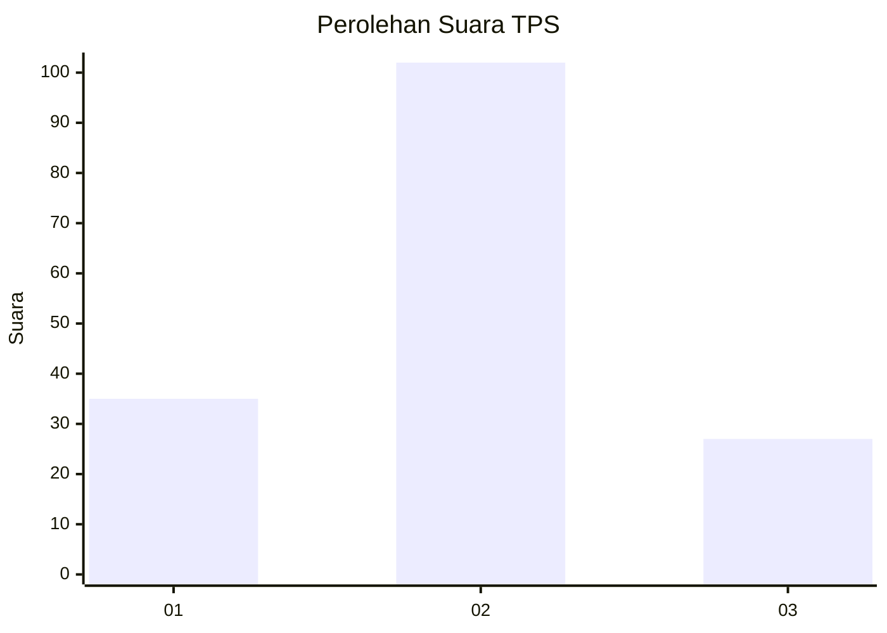

# Hasil

## Grafik

## Tabel

| No. | Nama Paslon    | Suara | Suara (raw) | Persentase |
|:--- |:-------------- | -----:| -----------:| ----------:|
| 1   | ANIES MUHAIMIN | 35    | [35][p-1]   | 21,34      |
| 2   | PRABOWO GIBRAN | 102   | [102][p-2]  | 62,20      |
| 3   | GANJAR MAHFUD  | 27    | [27][p-3]   | 16,46      |

[p-1]: https://github.com/gigit-pemilu/pemilu-2024-12-sumatera-utara/blob/main/pilpres/hitung-suara/sub/12-sumatera-utara/sub/19-batu-bara/sub/11-datuk-tanah-datar/sub/2001-sumber-tani/sub/007-tps/sub/paslon-1.txt
[p-2]: https://github.com/gigit-pemilu/pemilu-2024-12-sumatera-utara/blob/main/pilpres/hitung-suara/sub/12-sumatera-utara/sub/19-batu-bara/sub/11-datuk-tanah-datar/sub/2001-sumber-tani/sub/007-tps/sub/paslon-2.txt
[p-3]: https://github.com/gigit-pemilu/pemilu-2024-12-sumatera-utara/blob/main/pilpres/hitung-suara/sub/12-sumatera-utara/sub/19-batu-bara/sub/11-datuk-tanah-datar/sub/2001-sumber-tani/sub/007-tps/sub/paslon-3.txt

## Foto C Plano

https://sirekap-obj-formc.kpu.go.id/1f86/pemilu/ppwp/12/19/11/20/01/1219112001007-20240215-010723--adf49a3e-cbae-46c2-8d8c-b268dea609cb.jpg

https://sirekap-obj-formc.kpu.go.id/1f86/pemilu/ppwp/12/19/11/20/01/1219112001007-20240215-010803--719953a0-d253-47c1-850f-9bc29c95939f.jpg

https://sirekap-obj-formc.kpu.go.id/1f86/pemilu/ppwp/12/19/11/20/01/1219112001007-20240215-010902--6e15bf4a-ef8f-46e2-8eb2-7a5b81a792cd.jpg

## Metadata

| Key        | Value               |
| ---------- | ------------------- |
| Time Stamp | 2024-02-15 16:30:25 |

