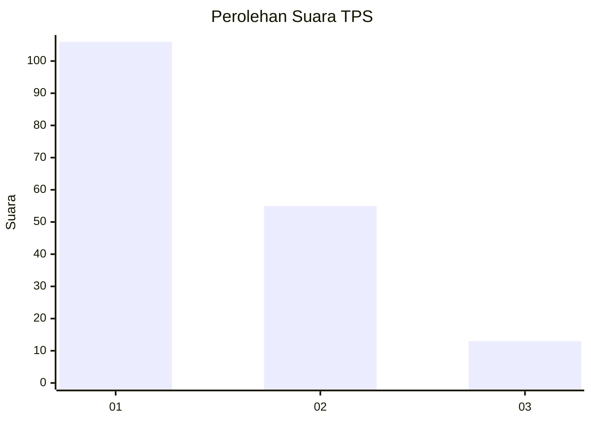
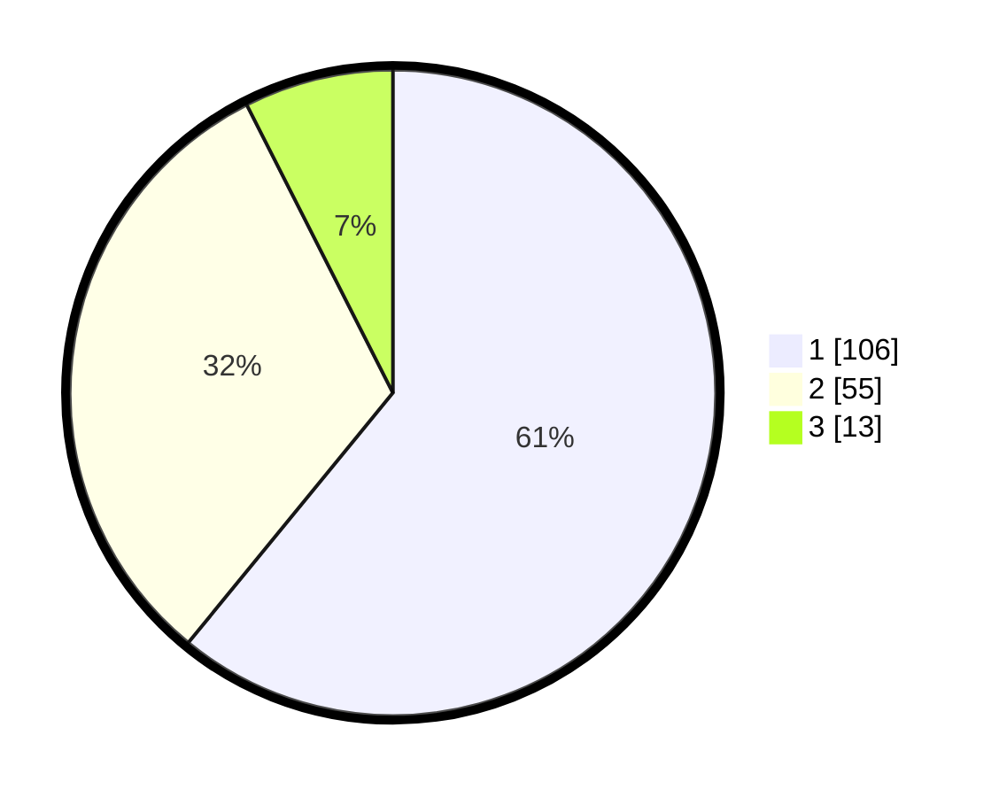

# Hasil

## Grafik

## Tabel

| No. | Nama Paslon    | Suara | Suara (raw) | Persentase |
|:--- |:-------------- | -----:| -----------:| ----------:|
| 1   | ANIES MUHAIMIN | 106   | [106][p-1]  | 60,92      |
| 2   | PRABOWO GIBRAN | 55    | [55][p-2]   | 31,61      |
| 3   | GANJAR MAHFUD  | 13    | [13][p-3]   | 7,47       |

[p-1]: https://github.com/gigit-pemilu/pemilu-2024/blob/main/pilpres/hitung-suara/sub/12-sumatera-utara/sub/19-batu-bara/sub/12-nibung-hangus/sub/2002-tanjung-mulia/sub/001-tps/sub/paslon-1.txt
[p-2]: https://github.com/gigit-pemilu/pemilu-2024/blob/main/pilpres/hitung-suara/sub/12-sumatera-utara/sub/19-batu-bara/sub/12-nibung-hangus/sub/2002-tanjung-mulia/sub/001-tps/sub/paslon-2.txt
[p-3]: https://github.com/gigit-pemilu/pemilu-2024/blob/main/pilpres/hitung-suara/sub/12-sumatera-utara/sub/19-batu-bara/sub/12-nibung-hangus/sub/2002-tanjung-mulia/sub/001-tps/sub/paslon-3.txt

## Foto C Plano

https://sirekap-obj-formc.kpu.go.id/87bf/pemilu/ppwp/12/19/12/20/02/1219122002001-20240215-104011--9f359b73-5632-4c95-b225-87901c17770b.jpg

https://sirekap-obj-formc.kpu.go.id/87bf/pemilu/ppwp/12/19/12/20/02/1219122002001-20240215-104038--129eea74-2c09-4882-a1fb-a346b75890e6.jpg

https://sirekap-obj-formc.kpu.go.id/87bf/pemilu/ppwp/12/19/12/20/02/1219122002001-20240215-104133--da3b2f8d-9f9f-4002-becf-f3e6c9dfd63a.jpg

## Metadata

| Key        | Value               |
| ---------- | ------------------- |
| Time Stamp | 2024-02-15 17:00:25 |

