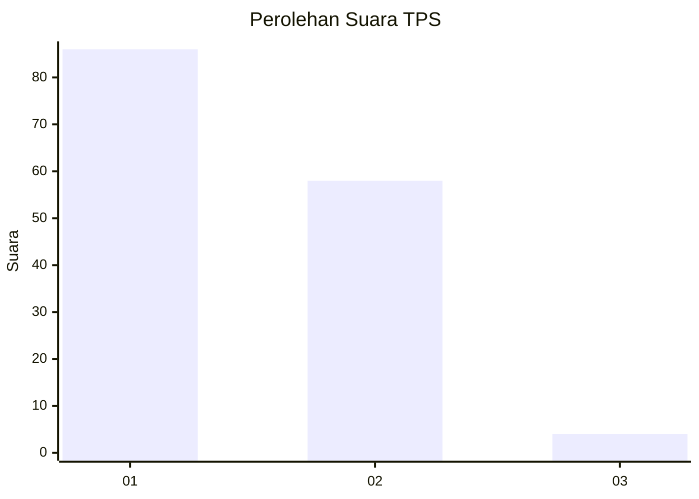
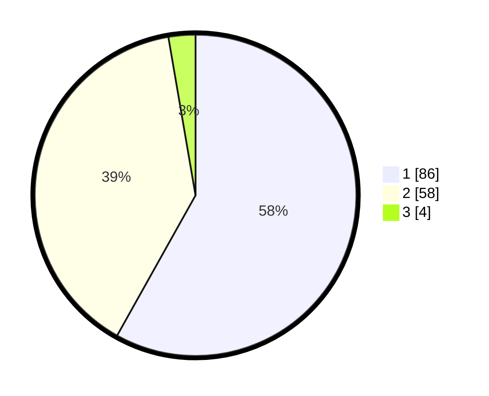

# Hasil

## Grafik

## Tabel

| No. | Nama Paslon    | Suara | Suara (raw) | Persentase |
|:--- |:-------------- | -----:| -----------:| ----------:|
| 1   | ANIES MUHAIMIN | 86    | [86][p-1]   | 58,11      |
| 2   | PRABOWO GIBRAN | 58    | [58][p-2]   | 39,19      |
| 3   | GANJAR MAHFUD  | 4     | [4][p-3]    | 2,70       |

[p-1]: https://github.com/gigit-pemilu/pemilu-2024/blob/main/pilpres/hitung-suara/sub/12-sumatera-utara/sub/19-batu-bara/sub/12-nibung-hangus/sub/2002-tanjung-mulia/sub/003-tps/sub/paslon-1.txt
[p-2]: https://github.com/gigit-pemilu/pemilu-2024/blob/main/pilpres/hitung-suara/sub/12-sumatera-utara/sub/19-batu-bara/sub/12-nibung-hangus/sub/2002-tanjung-mulia/sub/003-tps/sub/paslon-2.txt
[p-3]: https://github.com/gigit-pemilu/pemilu-2024/blob/main/pilpres/hitung-suara/sub/12-sumatera-utara/sub/19-batu-bara/sub/12-nibung-hangus/sub/2002-tanjung-mulia/sub/003-tps/sub/paslon-3.txt

## Foto C Plano

https://sirekap-obj-formc.kpu.go.id/596c/pemilu/ppwp/12/19/12/20/02/1219122002003-20240215-031119--028b7d25-39ea-48bf-8d3c-9c8422089271.jpg

https://sirekap-obj-formc.kpu.go.id/596c/pemilu/ppwp/12/19/12/20/02/1219122002003-20240215-031226--2d012322-91ba-4bff-8c60-9116d729df0d.jpg

https://sirekap-obj-formc.kpu.go.id/596c/pemilu/ppwp/12/19/12/20/02/1219122002003-20240215-031333--1c221568-c377-4430-9097-240b85c3762a.jpg

## Metadata

| Key        | Value               |
| ---------- | ------------------- |
| Time Stamp | 2024-02-15 23:29:50 |

