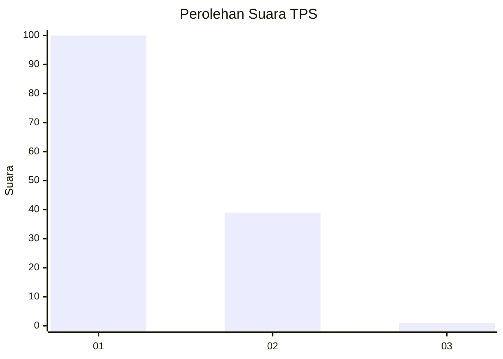
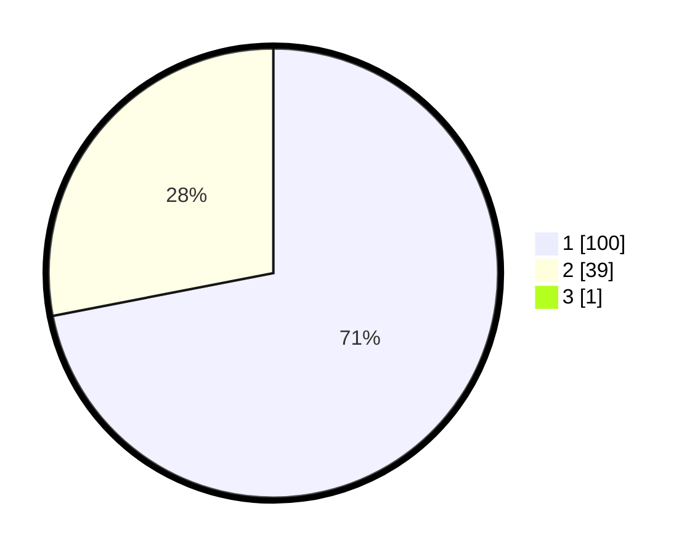

# Hasil

## Grafik

## Tabel

| No. | Nama Paslon    | Suara | Suara (raw) | Persentase |
|:--- |:-------------- | -----:| -----------:| ----------:|
| 1   | ANIES MUHAIMIN | 100   | [100][p-1]  | 71,43      |
| 2   | PRABOWO GIBRAN | 39    | [39][p-2]   | 27,86      |
| 3   | GANJAR MAHFUD  | 1     | [1][p-3]    | 0,71       |

[p-1]: https://github.com/gigit-pemilu/pemilu-2024/blob/main/pilpres/hitung-suara/sub/12-sumatera-utara/sub/19-batu-bara/sub/12-nibung-hangus/sub/2006-bandar-sono/sub/002-tps/sub/paslon-1.txt
[p-2]: https://github.com/gigit-pemilu/pemilu-2024/blob/main/pilpres/hitung-suara/sub/12-sumatera-utara/sub/19-batu-bara/sub/12-nibung-hangus/sub/2006-bandar-sono/sub/002-tps/sub/paslon-2.txt
[p-3]: https://github.com/gigit-pemilu/pemilu-2024/blob/main/pilpres/hitung-suara/sub/12-sumatera-utara/sub/19-batu-bara/sub/12-nibung-hangus/sub/2006-bandar-sono/sub/002-tps/sub/paslon-3.txt

## Foto C Plano

https://sirekap-obj-formc.kpu.go.id/8384/pemilu/ppwp/12/19/12/20/06/1219122006002-20240215-002935--4e9e4439-5f43-4941-af85-334c01208bef.jpg

https://sirekap-obj-formc.kpu.go.id/8384/pemilu/ppwp/12/19/12/20/06/1219122006002-20240214-155858--c05518de-e4a6-4a79-9a6e-5416d1f0818d.jpg

https://sirekap-obj-formc.kpu.go.id/8384/pemilu/ppwp/12/19/12/20/06/1219122006002-20240215-024400--6a253518-7e14-448a-9abd-9b505549c779.jpg

## Metadata

| Key        | Value               |
| ---------- | ------------------- |
| Time Stamp | 2024-02-15 15:00:29 |

