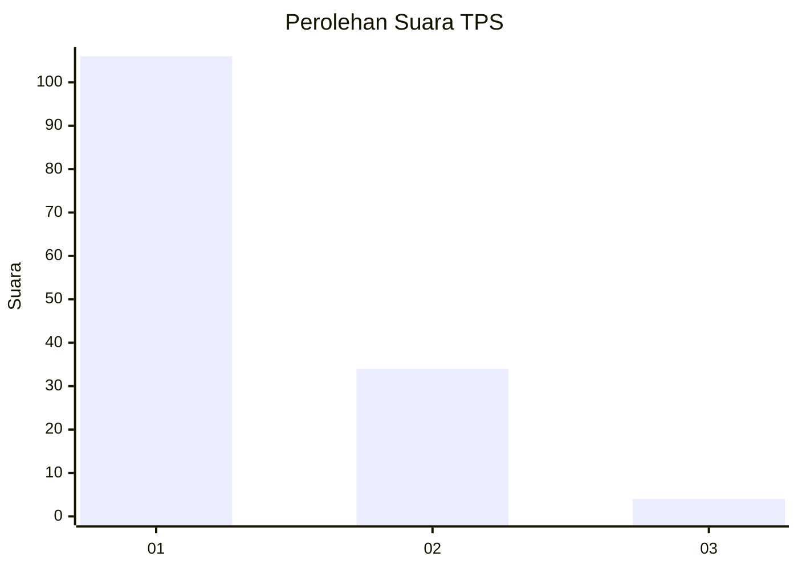
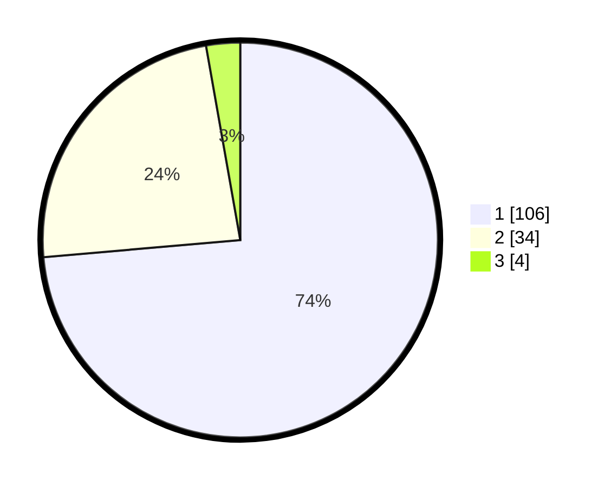

# Hasil

## Grafik

## Tabel

| No. | Nama Paslon    | Suara | Suara (raw) | Persentase |
|:--- |:-------------- | -----:| -----------:| ----------:|
| 1   | ANIES MUHAIMIN | 106   | [106][p-1]  | 73,61      |
| 2   | PRABOWO GIBRAN | 34    | [34][p-2]   | 23,61      |
| 3   | GANJAR MAHFUD  | 4     | [4][p-3]    | 2,78       |

[p-1]: https://github.com/gigit-pemilu/pemilu-2024-12-sumatera-utara/blob/main/pilpres/hitung-suara/sub/12-sumatera-utara/sub/19-batu-bara/sub/12-nibung-hangus/sub/2006-bandar-sono/sub/007-tps/sub/paslon-1.txt
[p-2]: https://github.com/gigit-pemilu/pemilu-2024-12-sumatera-utara/blob/main/pilpres/hitung-suara/sub/12-sumatera-utara/sub/19-batu-bara/sub/12-nibung-hangus/sub/2006-bandar-sono/sub/007-tps/sub/paslon-2.txt
[p-3]: https://github.com/gigit-pemilu/pemilu-2024-12-sumatera-utara/blob/main/pilpres/hitung-suara/sub/12-sumatera-utara/sub/19-batu-bara/sub/12-nibung-hangus/sub/2006-bandar-sono/sub/007-tps/sub/paslon-3.txt

## Foto C Plano

https://sirekap-obj-formc.kpu.go.id/15bc/pemilu/ppwp/12/19/12/20/06/1219122006007-20240215-000949--de4d21d1-a972-4d4d-86e2-c0267340437f.jpg

https://sirekap-obj-formc.kpu.go.id/15bc/pemilu/ppwp/12/19/12/20/06/1219122006007-20240215-001003--ce569c3e-8613-42db-a462-8e6c2150d3e2.jpg

https://sirekap-obj-formc.kpu.go.id/15bc/pemilu/ppwp/12/19/12/20/06/1219122006007-20240215-001128--3ba15c0c-2bbb-44b8-a53f-85bfc23d11fc.jpg

## Metadata

| Key        | Value               |
| ---------- | ------------------- |
| Time Stamp | 2024-02-15 20:30:46 |

