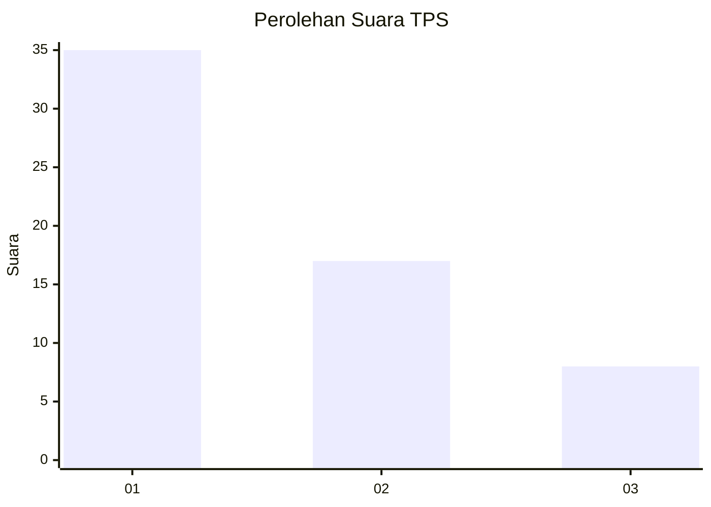
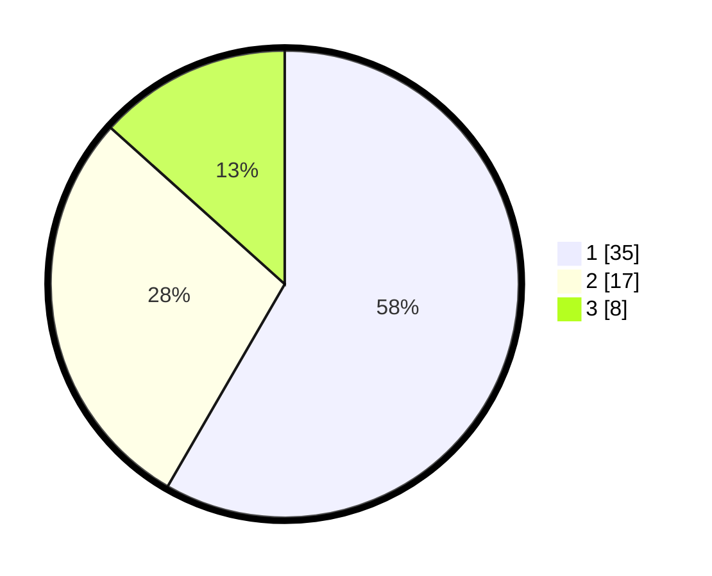

# Hasil

## Grafik

## Tabel

| No. | Nama Paslon    | Suara | Suara (raw) | Persentase |
|:--- |:-------------- | -----:| -----------:| ----------:|
| 1   | ANIES MUHAIMIN | 35    | [35][p-1]   | 58,33      |
| 2   | PRABOWO GIBRAN | 17    | [17][p-2]   | 28,33      |
| 3   | GANJAR MAHFUD  | 8     | [8][p-3]    | 13,33      |

[p-1]: https://github.com/gigit-pemilu/pemilu-2024-12-sumatera-utara/blob/main/pilpres/hitung-suara/sub/12-sumatera-utara/sub/19-batu-bara/sub/12-nibung-hangus/sub/2006-bandar-sono/sub/008-tps/sub/paslon-1.txt
[p-2]: https://github.com/gigit-pemilu/pemilu-2024-12-sumatera-utara/blob/main/pilpres/hitung-suara/sub/12-sumatera-utara/sub/19-batu-bara/sub/12-nibung-hangus/sub/2006-bandar-sono/sub/008-tps/sub/paslon-2.txt
[p-3]: https://github.com/gigit-pemilu/pemilu-2024-12-sumatera-utara/blob/main/pilpres/hitung-suara/sub/12-sumatera-utara/sub/19-batu-bara/sub/12-nibung-hangus/sub/2006-bandar-sono/sub/008-tps/sub/paslon-3.txt

## Foto C Plano

https://sirekap-obj-formc.kpu.go.id/1379/pemilu/ppwp/12/19/12/20/06/1219122006008-20240216-082222--c73258cf-73f6-4afc-b0ca-5c3bddcc4d5d.jpg

https://sirekap-obj-formc.kpu.go.id/1379/pemilu/ppwp/12/19/12/20/06/1219122006008-20240215-041249--2e16cd1f-2f7e-4b47-a056-4f3fbbeb16d2.jpg

https://sirekap-obj-formc.kpu.go.id/1379/pemilu/ppwp/12/19/12/20/06/1219122006008-20240215-041538--5a24b7f9-67a4-4292-b0fc-1ea8f70d9a5a.jpg

## Metadata

| Key        | Value               |
| ---------- | ------------------- |
| Time Stamp | 2024-02-16 08:30:27 |

