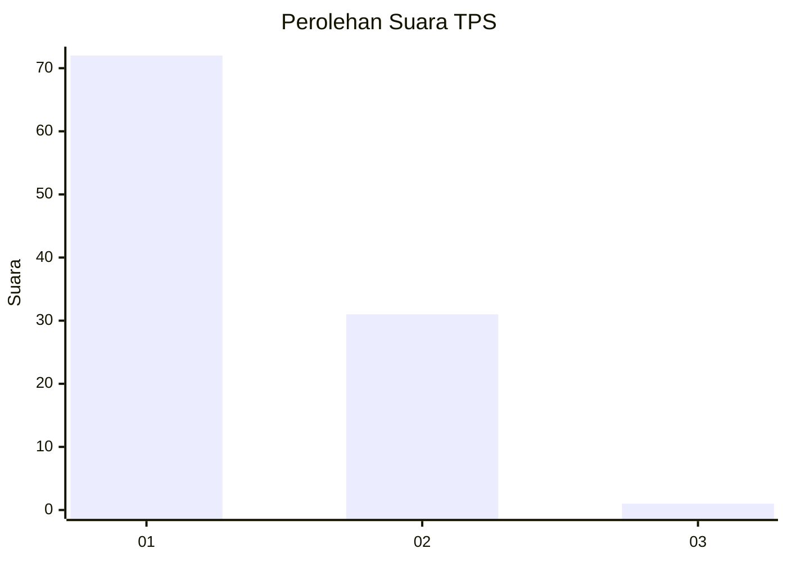
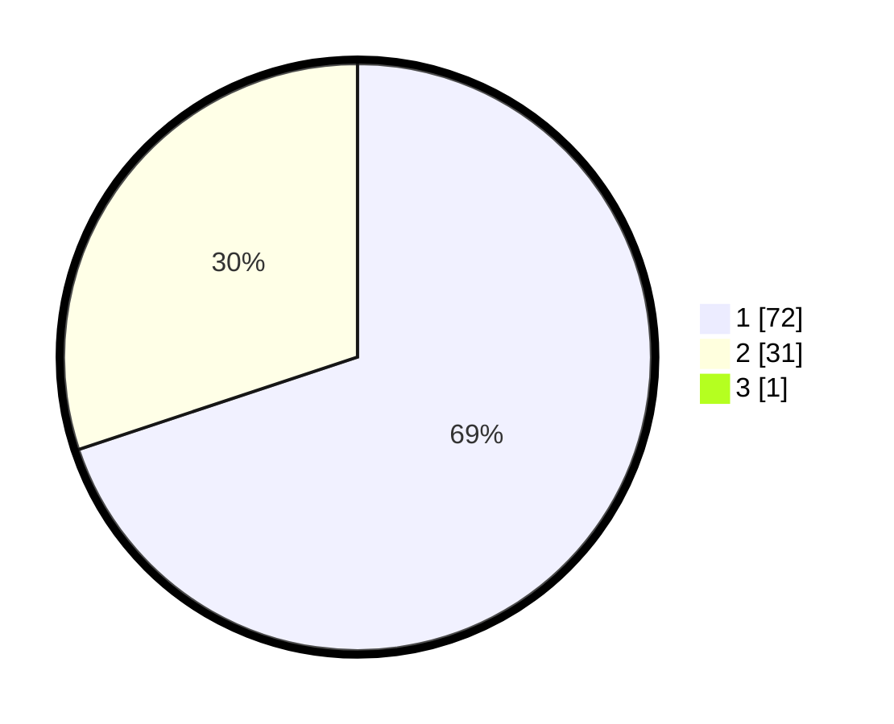

# Hasil

## Grafik

## Tabel

| No. | Nama Paslon    | Suara | Suara (raw) | Persentase |
|:--- |:-------------- | -----:| -----------:| ----------:|
| 1   | ANIES MUHAIMIN | 72    | [72][p-1]   | 69,23      |
| 2   | PRABOWO GIBRAN | 31    | [31][p-2]   | 29,81      |
| 3   | GANJAR MAHFUD  | 1     | [1][p-3]    | 0,96       |

[p-1]: https://github.com/gigit-pemilu/pemilu-2024/blob/main/pilpres/hitung-suara/sub/12-sumatera-utara/sub/19-batu-bara/sub/12-nibung-hangus/sub/2006-bandar-sono/sub/010-tps/sub/paslon-1.txt
[p-2]: https://github.com/gigit-pemilu/pemilu-2024/blob/main/pilpres/hitung-suara/sub/12-sumatera-utara/sub/19-batu-bara/sub/12-nibung-hangus/sub/2006-bandar-sono/sub/010-tps/sub/paslon-2.txt
[p-3]: https://github.com/gigit-pemilu/pemilu-2024/blob/main/pilpres/hitung-suara/sub/12-sumatera-utara/sub/19-batu-bara/sub/12-nibung-hangus/sub/2006-bandar-sono/sub/010-tps/sub/paslon-3.txt

## Foto C Plano

https://sirekap-obj-formc.kpu.go.id/2e7c/pemilu/ppwp/12/19/12/20/06/1219122006010-20240214-155536--3eb9c677-a065-410d-8742-22545dd224ff.jpg

https://sirekap-obj-formc.kpu.go.id/2e7c/pemilu/ppwp/12/19/12/20/06/1219122006010-20240215-033516--252e8846-d59e-4e4e-b9cd-f299ae0cd499.jpg

https://sirekap-obj-formc.kpu.go.id/2e7c/pemilu/ppwp/12/19/12/20/06/1219122006010-20240214-184920--bf0f1e68-5a98-44ae-9472-54e5e5aac624.jpg

## Metadata

| Key        | Value               |
| ---------- | ------------------- |
| Time Stamp | 2024-02-15 15:00:29 |

