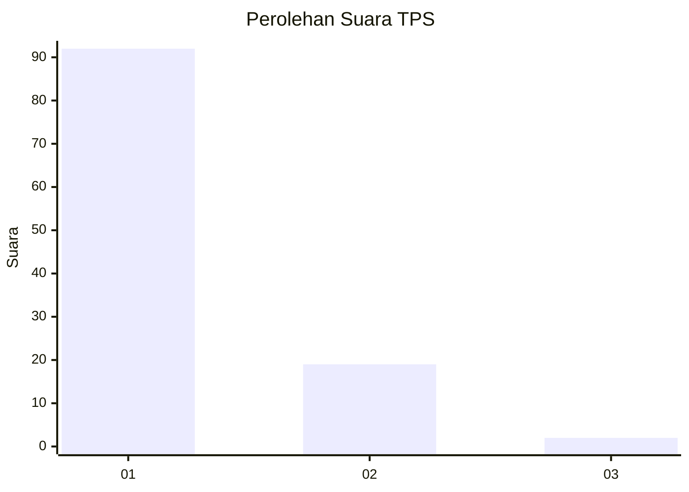
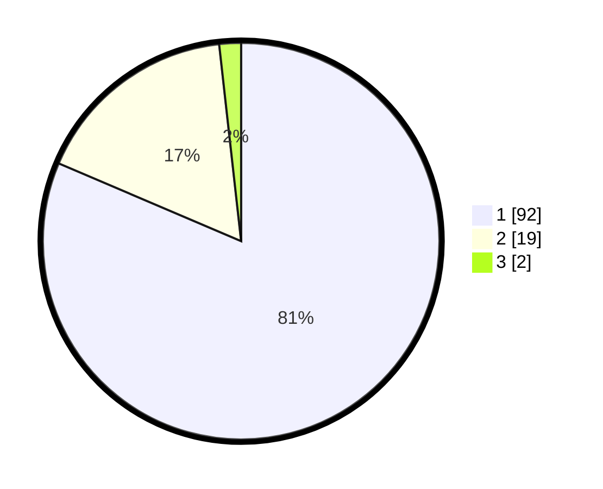

# Hasil

## Grafik

## Tabel

| No. | Nama Paslon    | Suara | Suara (raw) | Persentase |
|:--- |:-------------- | -----:| -----------:| ----------:|
| 1   | ANIES MUHAIMIN | 92    | [92][p-1]   | 81,42      |
| 2   | PRABOWO GIBRAN | 19    | [19][p-2]   | 16,81      |
| 3   | GANJAR MAHFUD  | 2     | [2][p-3]    | 1,77       |

[p-1]: https://github.com/gigit-pemilu/pemilu-2024/blob/main/pilpres/hitung-suara/sub/12-sumatera-utara/sub/19-batu-bara/sub/12-nibung-hangus/sub/2006-bandar-sono/sub/011-tps/sub/paslon-1.txt
[p-2]: https://github.com/gigit-pemilu/pemilu-2024/blob/main/pilpres/hitung-suara/sub/12-sumatera-utara/sub/19-batu-bara/sub/12-nibung-hangus/sub/2006-bandar-sono/sub/011-tps/sub/paslon-2.txt
[p-3]: https://github.com/gigit-pemilu/pemilu-2024/blob/main/pilpres/hitung-suara/sub/12-sumatera-utara/sub/19-batu-bara/sub/12-nibung-hangus/sub/2006-bandar-sono/sub/011-tps/sub/paslon-3.txt

## Foto C Plano

https://sirekap-obj-formc.kpu.go.id/c2ea/pemilu/ppwp/12/19/12/20/06/1219122006011-20240214-211903--7b832593-f793-4813-97b5-3c75f454bbfb.jpg

https://sirekap-obj-formc.kpu.go.id/c2ea/pemilu/ppwp/12/19/12/20/06/1219122006011-20240214-215023--42c582fb-74a1-40b3-b98b-b006e19bb7af.jpg

https://sirekap-obj-formc.kpu.go.id/c2ea/pemilu/ppwp/12/19/12/20/06/1219122006011-20240214-215444--b87cc02a-b33d-4d80-8b94-4bffb920ed60.jpg

## Metadata

| Key        | Value               |
| ---------- | ------------------- |
| Time Stamp | 2024-02-15 15:00:29 |

