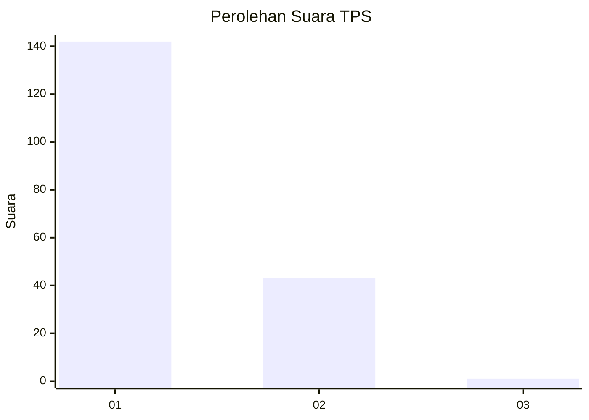
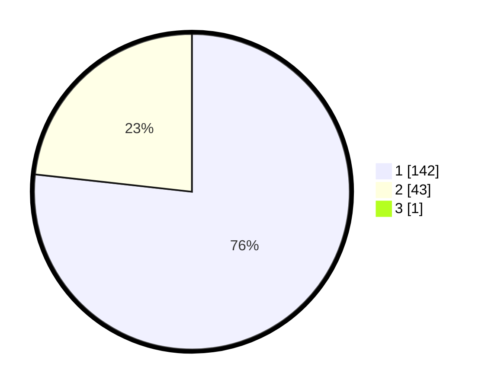

# Hasil

## Grafik

## Tabel

| No. | Nama Paslon    | Suara | Suara (raw) | Persentase |
|:--- |:-------------- | -----:| -----------:| ----------:|
| 1   | ANIES MUHAIMIN | 142   | [142][p-1]  | 76,34      |
| 2   | PRABOWO GIBRAN | 43    | [43][p-2]   | 23,12      |
| 3   | GANJAR MAHFUD  | 1     | [1][p-3]    | 0,54       |

[p-1]: https://github.com/gigit-pemilu/pemilu-2024-12-sumatera-utara/blob/main/pilpres/hitung-suara/sub/12-sumatera-utara/sub/19-batu-bara/sub/12-nibung-hangus/sub/2007-ujung-kubu/sub/006-tps/sub/paslon-1.txt
[p-2]: https://github.com/gigit-pemilu/pemilu-2024-12-sumatera-utara/blob/main/pilpres/hitung-suara/sub/12-sumatera-utara/sub/19-batu-bara/sub/12-nibung-hangus/sub/2007-ujung-kubu/sub/006-tps/sub/paslon-2.txt
[p-3]: https://github.com/gigit-pemilu/pemilu-2024-12-sumatera-utara/blob/main/pilpres/hitung-suara/sub/12-sumatera-utara/sub/19-batu-bara/sub/12-nibung-hangus/sub/2007-ujung-kubu/sub/006-tps/sub/paslon-3.txt

## Foto C Plano

https://sirekap-obj-formc.kpu.go.id/4b48/pemilu/ppwp/12/19/12/20/07/1219122007006-20240215-013847--31ca268c-7242-4e31-bbe7-fd0f434a5d6a.jpg

https://sirekap-obj-formc.kpu.go.id/4b48/pemilu/ppwp/12/19/12/20/07/1219122007006-20240215-013938--731335fa-e783-4f07-82c8-cf1862a595ff.jpg

https://sirekap-obj-formc.kpu.go.id/4b48/pemilu/ppwp/12/19/12/20/07/1219122007006-20240215-014026--d4606f4d-e193-4b29-b6f5-28f7e8a2264c.jpg

## Metadata

| Key        | Value               |
| ---------- | ------------------- |
| Time Stamp | 2024-02-25 18:00:00 |

