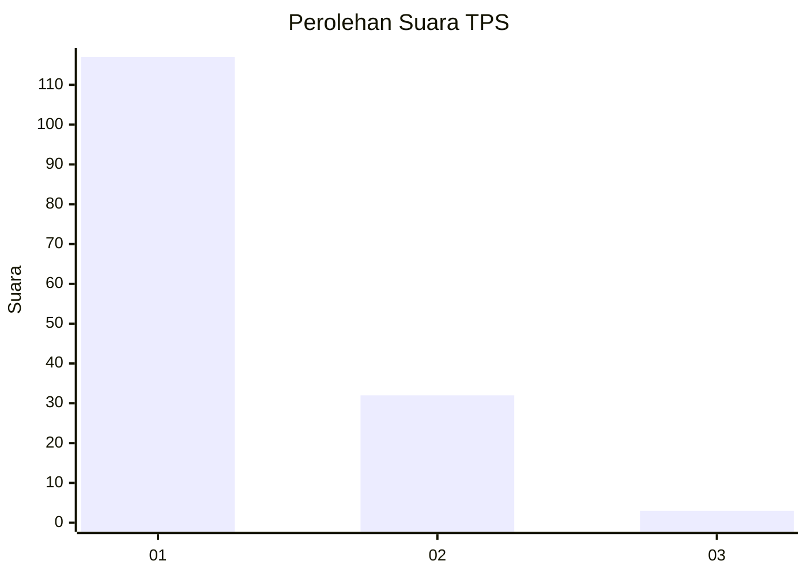
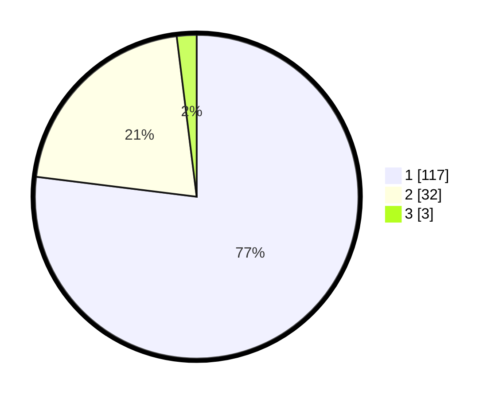

# Hasil

## Grafik

## Tabel

| No. | Nama Paslon    | Suara | Suara (raw) | Persentase |
|:--- |:-------------- | -----:| -----------:| ----------:|
| 1   | ANIES MUHAIMIN | 117   | [117][p-1]  | 76,97      |
| 2   | PRABOWO GIBRAN | 32    | [32][p-2]   | 21,05      |
| 3   | GANJAR MAHFUD  | 3     | [3][p-3]    | 1,97       |

[p-1]: https://github.com/gigit-pemilu/pemilu-2024/blob/main/pilpres/hitung-suara/sub/12-sumatera-utara/sub/19-batu-bara/sub/12-nibung-hangus/sub/2007-ujung-kubu/sub/010-tps/sub/paslon-1.txt
[p-2]: https://github.com/gigit-pemilu/pemilu-2024/blob/main/pilpres/hitung-suara/sub/12-sumatera-utara/sub/19-batu-bara/sub/12-nibung-hangus/sub/2007-ujung-kubu/sub/010-tps/sub/paslon-2.txt
[p-3]: https://github.com/gigit-pemilu/pemilu-2024/blob/main/pilpres/hitung-suara/sub/12-sumatera-utara/sub/19-batu-bara/sub/12-nibung-hangus/sub/2007-ujung-kubu/sub/010-tps/sub/paslon-3.txt

## Foto C Plano

https://sirekap-obj-formc.kpu.go.id/684e/pemilu/ppwp/12/19/12/20/07/1219122007010-20240215-031002--dd843c07-e3aa-42fa-8db7-fda0dfe1b063.jpg

https://sirekap-obj-formc.kpu.go.id/684e/pemilu/ppwp/12/19/12/20/07/1219122007010-20240215-031148--67e03d64-1c94-4339-a5a5-7c873b76aa4d.jpg

https://sirekap-obj-formc.kpu.go.id/684e/pemilu/ppwp/12/19/12/20/07/1219122007010-20240215-031254--417a153e-5fb8-40f8-8a6f-c7ef6389f830.jpg

## Metadata

| Key        | Value               |
| ---------- | ------------------- |
| Time Stamp | 2024-02-15 22:00:27 |

