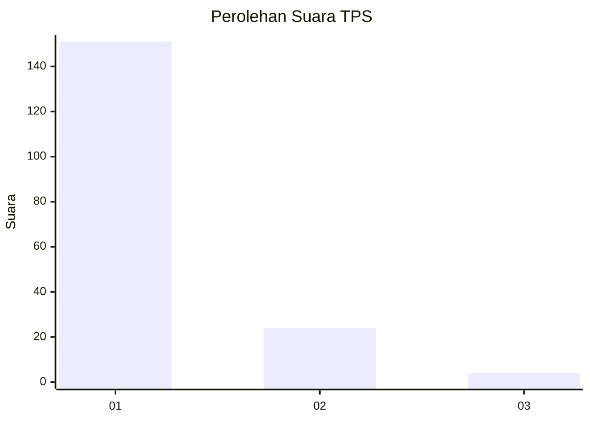
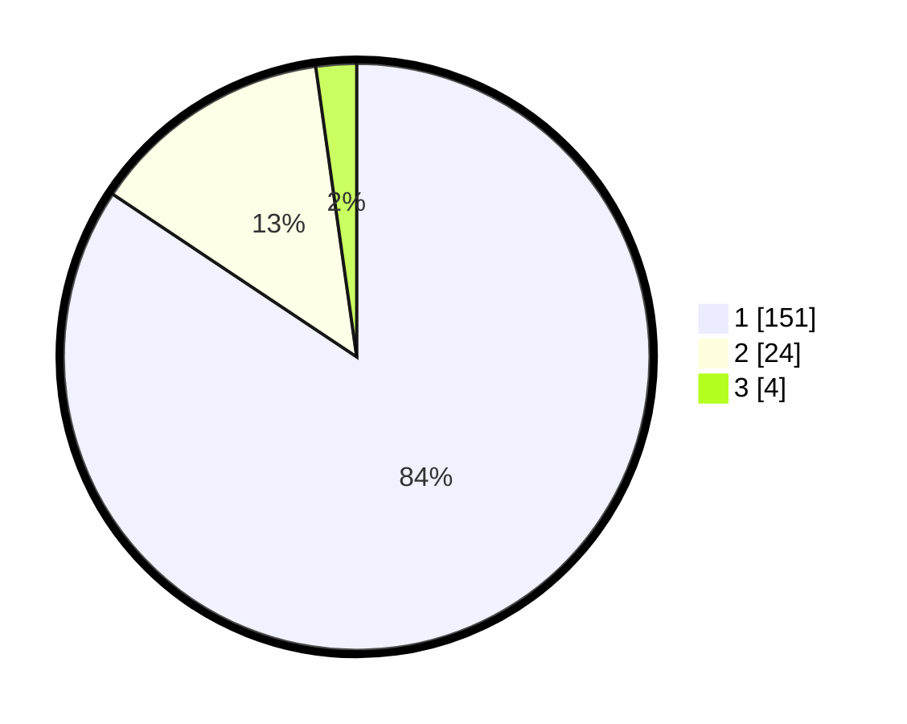

# Hasil

## Grafik

## Tabel

| No. | Nama Paslon    | Suara | Suara (raw) | Persentase |
|:--- |:-------------- | -----:| -----------:| ----------:|
| 1   | ANIES MUHAIMIN | 151   | [151][p-1]  | 84,36      |
| 2   | PRABOWO GIBRAN | 24    | [24][p-2]   | 13,41      |
| 3   | GANJAR MAHFUD  | 4     | [4][p-3]    | 2,23       |

[p-1]: https://github.com/gigit-pemilu/pemilu-2024/blob/main/pilpres/hitung-suara/sub/12-sumatera-utara/sub/19-batu-bara/sub/12-nibung-hangus/sub/2007-ujung-kubu/sub/014-tps/sub/paslon-1.txt
[p-2]: https://github.com/gigit-pemilu/pemilu-2024/blob/main/pilpres/hitung-suara/sub/12-sumatera-utara/sub/19-batu-bara/sub/12-nibung-hangus/sub/2007-ujung-kubu/sub/014-tps/sub/paslon-2.txt
[p-3]: https://github.com/gigit-pemilu/pemilu-2024/blob/main/pilpres/hitung-suara/sub/12-sumatera-utara/sub/19-batu-bara/sub/12-nibung-hangus/sub/2007-ujung-kubu/sub/014-tps/sub/paslon-3.txt

## Foto C Plano

https://sirekap-obj-formc.kpu.go.id/3b9d/pemilu/ppwp/12/19/12/20/07/1219122007014-20240215-043732--1c68559e-1443-4cf4-9569-72f5de916ea1.jpg

https://sirekap-obj-formc.kpu.go.id/3b9d/pemilu/ppwp/12/19/12/20/07/1219122007014-20240215-044008--7409600d-65cf-42a4-b2f6-bf61c25f2a68.jpg

https://sirekap-obj-formc.kpu.go.id/3b9d/pemilu/ppwp/12/19/12/20/07/1219122007014-20240215-044223--22efa02f-1a81-4a5d-94da-39c791cfeca2.jpg

## Metadata

| Key        | Value               |
| ---------- | ------------------- |
| Time Stamp | 2024-02-15 20:30:46 |

