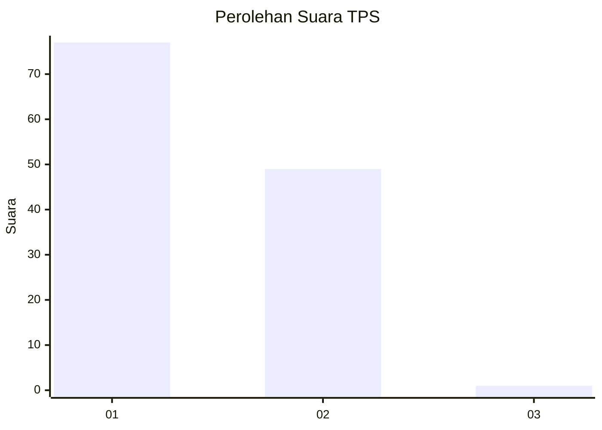
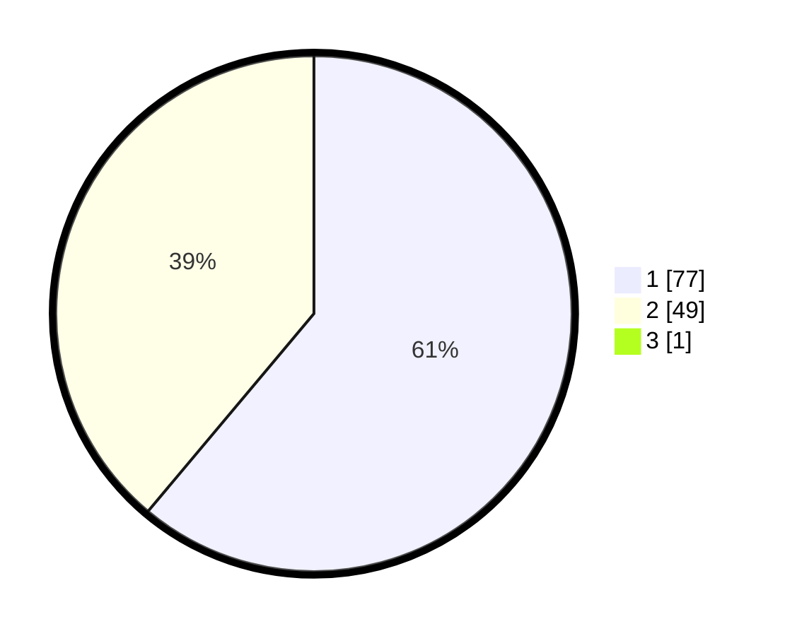

# Hasil

## Grafik

## Tabel

| No. | Nama Paslon    | Suara | Suara (raw) | Persentase |
|:--- |:-------------- | -----:| -----------:| ----------:|
| 1   | ANIES MUHAIMIN | 77    | [77][p-1]   | 60,63      |
| 2   | PRABOWO GIBRAN | 49    | [49][p-2]   | 38,58      |
| 3   | GANJAR MAHFUD  | 1     | [1][p-3]    | 0,79       |

[p-1]: https://github.com/gigit-pemilu/pemilu-2024/blob/main/pilpres/hitung-suara/sub/12-sumatera-utara/sub/19-batu-bara/sub/12-nibung-hangus/sub/2007-ujung-kubu/sub/016-tps/sub/paslon-1.txt
[p-2]: https://github.com/gigit-pemilu/pemilu-2024/blob/main/pilpres/hitung-suara/sub/12-sumatera-utara/sub/19-batu-bara/sub/12-nibung-hangus/sub/2007-ujung-kubu/sub/016-tps/sub/paslon-2.txt
[p-3]: https://github.com/gigit-pemilu/pemilu-2024/blob/main/pilpres/hitung-suara/sub/12-sumatera-utara/sub/19-batu-bara/sub/12-nibung-hangus/sub/2007-ujung-kubu/sub/016-tps/sub/paslon-3.txt

## Foto C Plano

https://sirekap-obj-formc.kpu.go.id/8cc8/pemilu/ppwp/12/19/12/20/07/1219122007016-20240215-050853--0c47853e-ebad-49e3-99d4-90fd4f46bd6d.jpg

https://sirekap-obj-formc.kpu.go.id/8cc8/pemilu/ppwp/12/19/12/20/07/1219122007016-20240215-050905--f9314790-54a4-432f-9006-aab40c417549.jpg

https://sirekap-obj-formc.kpu.go.id/8cc8/pemilu/ppwp/12/19/12/20/07/1219122007016-20240215-050918--637d4e1e-1b54-46fb-b7bd-0af1cbecab70.jpg

## Metadata

| Key        | Value               |
| ---------- | ------------------- |
| Time Stamp | 2024-02-15 17:00:25 |

