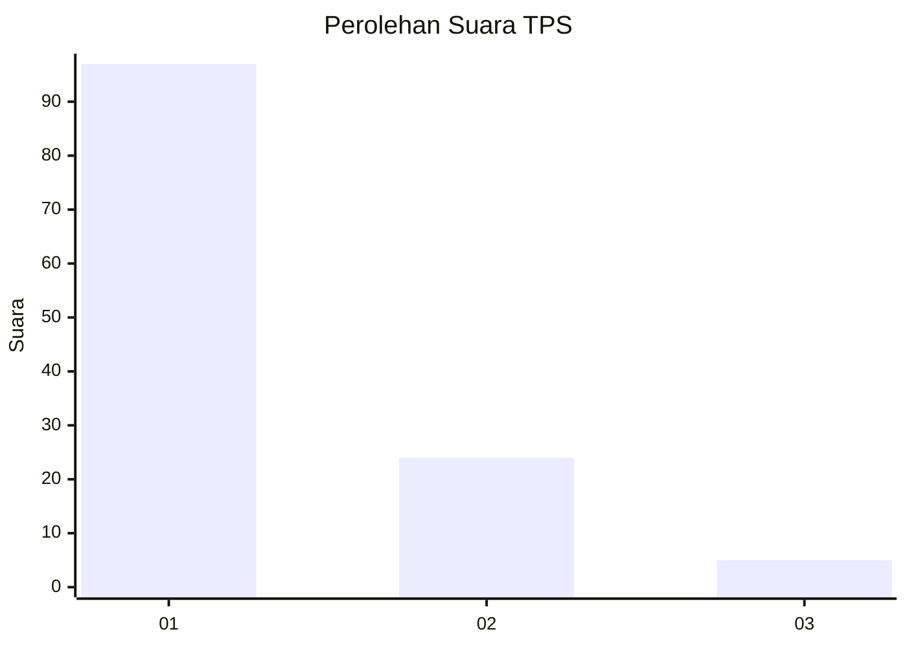
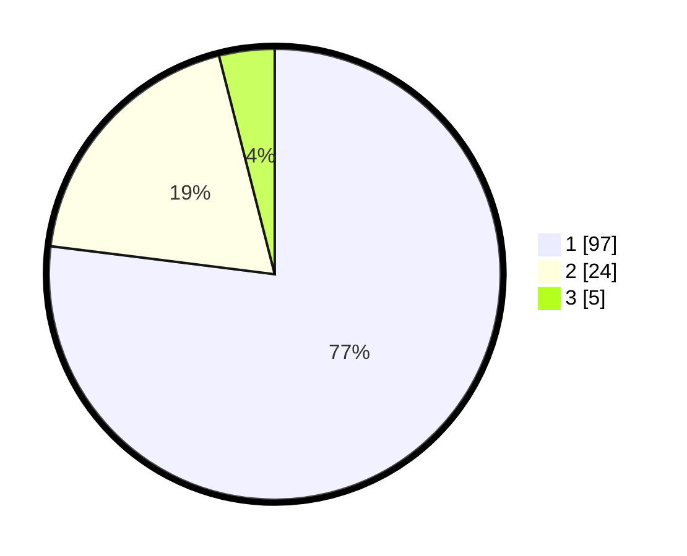

# Hasil

## Grafik

## Tabel

| No. | Nama Paslon    | Suara | Suara (raw) | Persentase |
|:--- |:-------------- | -----:| -----------:| ----------:|
| 1   | ANIES MUHAIMIN | 97    | [97][p-1]   | 76,98      |
| 2   | PRABOWO GIBRAN | 24    | [24][p-2]   | 19,05      |
| 3   | GANJAR MAHFUD  | 5     | [5][p-3]    | 3,97       |

[p-1]: https://github.com/gigit-pemilu/pemilu-2024/blob/main/pilpres/hitung-suara/sub/12-sumatera-utara/sub/19-batu-bara/sub/12-nibung-hangus/sub/2007-ujung-kubu/sub/020-tps/sub/paslon-1.txt
[p-2]: https://github.com/gigit-pemilu/pemilu-2024/blob/main/pilpres/hitung-suara/sub/12-sumatera-utara/sub/19-batu-bara/sub/12-nibung-hangus/sub/2007-ujung-kubu/sub/020-tps/sub/paslon-2.txt
[p-3]: https://github.com/gigit-pemilu/pemilu-2024/blob/main/pilpres/hitung-suara/sub/12-sumatera-utara/sub/19-batu-bara/sub/12-nibung-hangus/sub/2007-ujung-kubu/sub/020-tps/sub/paslon-3.txt

## Foto C Plano

https://sirekap-obj-formc.kpu.go.id/0f1e/pemilu/ppwp/12/19/12/20/07/1219122007020-20240215-074802--93234cbb-64ea-40c6-b3d8-ee2e1054130a.jpg

https://sirekap-obj-formc.kpu.go.id/0f1e/pemilu/ppwp/12/19/12/20/07/1219122007020-20240215-074853--a627a9b4-7762-41db-8a41-214d8a51ac3b.jpg

https://sirekap-obj-formc.kpu.go.id/0f1e/pemilu/ppwp/12/19/12/20/07/1219122007020-20240215-073017--c63a7a7f-ec5b-49f5-9651-488e4a4bdaf1.jpg

## Metadata

| Key        | Value               |
| ---------- | ------------------- |
| Time Stamp | 2024-02-15 20:00:44 |

