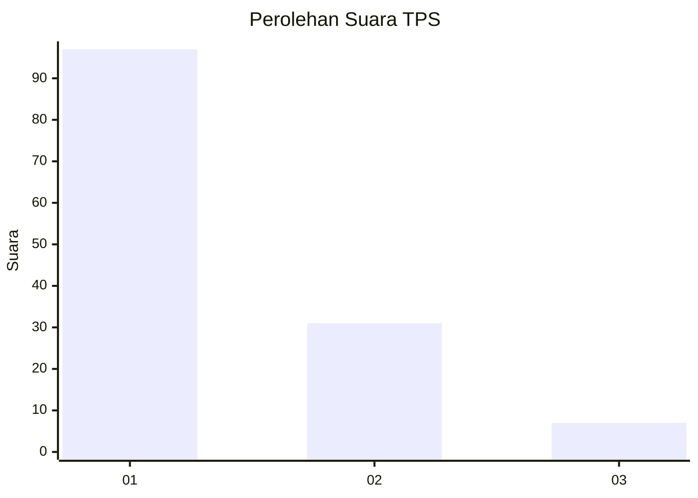
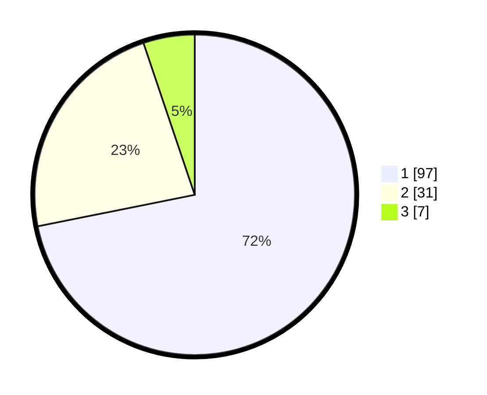

# Hasil

## Grafik

## Tabel

| No. | Nama Paslon    | Suara | Suara (raw) | Persentase |
|:--- |:-------------- | -----:| -----------:| ----------:|
| 1   | ANIES MUHAIMIN | 97    | [97][p-1]   | 71,85      |
| 2   | PRABOWO GIBRAN | 31    | [31][p-2]   | 22,96      |
| 3   | GANJAR MAHFUD  | 7     | [7][p-3]    | 5,19       |

[p-1]: https://github.com/gigit-pemilu/pemilu-2024/blob/main/pilpres/hitung-suara/sub/12-sumatera-utara/sub/19-batu-bara/sub/12-nibung-hangus/sub/2007-ujung-kubu/sub/021-tps/sub/paslon-1.txt
[p-2]: https://github.com/gigit-pemilu/pemilu-2024/blob/main/pilpres/hitung-suara/sub/12-sumatera-utara/sub/19-batu-bara/sub/12-nibung-hangus/sub/2007-ujung-kubu/sub/021-tps/sub/paslon-2.txt
[p-3]: https://github.com/gigit-pemilu/pemilu-2024/blob/main/pilpres/hitung-suara/sub/12-sumatera-utara/sub/19-batu-bara/sub/12-nibung-hangus/sub/2007-ujung-kubu/sub/021-tps/sub/paslon-3.txt

## Foto C Plano

https://sirekap-obj-formc.kpu.go.id/eb64/pemilu/ppwp/12/19/12/20/07/1219122007021-20240216-134139--9e26b734-cdac-40d5-8bfa-fadf1ed72070.jpg

https://sirekap-obj-formc.kpu.go.id/eb64/pemilu/ppwp/12/19/12/20/07/1219122007021-20240216-134154--2b8079c9-68bf-4d35-9176-382e5c18cfa3.jpg

https://sirekap-obj-formc.kpu.go.id/eb64/pemilu/ppwp/12/19/12/20/07/1219122007021-20240216-134214--b4d7815a-4412-4205-8ff1-e7d34f54f780.jpg

## Metadata

| Key        | Value               |
| ---------- | ------------------- |
| Time Stamp | 2024-02-16 14:00:34 |

