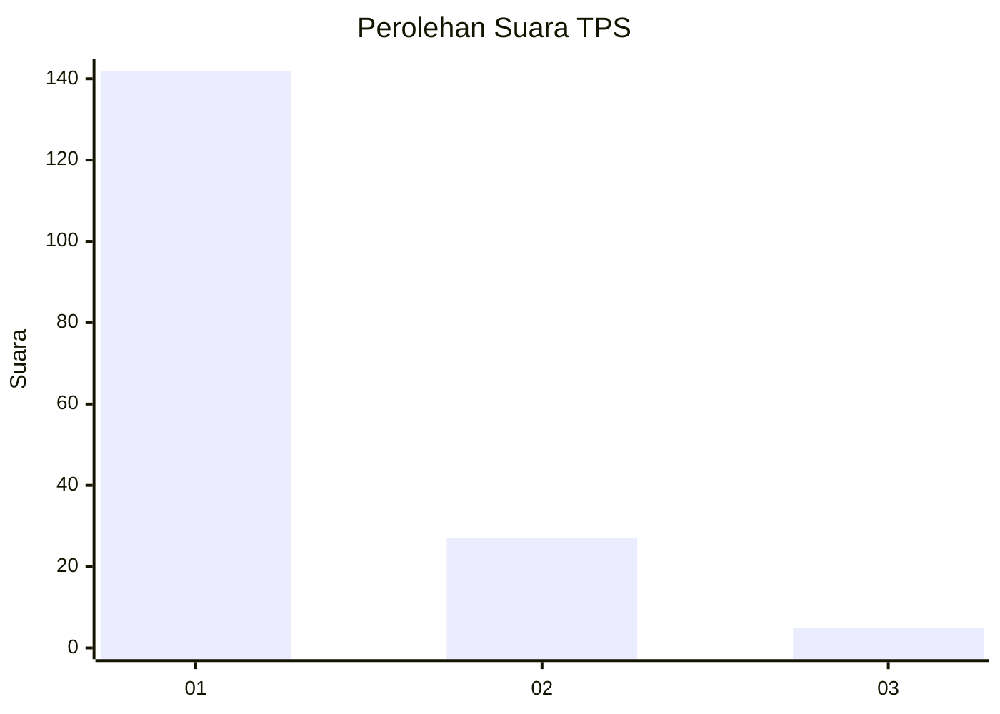
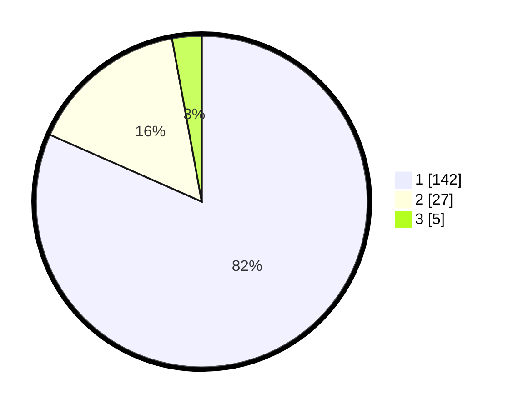

# Hasil

## Grafik

## Tabel

| No. | Nama Paslon    | Suara | Suara (raw) | Persentase |
|:--- |:-------------- | -----:| -----------:| ----------:|
| 1   | ANIES MUHAIMIN | 142   | [142][p-1]  | 81,61      |
| 2   | PRABOWO GIBRAN | 27    | [27][p-2]   | 15,52      |
| 3   | GANJAR MAHFUD  | 5     | [5][p-3]    | 2,87       |

[p-1]: https://github.com/gigit-pemilu/pemilu-2024-12-sumatera-utara/blob/main/pilpres/hitung-suara/sub/12-sumatera-utara/sub/19-batu-bara/sub/12-nibung-hangus/sub/2009-pematang-rambai/sub/003-tps/sub/paslon-1.txt
[p-2]: https://github.com/gigit-pemilu/pemilu-2024-12-sumatera-utara/blob/main/pilpres/hitung-suara/sub/12-sumatera-utara/sub/19-batu-bara/sub/12-nibung-hangus/sub/2009-pematang-rambai/sub/003-tps/sub/paslon-2.txt
[p-3]: https://github.com/gigit-pemilu/pemilu-2024-12-sumatera-utara/blob/main/pilpres/hitung-suara/sub/12-sumatera-utara/sub/19-batu-bara/sub/12-nibung-hangus/sub/2009-pematang-rambai/sub/003-tps/sub/paslon-3.txt

## Foto C Plano

https://sirekap-obj-formc.kpu.go.id/e8fa/pemilu/ppwp/12/19/12/20/09/1219122009003-20240215-081621--214509a3-3f71-4738-bd01-9d2aed819ea1.jpg

https://sirekap-obj-formc.kpu.go.id/e8fa/pemilu/ppwp/12/19/12/20/09/1219122009003-20240215-042941--13066077-a29f-459a-9b82-dcd6a56b89aa.jpg

https://sirekap-obj-formc.kpu.go.id/e8fa/pemilu/ppwp/12/19/12/20/09/1219122009003-20240215-043156--5ee1dd03-4962-433d-b030-b0b613849a8b.jpg

## Metadata

| Key        | Value               |
| ---------- | ------------------- |
| Time Stamp | 2024-02-15 17:00:25 |

