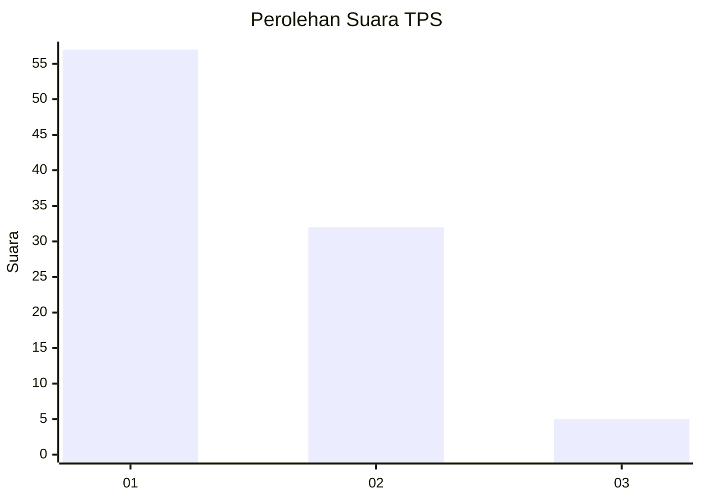
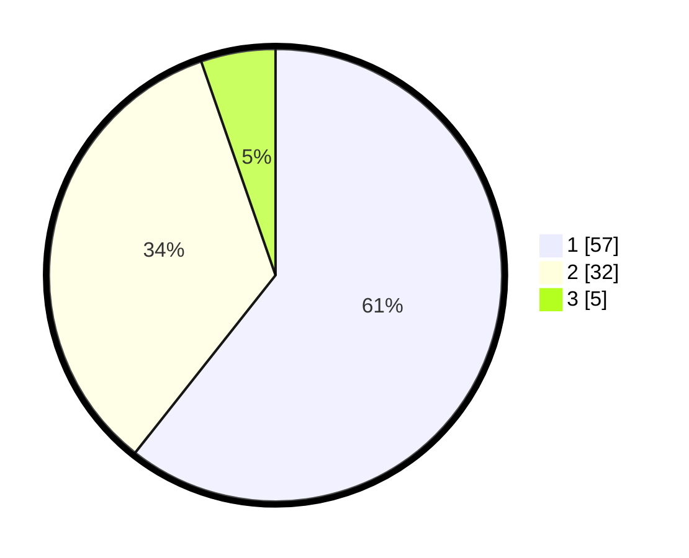

# Hasil

## Grafik

## Tabel

| No. | Nama Paslon    | Suara | Suara (raw) | Persentase |
|:--- |:-------------- | -----:| -----------:| ----------:|
| 1   | ANIES MUHAIMIN | 57    | [57][p-1]   | 60,64      |
| 2   | PRABOWO GIBRAN | 32    | [32][p-2]   | 34,04      |
| 3   | GANJAR MAHFUD  | 5     | [5][p-3]    | 5,32       |

[p-1]: https://github.com/gigit-pemilu/pemilu-2024-12-sumatera-utara/blob/main/pilpres/hitung-suara/sub/12-sumatera-utara/sub/19-batu-bara/sub/12-nibung-hangus/sub/2009-pematang-rambai/sub/009-tps/sub/paslon-1.txt
[p-2]: https://github.com/gigit-pemilu/pemilu-2024-12-sumatera-utara/blob/main/pilpres/hitung-suara/sub/12-sumatera-utara/sub/19-batu-bara/sub/12-nibung-hangus/sub/2009-pematang-rambai/sub/009-tps/sub/paslon-2.txt
[p-3]: https://github.com/gigit-pemilu/pemilu-2024-12-sumatera-utara/blob/main/pilpres/hitung-suara/sub/12-sumatera-utara/sub/19-batu-bara/sub/12-nibung-hangus/sub/2009-pematang-rambai/sub/009-tps/sub/paslon-3.txt

## Foto C Plano

https://sirekap-obj-formc.kpu.go.id/c21e/pemilu/ppwp/12/19/12/20/09/1219122009009-20240217-070604--b220bc62-386b-43a5-9c58-edababebe41f.jpg

https://sirekap-obj-formc.kpu.go.id/c21e/pemilu/ppwp/12/19/12/20/09/1219122009009-20240215-032839--c35ea381-d343-4045-a5e3-6e6e4172126a.jpg

https://sirekap-obj-formc.kpu.go.id/c21e/pemilu/ppwp/12/19/12/20/09/1219122009009-20240215-040305--38c0108b-eb43-46d8-bc81-bdcb4ad0427b.jpg

## Metadata

| Key        | Value               |
| ---------- | ------------------- |
| Time Stamp | 2024-02-17 07:30:03 |

