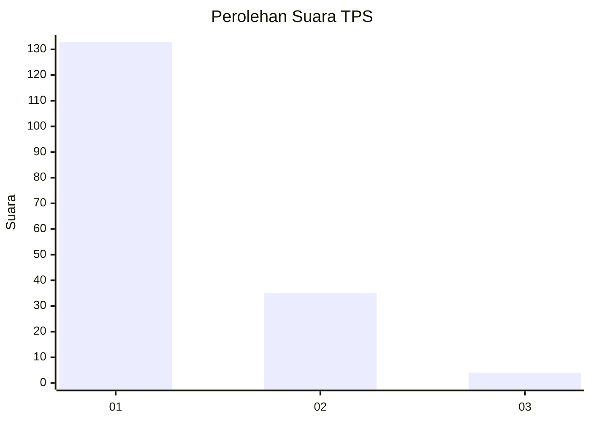
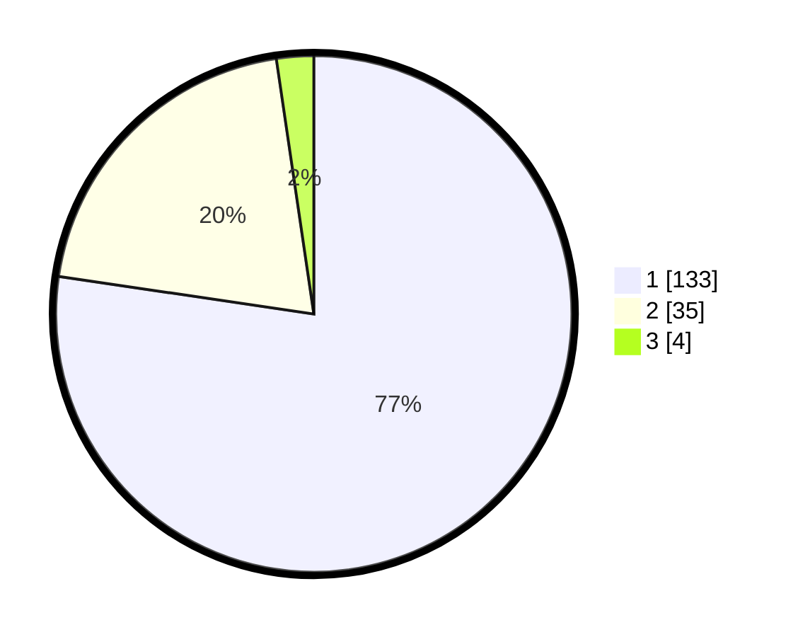

# Hasil

## Grafik

## Tabel

| No. | Nama Paslon    | Suara | Suara (raw) | Persentase |
|:--- |:-------------- | -----:| -----------:| ----------:|
| 1   | ANIES MUHAIMIN | 133   | [133][p-1]  | 77,33      |
| 2   | PRABOWO GIBRAN | 35    | [35][p-2]   | 20,35      |
| 3   | GANJAR MAHFUD  | 4     | [4][p-3]    | 2,33       |

[p-1]: https://github.com/gigit-pemilu/pemilu-2024-12-sumatera-utara/blob/main/pilpres/hitung-suara/sub/12-sumatera-utara/sub/19-batu-bara/sub/12-nibung-hangus/sub/2010-tali-air-permai/sub/002-tps/sub/paslon-1.txt
[p-2]: https://github.com/gigit-pemilu/pemilu-2024-12-sumatera-utara/blob/main/pilpres/hitung-suara/sub/12-sumatera-utara/sub/19-batu-bara/sub/12-nibung-hangus/sub/2010-tali-air-permai/sub/002-tps/sub/paslon-2.txt
[p-3]: https://github.com/gigit-pemilu/pemilu-2024-12-sumatera-utara/blob/main/pilpres/hitung-suara/sub/12-sumatera-utara/sub/19-batu-bara/sub/12-nibung-hangus/sub/2010-tali-air-permai/sub/002-tps/sub/paslon-3.txt

## Foto C Plano

https://sirekap-obj-formc.kpu.go.id/6fd1/pemilu/ppwp/12/19/12/20/10/1219122010002-20240215-105714--4ccb2172-c083-414e-bba0-e951ca2bb792.jpg

https://sirekap-obj-formc.kpu.go.id/6fd1/pemilu/ppwp/12/19/12/20/10/1219122010002-20240215-110001--b14a73ca-0a1b-4766-90c5-5afc5c24a5dc.jpg

https://sirekap-obj-formc.kpu.go.id/6fd1/pemilu/ppwp/12/19/12/20/10/1219122010002-20240215-105906--e3f08dbe-9027-468b-bd91-f64b834fbf46.jpg

## Metadata

| Key        | Value               |
| ---------- | ------------------- |
| Time Stamp | 2024-02-15 23:29:50 |

