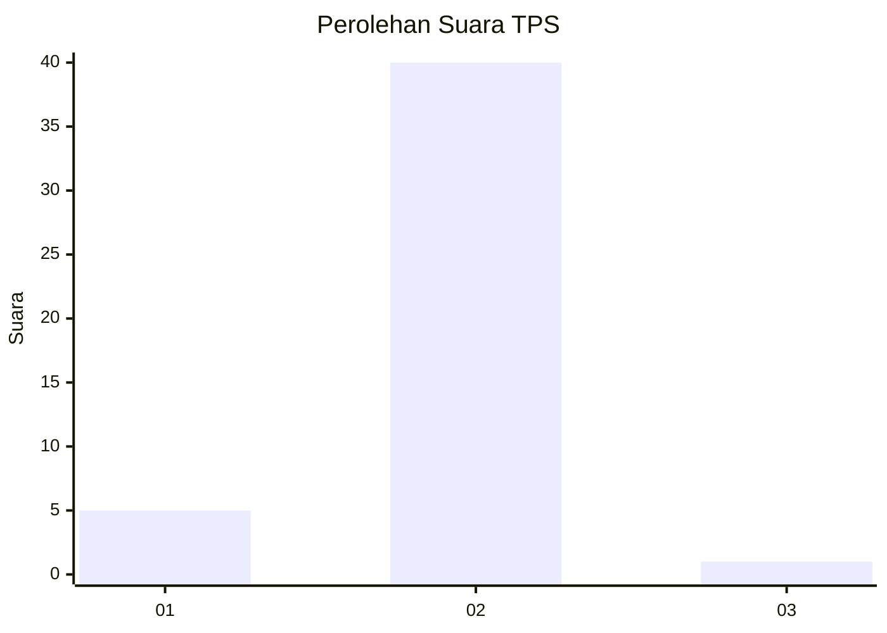
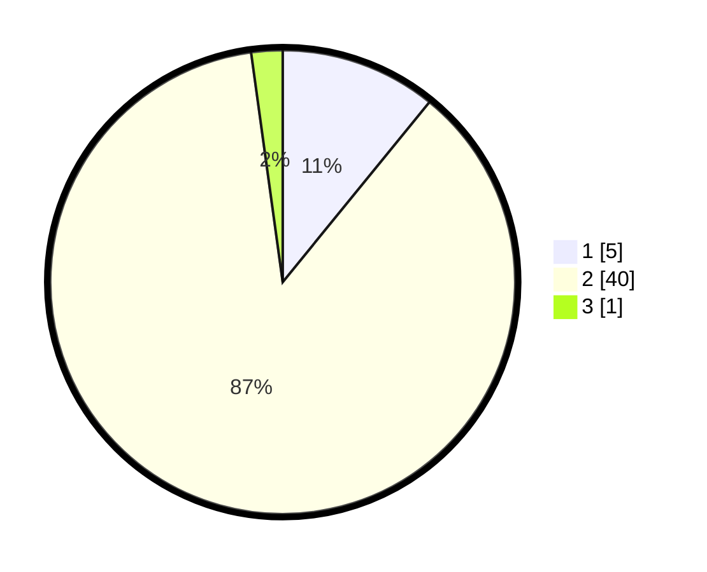

# Hasil

## Grafik

## Tabel

| No. | Nama Paslon    | Suara | Suara (raw) | Persentase |
|:--- |:-------------- | -----:| -----------:| ----------:|
| 1   | ANIES MUHAIMIN | 5     | [5][p-1]    | 10,87      |
| 2   | PRABOWO GIBRAN | 40    | [40][p-2]   | 86,96      |
| 3   | GANJAR MAHFUD  | 1     | [1][p-3]    | 2,17       |

[p-1]: https://github.com/gigit-pemilu/pemilu-2024/blob/main/pilpres/hitung-suara/sub/12-sumatera-utara/sub/20-padang-lawas-utara/sub/01-dolok-sigompulon/sub/2002-pasang-lela/sub/002-tps/sub/paslon-1.txt
[p-2]: https://github.com/gigit-pemilu/pemilu-2024/blob/main/pilpres/hitung-suara/sub/12-sumatera-utara/sub/20-padang-lawas-utara/sub/01-dolok-sigompulon/sub/2002-pasang-lela/sub/002-tps/sub/paslon-2.txt
[p-3]: https://github.com/gigit-pemilu/pemilu-2024/blob/main/pilpres/hitung-suara/sub/12-sumatera-utara/sub/20-padang-lawas-utara/sub/01-dolok-sigompulon/sub/2002-pasang-lela/sub/002-tps/sub/paslon-3.txt

## Foto C Plano

https://sirekap-obj-formc.kpu.go.id/9804/pemilu/ppwp/12/20/01/20/02/1220012002002-20240214-155104--d278e768-0f36-4f2c-8aba-0916af80f026.jpg

https://sirekap-obj-formc.kpu.go.id/9804/pemilu/ppwp/12/20/01/20/02/1220012002002-20240214-155129--81660eb2-dec5-45c3-803a-10957b1afae3.jpg

## Metadata

| Key        | Value               |
| ---------- | ------------------- |
| Time Stamp | 2024-02-15 15:00:29 |

