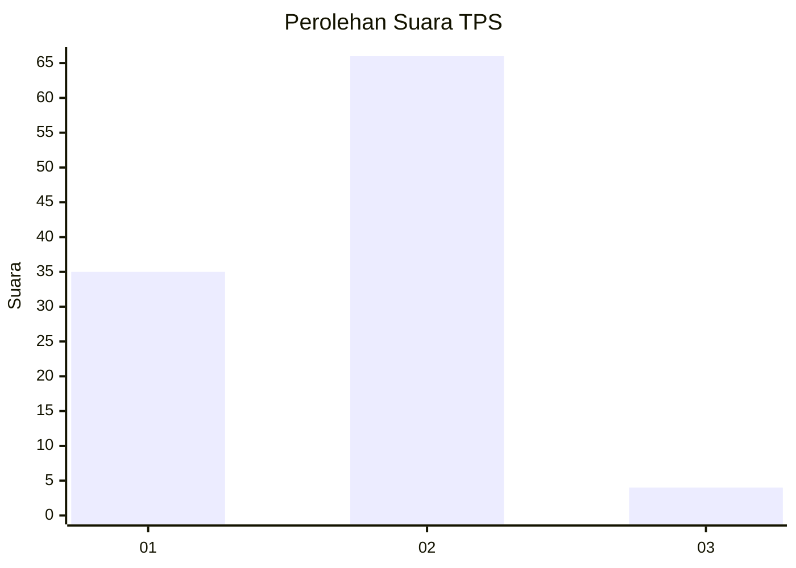
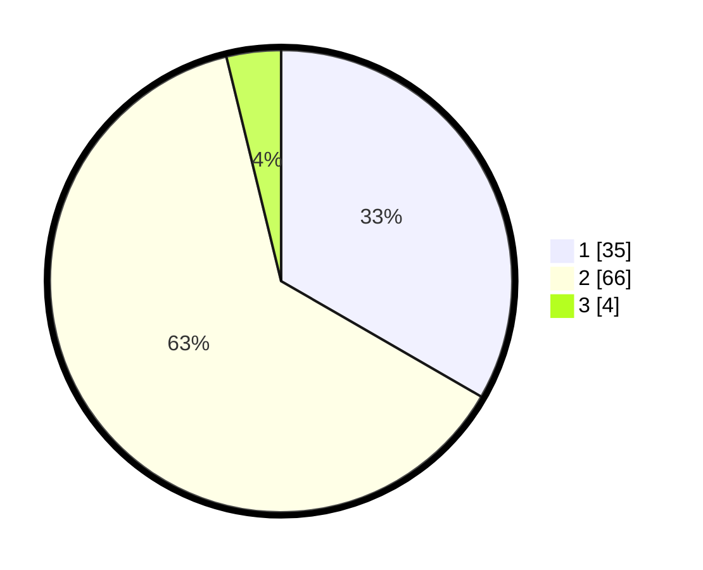

# Hasil

## Grafik

## Tabel

| No. | Nama Paslon    | Suara | Suara (raw) | Persentase |
|:--- |:-------------- | -----:| -----------:| ----------:|
| 1   | ANIES MUHAIMIN | 35    | [35][p-1]   | 33,33      |
| 2   | PRABOWO GIBRAN | 66    | [66][p-2]   | 62,86      |
| 3   | GANJAR MAHFUD  | 4     | [4][p-3]    | 3,81       |

[p-1]: https://github.com/gigit-pemilu/pemilu-2024-12-sumatera-utara/blob/main/pilpres/hitung-suara/sub/12-sumatera-utara/sub/20-padang-lawas-utara/sub/01-dolok-sigompulon/sub/2026-hasahatan/sub/001-tps/sub/paslon-1.txt
[p-2]: https://github.com/gigit-pemilu/pemilu-2024-12-sumatera-utara/blob/main/pilpres/hitung-suara/sub/12-sumatera-utara/sub/20-padang-lawas-utara/sub/01-dolok-sigompulon/sub/2026-hasahatan/sub/001-tps/sub/paslon-2.txt
[p-3]: https://github.com/gigit-pemilu/pemilu-2024-12-sumatera-utara/blob/main/pilpres/hitung-suara/sub/12-sumatera-utara/sub/20-padang-lawas-utara/sub/01-dolok-sigompulon/sub/2026-hasahatan/sub/001-tps/sub/paslon-3.txt

## Foto C Plano

https://sirekap-obj-formc.kpu.go.id/181a/pemilu/ppwp/12/20/01/20/26/1220012026001-20240215-004031--2cc75e10-6b3d-45f5-ac50-9a845bcbd07d.jpg

https://sirekap-obj-formc.kpu.go.id/181a/pemilu/ppwp/12/20/01/20/26/1220012026001-20240215-004347--7295e730-948f-4791-8915-63760f8e5133.jpg

https://sirekap-obj-formc.kpu.go.id/181a/pemilu/ppwp/12/20/01/20/26/1220012026001-20240215-004603--008c7581-8b3d-4a4b-a825-d2ea888ff56d.jpg

## Metadata

| Key        | Value               |
| ---------- | ------------------- |
| Time Stamp | 2024-02-15 19:00:26 |

