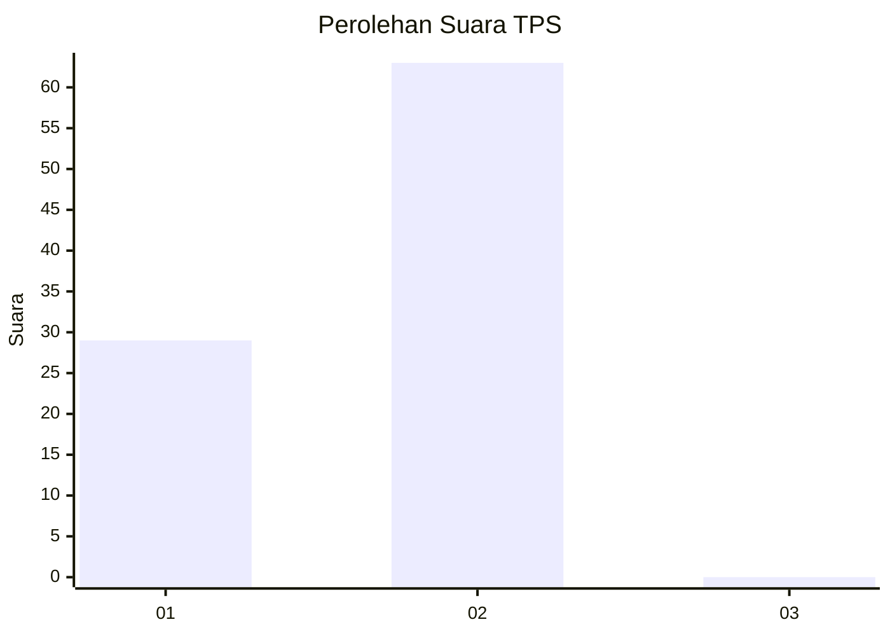
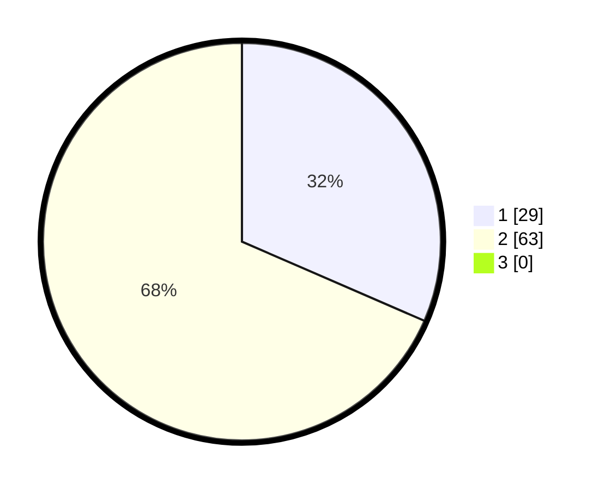

# Hasil

## Grafik

## Tabel

| No. | Nama Paslon    | Suara | Suara (raw) | Persentase |
|:--- |:-------------- | -----:| -----------:| ----------:|
| 1   | ANIES MUHAIMIN | 29    | [29][p-1]   | 31,52      |
| 2   | PRABOWO GIBRAN | 63    | [63][p-2]   | 68,48      |
| 3   | GANJAR MAHFUD  | 0     | [0][p-3]    | 0,00       |

[p-1]: https://github.com/gigit-pemilu/pemilu-2024/blob/main/pilpres/hitung-suara/sub/12-sumatera-utara/sub/20-padang-lawas-utara/sub/02-dolok/sub/2002-singanyal/sub/003-tps/sub/paslon-1.txt
[p-2]: https://github.com/gigit-pemilu/pemilu-2024/blob/main/pilpres/hitung-suara/sub/12-sumatera-utara/sub/20-padang-lawas-utara/sub/02-dolok/sub/2002-singanyal/sub/003-tps/sub/paslon-2.txt
[p-3]: https://github.com/gigit-pemilu/pemilu-2024/blob/main/pilpres/hitung-suara/sub/12-sumatera-utara/sub/20-padang-lawas-utara/sub/02-dolok/sub/2002-singanyal/sub/003-tps/sub/paslon-3.txt

## Foto C Plano

https://sirekap-obj-formc.kpu.go.id/6d5b/pemilu/ppwp/12/20/02/20/02/1220022002003-20240215-090018--b4b1848f-e361-4376-875d-6ff8c938b200.jpg

https://sirekap-obj-formc.kpu.go.id/6d5b/pemilu/ppwp/12/20/02/20/02/1220022002003-20240215-092233--a1ecfe4e-af54-42e8-a52d-1f7e522ef406.jpg

https://sirekap-obj-formc.kpu.go.id/6d5b/pemilu/ppwp/12/20/02/20/02/1220022002003-20240215-092217--dd1d7dcb-0473-41ba-a80f-d3cb72e60344.jpg

## Metadata

| Key        | Value               |
| ---------- | ------------------- |
| Time Stamp | 2024-02-15 15:00:29 |

