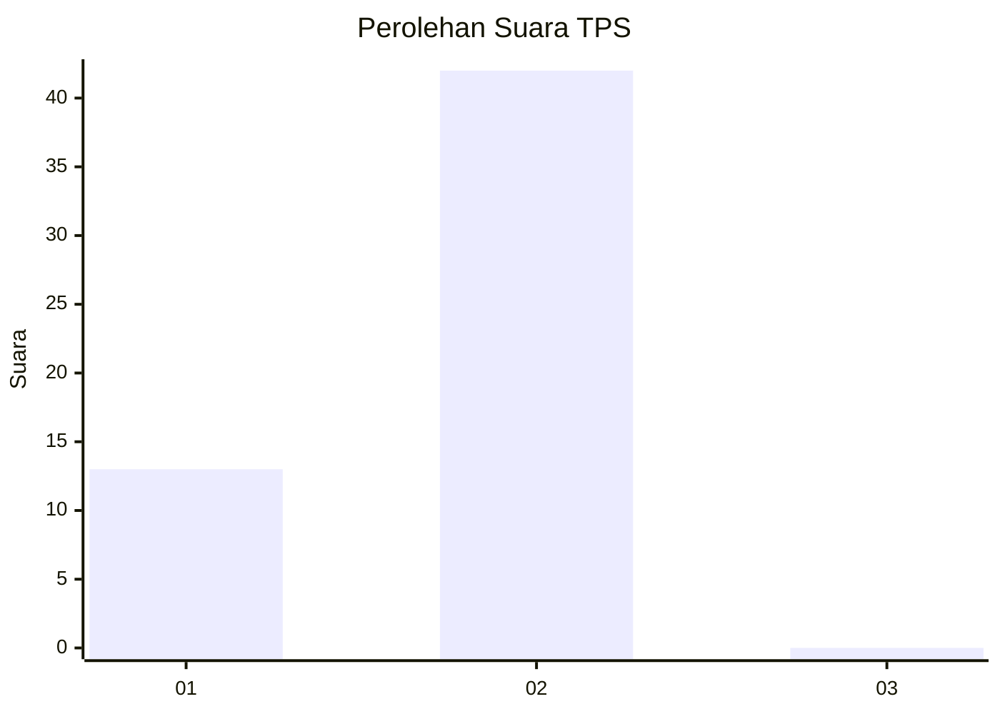
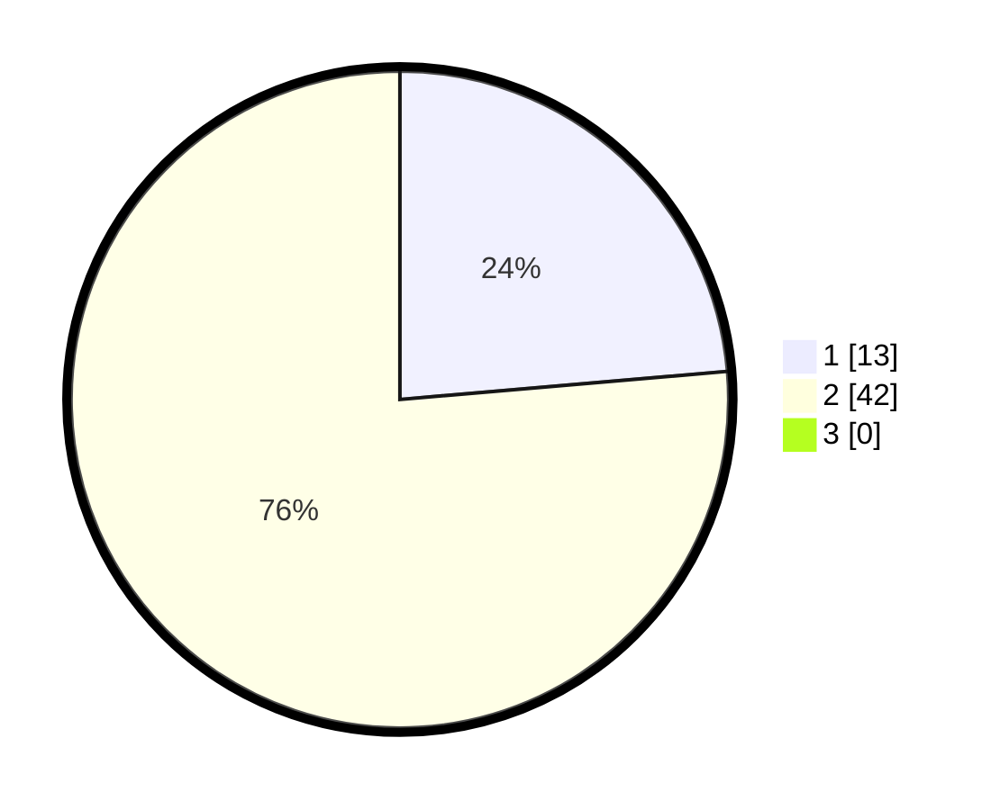

# Hasil

## Grafik

## Tabel

| No. | Nama Paslon    | Suara | Suara (raw) | Persentase |
|:--- |:-------------- | -----:| -----------:| ----------:|
| 1   | ANIES MUHAIMIN | 13    | [13][p-1]   | 23,64      |
| 2   | PRABOWO GIBRAN | 42    | [42][p-2]   | 76,36      |
| 3   | GANJAR MAHFUD  | 0     | [0][p-3]    | 0,00       |

[p-1]: https://github.com/gigit-pemilu/pemilu-2024/blob/main/pilpres/hitung-suara/sub/12-sumatera-utara/sub/20-padang-lawas-utara/sub/02-dolok/sub/2005-tanjung-baru-b/sub/001-tps/sub/paslon-1.txt
[p-2]: https://github.com/gigit-pemilu/pemilu-2024/blob/main/pilpres/hitung-suara/sub/12-sumatera-utara/sub/20-padang-lawas-utara/sub/02-dolok/sub/2005-tanjung-baru-b/sub/001-tps/sub/paslon-2.txt
[p-3]: https://github.com/gigit-pemilu/pemilu-2024/blob/main/pilpres/hitung-suara/sub/12-sumatera-utara/sub/20-padang-lawas-utara/sub/02-dolok/sub/2005-tanjung-baru-b/sub/001-tps/sub/paslon-3.txt

## Foto C Plano

https://sirekap-obj-formc.kpu.go.id/024e/pemilu/ppwp/12/20/02/20/05/1220022005001-20240214-204506--ef964147-56c0-428c-8378-c1c625db5f4f.jpg

https://sirekap-obj-formc.kpu.go.id/024e/pemilu/ppwp/12/20/02/20/05/1220022005001-20240215-085147--c70589dc-e4f9-4536-a575-ce1ed16161cb.jpg

https://sirekap-obj-formc.kpu.go.id/024e/pemilu/ppwp/12/20/02/20/05/1220022005001-20240214-223140--706e90cb-e5a3-44f9-9852-40812608cfb1.jpg

## Metadata

| Key        | Value               |
| ---------- | ------------------- |
| Time Stamp | 2024-02-15 15:00:29 |

