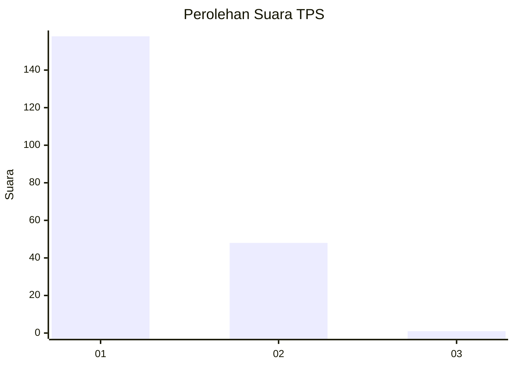
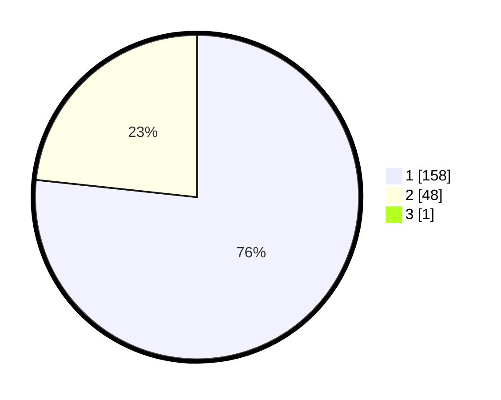

# Hasil

## Grafik

## Tabel

| No. | Nama Paslon    | Suara | Suara (raw) | Persentase |
|:--- |:-------------- | -----:| -----------:| ----------:|
| 1   | ANIES MUHAIMIN | 158   | [158][p-1]  | 76,33      |
| 2   | PRABOWO GIBRAN | 48    | [48][p-2]   | 23,19      |
| 3   | GANJAR MAHFUD  | 1     | [1][p-3]    | 0,48       |

[p-1]: https://github.com/gigit-pemilu/pemilu-2024/blob/main/pilpres/hitung-suara/sub/12-sumatera-utara/sub/20-padang-lawas-utara/sub/02-dolok/sub/2036-simatorkis/sub/004-tps/sub/paslon-1.txt
[p-2]: https://github.com/gigit-pemilu/pemilu-2024/blob/main/pilpres/hitung-suara/sub/12-sumatera-utara/sub/20-padang-lawas-utara/sub/02-dolok/sub/2036-simatorkis/sub/004-tps/sub/paslon-2.txt
[p-3]: https://github.com/gigit-pemilu/pemilu-2024/blob/main/pilpres/hitung-suara/sub/12-sumatera-utara/sub/20-padang-lawas-utara/sub/02-dolok/sub/2036-simatorkis/sub/004-tps/sub/paslon-3.txt

## Foto C Plano

https://sirekap-obj-formc.kpu.go.id/d3b3/pemilu/ppwp/12/20/02/20/36/1220022036004-20240221-220331--a9a13673-f22e-4c09-a836-7e7a7c663f3f.jpg

https://sirekap-obj-formc.kpu.go.id/d3b3/pemilu/ppwp/12/20/02/20/36/1220022036004-20240221-220057--1969854d-2380-4164-8ff8-0fbb51f0e3a3.jpg

https://sirekap-obj-formc.kpu.go.id/d3b3/pemilu/ppwp/12/20/02/20/36/1220022036004-20240221-214315--21faf934-1194-4c16-b940-1c517238858d.jpg

## Metadata

| Key        | Value               |
| ---------- | ------------------- |
| Time Stamp | 2024-02-24 22:31:28 |

