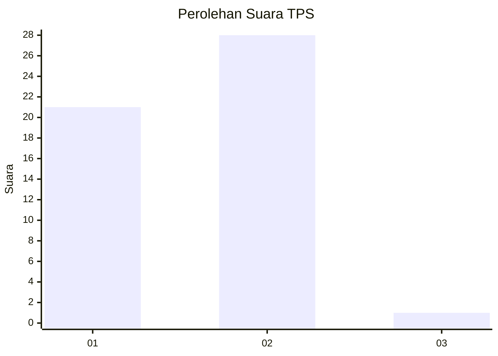
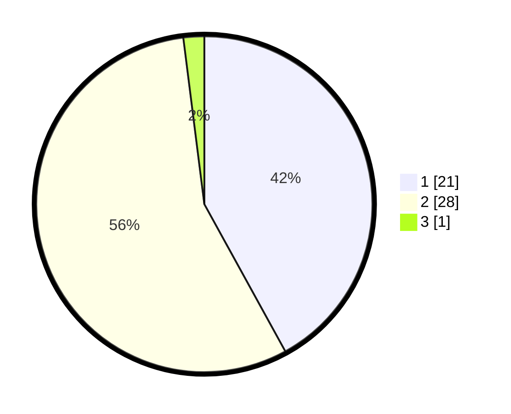

# Hasil

## Grafik

## Tabel

| No. | Nama Paslon    | Suara | Suara (raw) | Persentase |
|:--- |:-------------- | -----:| -----------:| ----------:|
| 1   | ANIES MUHAIMIN | 21    | [21][p-1]   | 42,00      |
| 2   | PRABOWO GIBRAN | 28    | [28][p-2]   | 56,00      |
| 3   | GANJAR MAHFUD  | 1     | [1][p-3]    | 2,00       |

[p-1]: https://github.com/gigit-pemilu/pemilu-2024-12-sumatera-utara/blob/main/pilpres/hitung-suara/sub/12-sumatera-utara/sub/20-padang-lawas-utara/sub/02-dolok/sub/2040-janji-manahan-gul/sub/001-tps/sub/paslon-1.txt
[p-2]: https://github.com/gigit-pemilu/pemilu-2024-12-sumatera-utara/blob/main/pilpres/hitung-suara/sub/12-sumatera-utara/sub/20-padang-lawas-utara/sub/02-dolok/sub/2040-janji-manahan-gul/sub/001-tps/sub/paslon-2.txt
[p-3]: https://github.com/gigit-pemilu/pemilu-2024-12-sumatera-utara/blob/main/pilpres/hitung-suara/sub/12-sumatera-utara/sub/20-padang-lawas-utara/sub/02-dolok/sub/2040-janji-manahan-gul/sub/001-tps/sub/paslon-3.txt

## Foto C Plano

https://sirekap-obj-formc.kpu.go.id/cd64/pemilu/ppwp/12/20/02/20/40/1220022040001-20240215-061724--57721ce4-513e-4fc4-a60d-ff3bc449b3c0.jpg

https://sirekap-obj-formc.kpu.go.id/cd64/pemilu/ppwp/12/20/02/20/40/1220022040001-20240215-061743--075ef319-6dff-456a-9775-521bf077f845.jpg

https://sirekap-obj-formc.kpu.go.id/cd64/pemilu/ppwp/12/20/02/20/40/1220022040001-20240215-061801--8e56c812-eafc-49cb-bddc-69ad74f8363e.jpg

## Metadata

| Key        | Value               |
| ---------- | ------------------- |
| Time Stamp | 2024-02-16 01:00:27 |

