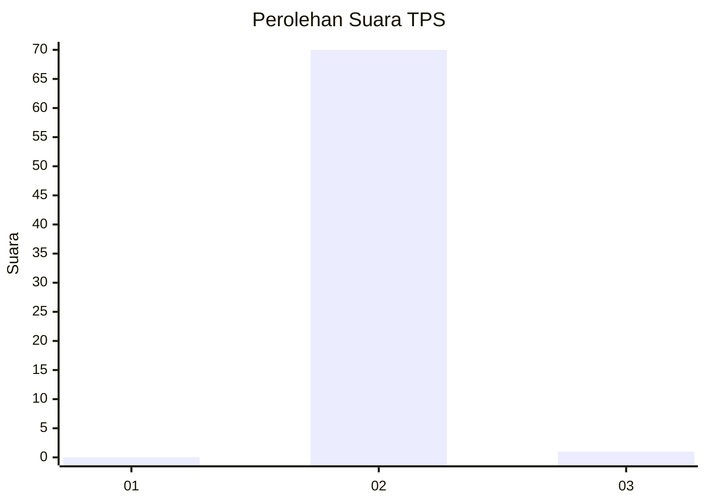
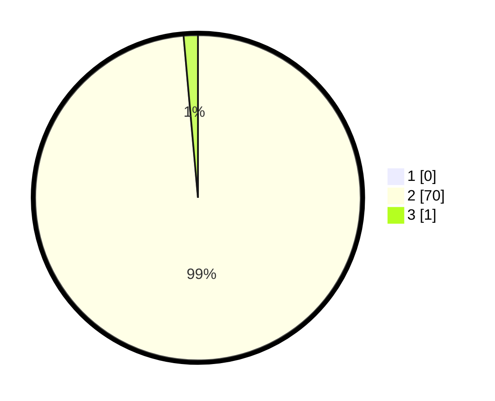

# Hasil

## Grafik

## Tabel

| No. | Nama Paslon    | Suara | Suara (raw) | Persentase |
|:--- |:-------------- | -----:| -----------:| ----------:|
| 1   | ANIES MUHAIMIN | 0     | [0][p-1]    | 0,00       |
| 2   | PRABOWO GIBRAN | 70    | [70][p-2]   | 98,59      |
| 3   | GANJAR MAHFUD  | 1     | [1][p-3]    | 1,41       |

[p-1]: https://github.com/gigit-pemilu/pemilu-2024/blob/main/pilpres/hitung-suara/sub/12-sumatera-utara/sub/20-padang-lawas-utara/sub/02-dolok/sub/2069-napasundali/sub/001-tps/sub/paslon-1.txt
[p-2]: https://github.com/gigit-pemilu/pemilu-2024/blob/main/pilpres/hitung-suara/sub/12-sumatera-utara/sub/20-padang-lawas-utara/sub/02-dolok/sub/2069-napasundali/sub/001-tps/sub/paslon-2.txt
[p-3]: https://github.com/gigit-pemilu/pemilu-2024/blob/main/pilpres/hitung-suara/sub/12-sumatera-utara/sub/20-padang-lawas-utara/sub/02-dolok/sub/2069-napasundali/sub/001-tps/sub/paslon-3.txt

## Foto C Plano

https://sirekap-obj-formc.kpu.go.id/e453/pemilu/ppwp/12/20/02/20/69/1220022069001-20240216-092553--0a1e8afa-f5b9-474b-ae81-da4ad696a4bb.jpg

https://sirekap-obj-formc.kpu.go.id/e453/pemilu/ppwp/12/20/02/20/69/1220022069001-20240216-092647--b7fd9afd-13aa-4199-bcfa-a85da1e6fd4f.jpg

https://sirekap-obj-formc.kpu.go.id/e453/pemilu/ppwp/12/20/02/20/69/1220022069001-20240216-092807--d284e3bd-236d-42d6-b7e4-0d215af17973.jpg

## Metadata

| Key        | Value               |
| ---------- | ------------------- |
| Time Stamp | 2024-02-16 10:30:29 |

