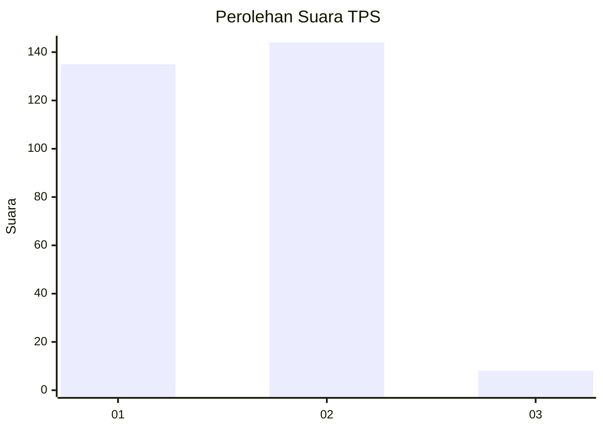
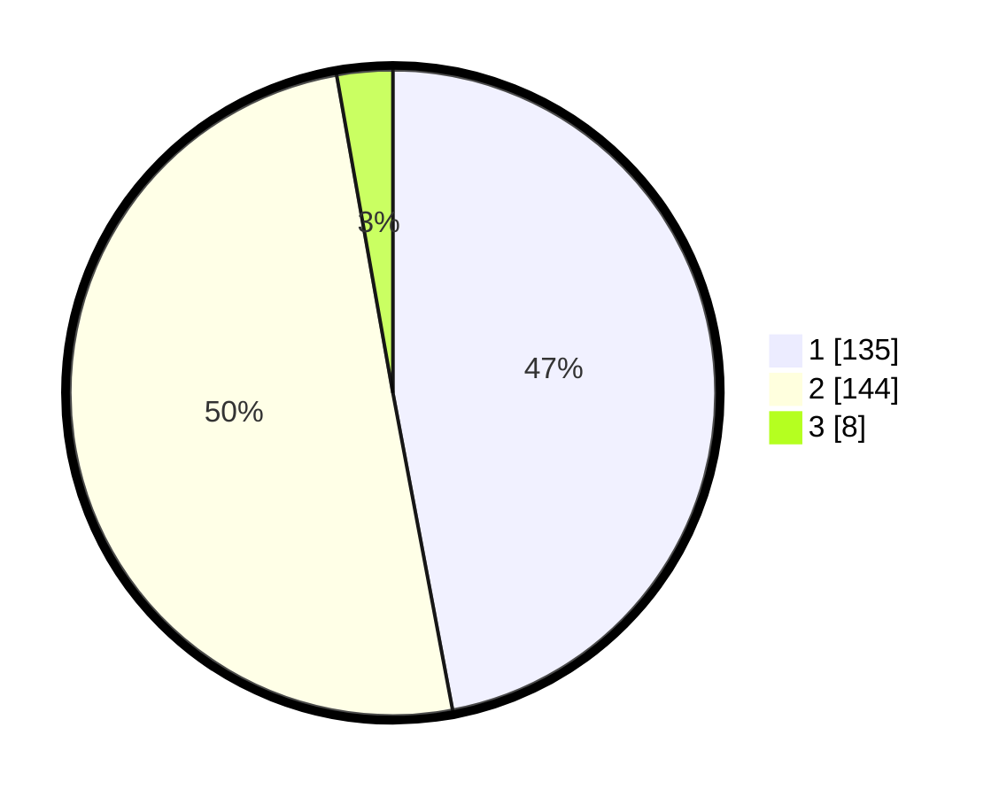

# Hasil

## Grafik

## Tabel

| No. | Nama Paslon    | Suara | Suara (raw) | Persentase |
|:--- |:-------------- | -----:| -----------:| ----------:|
| 1   | ANIES MUHAIMIN | 135   | [135][p-1]  | 47,04      |
| 2   | PRABOWO GIBRAN | 144   | [144][p-2]  | 50,17      |
| 3   | GANJAR MAHFUD  | 8     | [8][p-3]    | 2,79       |

[p-1]: https://github.com/gigit-pemilu/pemilu-2024/blob/main/pilpres/hitung-suara/sub/12-sumatera-utara/sub/20-padang-lawas-utara/sub/03-halongonan/sub/2001-hutaimbaru/sub/002-tps/sub/paslon-1.txt
[p-2]: https://github.com/gigit-pemilu/pemilu-2024/blob/main/pilpres/hitung-suara/sub/12-sumatera-utara/sub/20-padang-lawas-utara/sub/03-halongonan/sub/2001-hutaimbaru/sub/002-tps/sub/paslon-2.txt
[p-3]: https://github.com/gigit-pemilu/pemilu-2024/blob/main/pilpres/hitung-suara/sub/12-sumatera-utara/sub/20-padang-lawas-utara/sub/03-halongonan/sub/2001-hutaimbaru/sub/002-tps/sub/paslon-3.txt

## Foto C Plano

https://sirekap-obj-formc.kpu.go.id/f4ed/pemilu/ppwp/12/20/03/20/01/1220032001002-20240218-102611--0a9c94c6-21b0-4cec-b2d5-99c47a1e5dfc.jpg

https://sirekap-obj-formc.kpu.go.id/f4ed/pemilu/ppwp/12/20/03/20/01/1220032001002-20240218-102740--d1a962d0-cd2e-4865-a161-31447fb29b3f.jpg

https://sirekap-obj-formc.kpu.go.id/f4ed/pemilu/ppwp/12/20/03/20/01/1220032001002-20240218-102901--c6046a82-d146-4129-ad95-4fcd20f5d46c.jpg

## Metadata

| Key        | Value               |
| ---------- | ------------------- |
| Time Stamp | 2024-02-24 22:31:28 |

