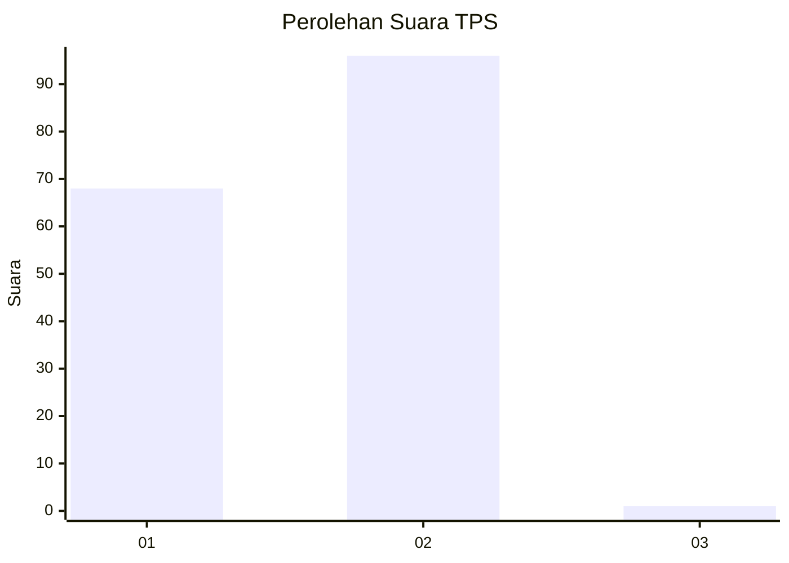
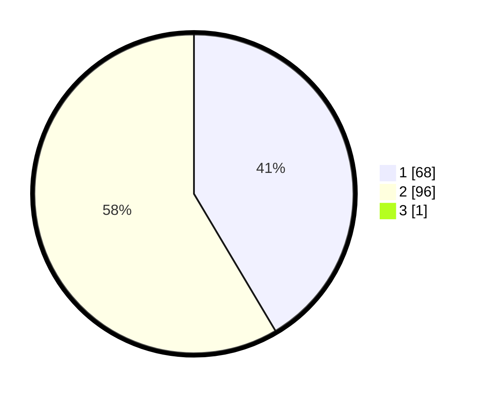

# Hasil

## Grafik

## Tabel

| No. | Nama Paslon    | Suara | Suara (raw) | Persentase |
|:--- |:-------------- | -----:| -----------:| ----------:|
| 1   | ANIES MUHAIMIN | 68    | [68][p-1]   | 41,21      |
| 2   | PRABOWO GIBRAN | 96    | [96][p-2]   | 58,18      |
| 3   | GANJAR MAHFUD  | 1     | [1][p-3]    | 0,61       |

[p-1]: https://github.com/gigit-pemilu/pemilu-2024-12-sumatera-utara/blob/main/pilpres/hitung-suara/sub/12-sumatera-utara/sub/20-padang-lawas-utara/sub/03-halongonan/sub/2002-hambulo/sub/001-tps/sub/paslon-1.txt
[p-2]: https://github.com/gigit-pemilu/pemilu-2024-12-sumatera-utara/blob/main/pilpres/hitung-suara/sub/12-sumatera-utara/sub/20-padang-lawas-utara/sub/03-halongonan/sub/2002-hambulo/sub/001-tps/sub/paslon-2.txt
[p-3]: https://github.com/gigit-pemilu/pemilu-2024-12-sumatera-utara/blob/main/pilpres/hitung-suara/sub/12-sumatera-utara/sub/20-padang-lawas-utara/sub/03-halongonan/sub/2002-hambulo/sub/001-tps/sub/paslon-3.txt

## Foto C Plano

https://sirekap-obj-formc.kpu.go.id/0522/pemilu/ppwp/12/20/03/20/02/1220032002001-20240215-023530--7cc854d1-d02f-422d-94a3-4576e5bd5d25.jpg

https://sirekap-obj-formc.kpu.go.id/0522/pemilu/ppwp/12/20/03/20/02/1220032002001-20240215-023700--cfa3571a-0add-4c56-98d2-8bbe71aac590.jpg

https://sirekap-obj-formc.kpu.go.id/0522/pemilu/ppwp/12/20/03/20/02/1220032002001-20240215-023900--0c3aa28d-b8b7-4f01-8cda-fad4534ede8a.jpg

## Metadata

| Key        | Value               |
| ---------- | ------------------- |
| Time Stamp | 2024-02-16 00:00:26 |

