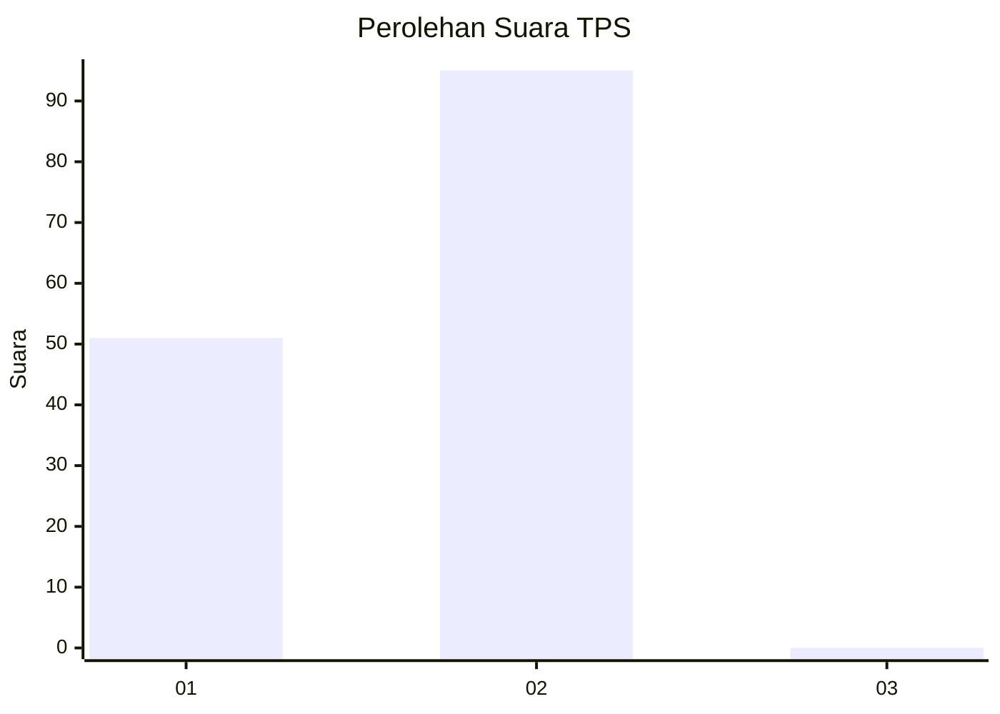
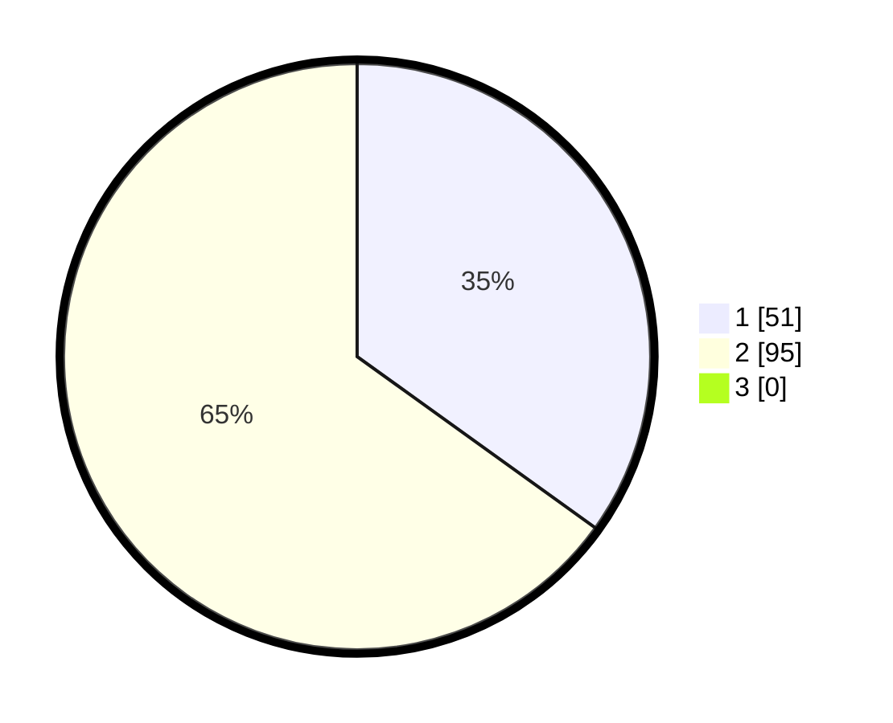

# Hasil

## Grafik

## Tabel

| No. | Nama Paslon    | Suara | Suara (raw) | Persentase |
|:--- |:-------------- | -----:| -----------:| ----------:|
| 1   | ANIES MUHAIMIN | 51    | [51][p-1]   | 34,93      |
| 2   | PRABOWO GIBRAN | 95    | [95][p-2]   | 65,07      |
| 3   | GANJAR MAHFUD  | 0     | [0][p-3]    | 0,00       |

[p-1]: https://github.com/gigit-pemilu/pemilu-2024/blob/main/pilpres/hitung-suara/sub/12-sumatera-utara/sub/20-padang-lawas-utara/sub/03-halongonan/sub/2002-hambulo/sub/002-tps/sub/paslon-1.txt
[p-2]: https://github.com/gigit-pemilu/pemilu-2024/blob/main/pilpres/hitung-suara/sub/12-sumatera-utara/sub/20-padang-lawas-utara/sub/03-halongonan/sub/2002-hambulo/sub/002-tps/sub/paslon-2.txt
[p-3]: https://github.com/gigit-pemilu/pemilu-2024/blob/main/pilpres/hitung-suara/sub/12-sumatera-utara/sub/20-padang-lawas-utara/sub/03-halongonan/sub/2002-hambulo/sub/002-tps/sub/paslon-3.txt

## Foto C Plano

https://sirekap-obj-formc.kpu.go.id/3856/pemilu/ppwp/12/20/03/20/02/1220032002002-20240214-231849--d024c886-2c17-41c0-b5ca-e5c8496bf5cd.jpg

https://sirekap-obj-formc.kpu.go.id/3856/pemilu/ppwp/12/20/03/20/02/1220032002002-20240214-232125--b30d9c6a-467d-45d5-96df-1b263542d05b.jpg

https://sirekap-obj-formc.kpu.go.id/3856/pemilu/ppwp/12/20/03/20/02/1220032002002-20240214-232040--c3fa00ce-23c4-4b7f-ae67-a77aaa962ea5.jpg

## Metadata

| Key        | Value               |
| ---------- | ------------------- |
| Time Stamp | 2024-02-15 23:29:50 |

