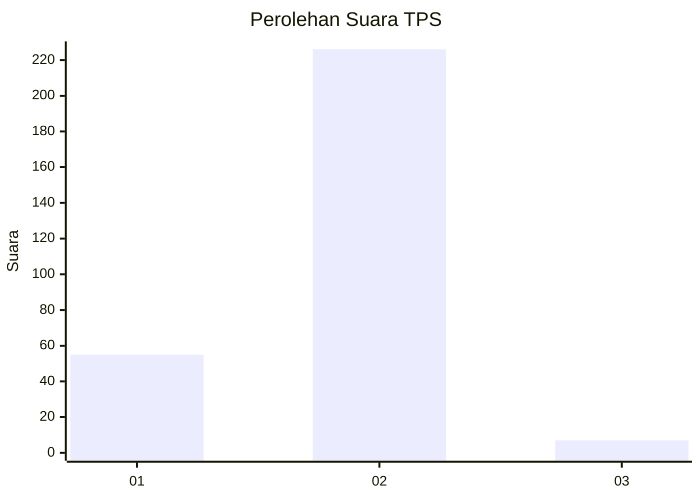
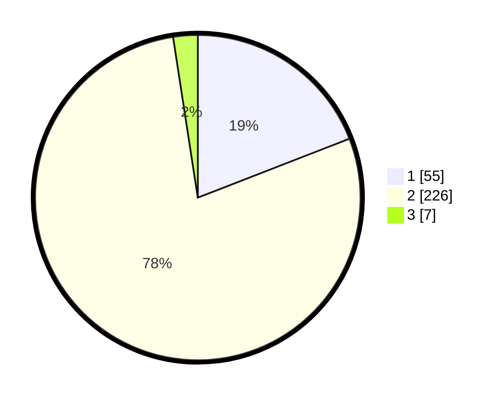

# Hasil

## Grafik

## Tabel

| No. | Nama Paslon    | Suara | Suara (raw) | Persentase |
|:--- |:-------------- | -----:| -----------:| ----------:|
| 1   | ANIES MUHAIMIN | 55    | [55][p-1]   | 19,10      |
| 2   | PRABOWO GIBRAN | 226   | [226][p-2]  | 78,47      |
| 3   | GANJAR MAHFUD  | 7     | [7][p-3]    | 2,43       |

[p-1]: https://github.com/gigit-pemilu/pemilu-2024/blob/main/pilpres/hitung-suara/sub/12-sumatera-utara/sub/20-padang-lawas-utara/sub/03-halongonan/sub/2010-siboru-angin/sub/001-tps/sub/paslon-1.txt
[p-2]: https://github.com/gigit-pemilu/pemilu-2024/blob/main/pilpres/hitung-suara/sub/12-sumatera-utara/sub/20-padang-lawas-utara/sub/03-halongonan/sub/2010-siboru-angin/sub/001-tps/sub/paslon-2.txt
[p-3]: https://github.com/gigit-pemilu/pemilu-2024/blob/main/pilpres/hitung-suara/sub/12-sumatera-utara/sub/20-padang-lawas-utara/sub/03-halongonan/sub/2010-siboru-angin/sub/001-tps/sub/paslon-3.txt

## Foto C Plano

https://sirekap-obj-formc.kpu.go.id/e185/pemilu/ppwp/12/20/03/20/10/1220032010001-20240217-161111--d0170422-2eb3-462d-9f6f-49f96d290709.jpg

https://sirekap-obj-formc.kpu.go.id/e185/pemilu/ppwp/12/20/03/20/10/1220032010001-20240217-161604--e748400f-2580-443a-935a-9692baa56872.jpg

https://sirekap-obj-formc.kpu.go.id/e185/pemilu/ppwp/12/20/03/20/10/1220032010001-20240217-163644--cb383f8d-60a5-4ef0-9160-b4a0c40c6658.jpg

## Metadata

| Key        | Value               |
| ---------- | ------------------- |
| Time Stamp | 2024-02-17 17:30:00 |

