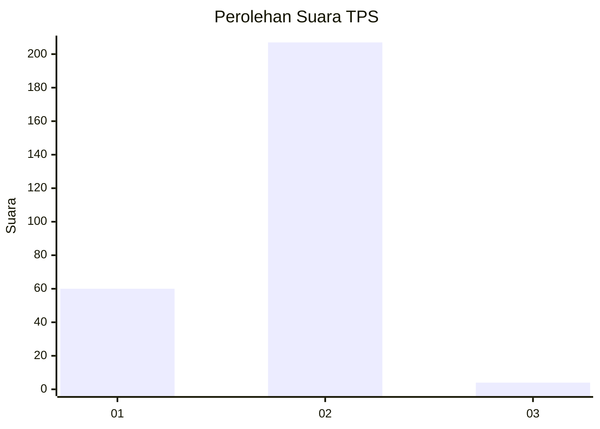
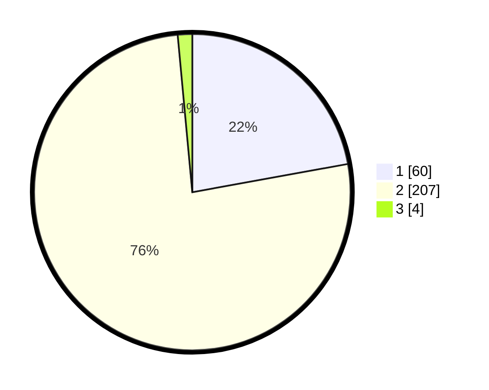

# Hasil

## Grafik

## Tabel

| No. | Nama Paslon    | Suara | Suara (raw) | Persentase |
|:--- |:-------------- | -----:| -----------:| ----------:|
| 1   | ANIES MUHAIMIN | 60    | [60][p-1]   | 22,14      |
| 2   | PRABOWO GIBRAN | 207   | [207][p-2]  | 76,38      |
| 3   | GANJAR MAHFUD  | 4     | [4][p-3]    | 1,48       |

[p-1]: https://github.com/gigit-pemilu/pemilu-2024-12-sumatera-utara/blob/main/pilpres/hitung-suara/sub/12-sumatera-utara/sub/20-padang-lawas-utara/sub/03-halongonan/sub/2010-siboru-angin/sub/002-tps/sub/paslon-1.txt
[p-2]: https://github.com/gigit-pemilu/pemilu-2024-12-sumatera-utara/blob/main/pilpres/hitung-suara/sub/12-sumatera-utara/sub/20-padang-lawas-utara/sub/03-halongonan/sub/2010-siboru-angin/sub/002-tps/sub/paslon-2.txt
[p-3]: https://github.com/gigit-pemilu/pemilu-2024-12-sumatera-utara/blob/main/pilpres/hitung-suara/sub/12-sumatera-utara/sub/20-padang-lawas-utara/sub/03-halongonan/sub/2010-siboru-angin/sub/002-tps/sub/paslon-3.txt

## Foto C Plano

https://sirekap-obj-formc.kpu.go.id/3215/pemilu/ppwp/12/20/03/20/10/1220032010002-20240217-164509--c77164e2-882a-4037-879c-1d283d962040.jpg

https://sirekap-obj-formc.kpu.go.id/3215/pemilu/ppwp/12/20/03/20/10/1220032010002-20240217-164615--a9de0c1d-f628-4a27-a048-554df6a33755.jpg

https://sirekap-obj-formc.kpu.go.id/3215/pemilu/ppwp/12/20/03/20/10/1220032010002-20240217-164808--450be5e3-bf7b-44c2-af2c-31da7f3bcbb6.jpg

## Metadata

| Key        | Value               |
| ---------- | ------------------- |
| Time Stamp | 2024-02-24 22:31:28 |

