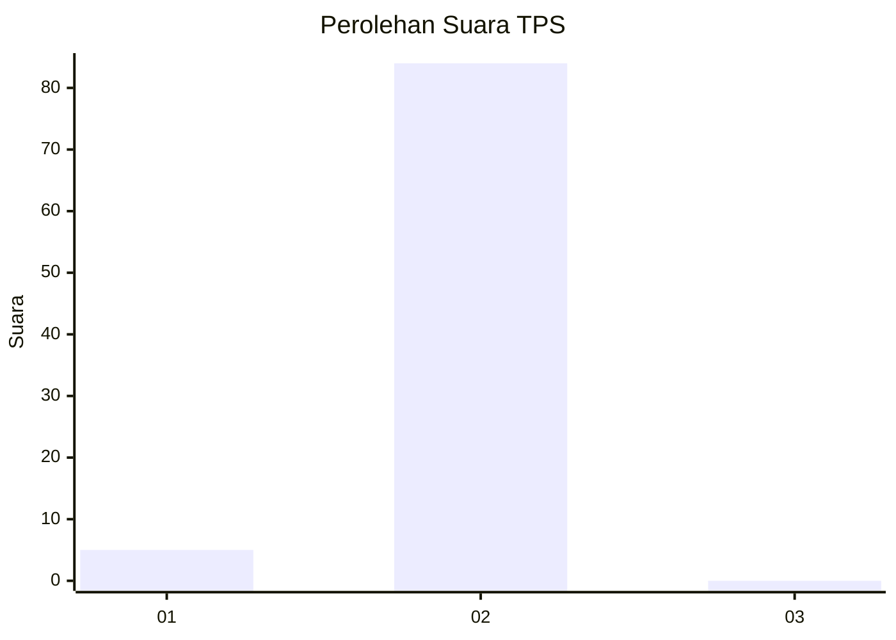
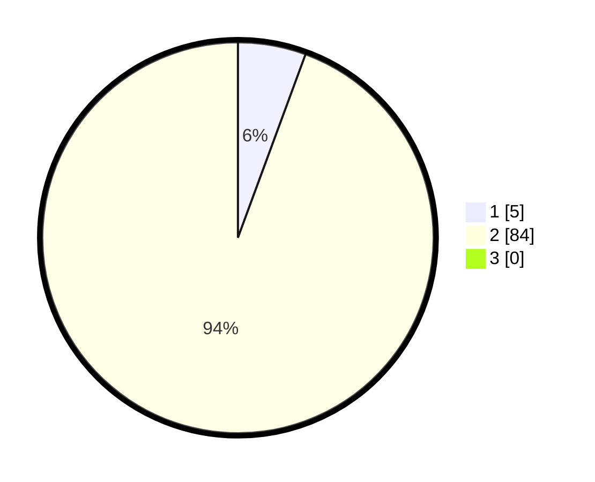

# Hasil

## Grafik

## Tabel

| No. | Nama Paslon    | Suara | Suara (raw) | Persentase |
|:--- |:-------------- | -----:| -----------:| ----------:|
| 1   | ANIES MUHAIMIN | 5     | [5][p-1]    | 5,62       |
| 2   | PRABOWO GIBRAN | 84    | [84][p-2]   | 94,38      |
| 3   | GANJAR MAHFUD  | 0     | [0][p-3]    | 0,00       |

[p-1]: https://github.com/gigit-pemilu/pemilu-2024/blob/main/pilpres/hitung-suara/sub/12-sumatera-utara/sub/20-padang-lawas-utara/sub/03-halongonan/sub/2013-sandean-julu/sub/001-tps/sub/paslon-1.txt
[p-2]: https://github.com/gigit-pemilu/pemilu-2024/blob/main/pilpres/hitung-suara/sub/12-sumatera-utara/sub/20-padang-lawas-utara/sub/03-halongonan/sub/2013-sandean-julu/sub/001-tps/sub/paslon-2.txt
[p-3]: https://github.com/gigit-pemilu/pemilu-2024/blob/main/pilpres/hitung-suara/sub/12-sumatera-utara/sub/20-padang-lawas-utara/sub/03-halongonan/sub/2013-sandean-julu/sub/001-tps/sub/paslon-3.txt

## Foto C Plano

https://sirekap-obj-formc.kpu.go.id/8640/pemilu/ppwp/12/20/03/20/13/1220032013001-20240218-163757--922484ad-eb0e-43e0-b849-dd68ade63259.jpg

https://sirekap-obj-formc.kpu.go.id/8640/pemilu/ppwp/12/20/03/20/13/1220032013001-20240218-163914--e7195561-772e-48f8-a84a-7cec793f6133.jpg

https://sirekap-obj-formc.kpu.go.id/8640/pemilu/ppwp/12/20/03/20/13/1220032013001-20240218-164041--1160c949-28f4-48d3-8b9f-8f6f196b07f4.jpg

## Metadata

| Key        | Value               |
| ---------- | ------------------- |
| Time Stamp | 2024-02-24 22:31:28 |

