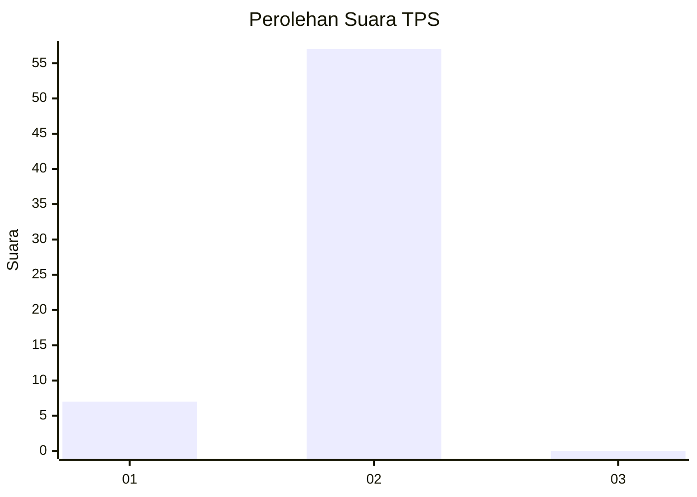
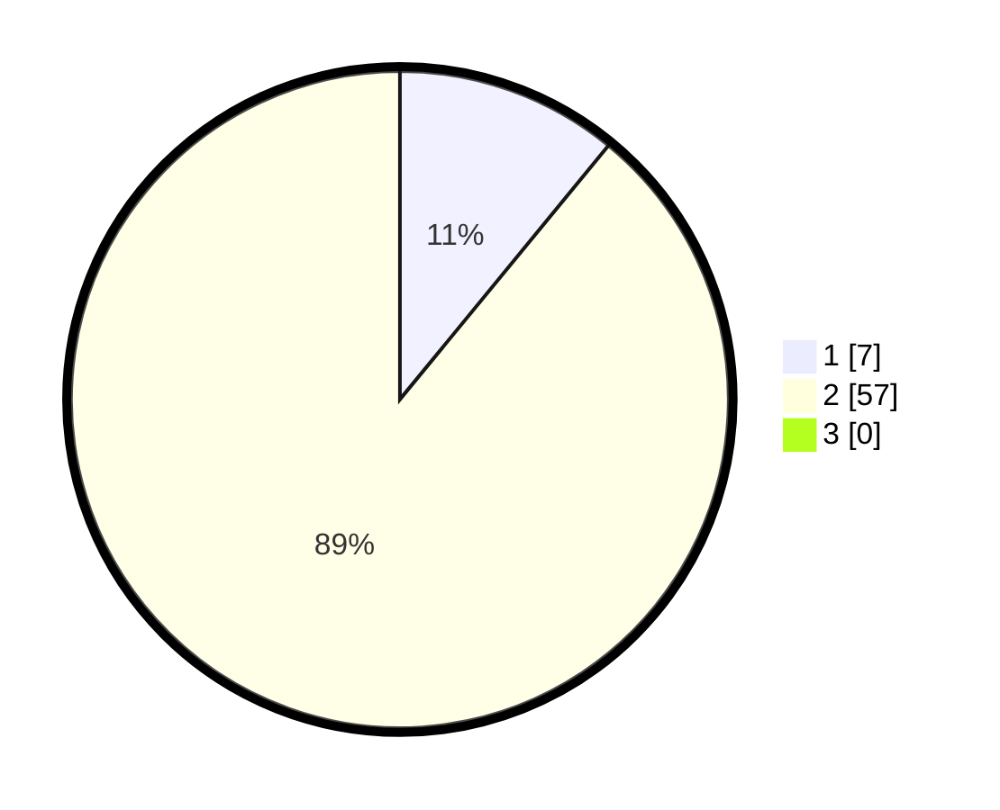

# Hasil

## Grafik

## Tabel

| No. | Nama Paslon    | Suara | Suara (raw) | Persentase |
|:--- |:-------------- | -----:| -----------:| ----------:|
| 1   | ANIES MUHAIMIN | 7     | [7][p-1]    | 10,94      |
| 2   | PRABOWO GIBRAN | 57    | [57][p-2]   | 89,06      |
| 3   | GANJAR MAHFUD  | 0     | [0][p-3]    | 0,00       |

[p-1]: https://github.com/gigit-pemilu/pemilu-2024/blob/main/pilpres/hitung-suara/sub/12-sumatera-utara/sub/20-padang-lawas-utara/sub/03-halongonan/sub/2014-hasahatan/sub/001-tps/sub/paslon-1.txt
[p-2]: https://github.com/gigit-pemilu/pemilu-2024/blob/main/pilpres/hitung-suara/sub/12-sumatera-utara/sub/20-padang-lawas-utara/sub/03-halongonan/sub/2014-hasahatan/sub/001-tps/sub/paslon-2.txt
[p-3]: https://github.com/gigit-pemilu/pemilu-2024/blob/main/pilpres/hitung-suara/sub/12-sumatera-utara/sub/20-padang-lawas-utara/sub/03-halongonan/sub/2014-hasahatan/sub/001-tps/sub/paslon-3.txt

## Foto C Plano

https://sirekap-obj-formc.kpu.go.id/5615/pemilu/ppwp/12/20/03/20/14/1220032014001-20240218-163020--e2897baa-587b-45b1-b18e-a93983a325eb.jpg

https://sirekap-obj-formc.kpu.go.id/5615/pemilu/ppwp/12/20/03/20/14/1220032014001-20240218-163131--200cfaaf-fbec-4a34-a8b0-c195e52d03b4.jpg

https://sirekap-obj-formc.kpu.go.id/5615/pemilu/ppwp/12/20/03/20/14/1220032014001-20240218-163254--b259bc79-bfb1-4212-b9fd-9d9b5894fa94.jpg

## Metadata

| Key        | Value               |
| ---------- | ------------------- |
| Time Stamp | 2024-02-24 22:31:28 |

