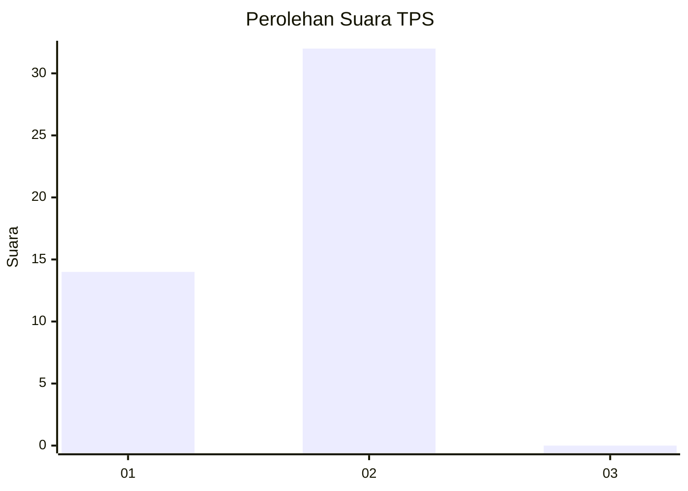
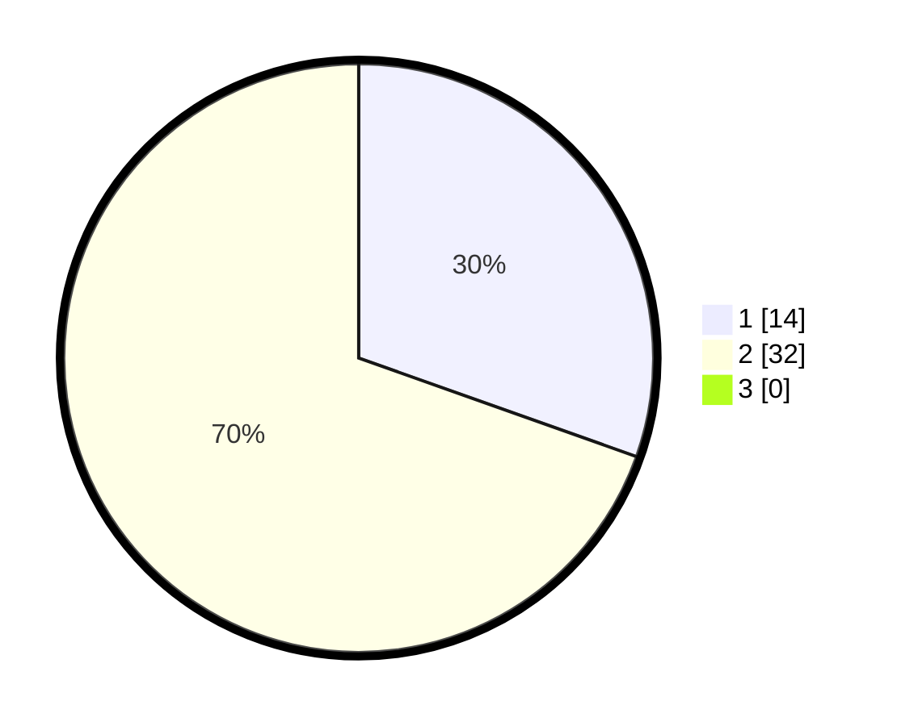

# Hasil

## Grafik

## Tabel

| No. | Nama Paslon    | Suara | Suara (raw) | Persentase |
|:--- |:-------------- | -----:| -----------:| ----------:|
| 1   | ANIES MUHAIMIN | 14    | [14][p-1]   | 30,43      |
| 2   | PRABOWO GIBRAN | 32    | [32][p-2]   | 69,57      |
| 3   | GANJAR MAHFUD  | 0     | [0][p-3]    | 0,00       |

[p-1]: https://github.com/gigit-pemilu/pemilu-2024/blob/main/pilpres/hitung-suara/sub/12-sumatera-utara/sub/20-padang-lawas-utara/sub/03-halongonan/sub/2018-halongonan/sub/001-tps/sub/paslon-1.txt
[p-2]: https://github.com/gigit-pemilu/pemilu-2024/blob/main/pilpres/hitung-suara/sub/12-sumatera-utara/sub/20-padang-lawas-utara/sub/03-halongonan/sub/2018-halongonan/sub/001-tps/sub/paslon-2.txt
[p-3]: https://github.com/gigit-pemilu/pemilu-2024/blob/main/pilpres/hitung-suara/sub/12-sumatera-utara/sub/20-padang-lawas-utara/sub/03-halongonan/sub/2018-halongonan/sub/001-tps/sub/paslon-3.txt

## Foto C Plano

https://sirekap-obj-formc.kpu.go.id/ec29/pemilu/ppwp/12/20/03/20/18/1220032018001-20240218-164227--199e9b86-7a56-498c-b7f7-daf9f2e1c06f.jpg

https://sirekap-obj-formc.kpu.go.id/ec29/pemilu/ppwp/12/20/03/20/18/1220032018001-20240218-164633--fb9e9bb3-7a8d-4f04-8a6f-5bc334f2de43.jpg

https://sirekap-obj-formc.kpu.go.id/ec29/pemilu/ppwp/12/20/03/20/18/1220032018001-20240218-165158--05e6f738-77e0-461d-acea-c7ab1cca6653.jpg

## Metadata

| Key        | Value               |
| ---------- | ------------------- |
| Time Stamp | 2024-02-25 00:00:00 |

