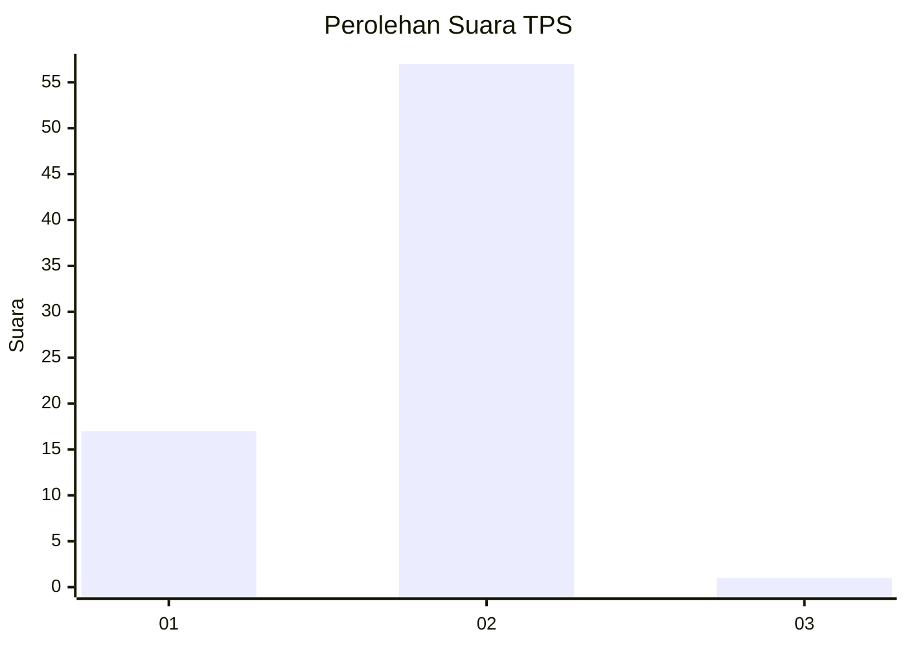
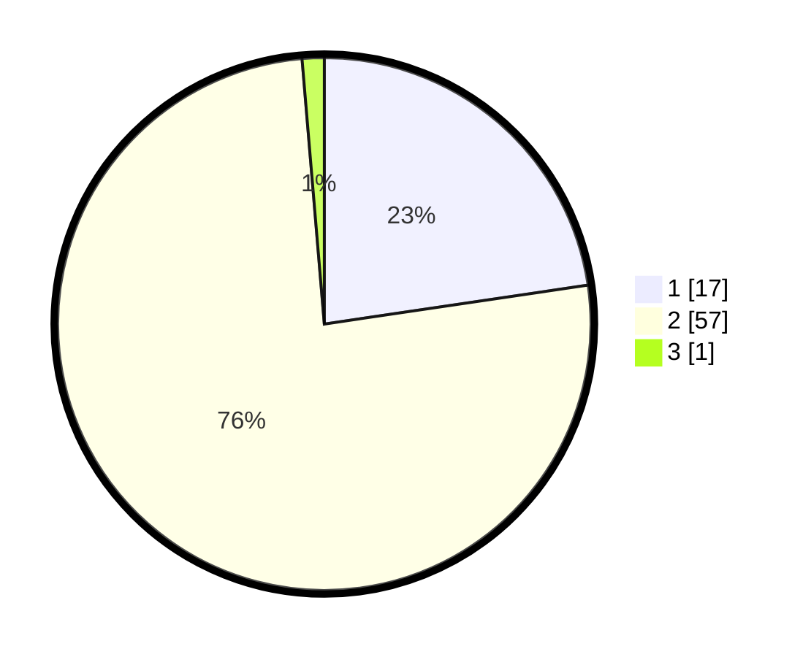

# Hasil

## Grafik

## Tabel

| No. | Nama Paslon    | Suara | Suara (raw) | Persentase |
|:--- |:-------------- | -----:| -----------:| ----------:|
| 1   | ANIES MUHAIMIN | 17    | [17][p-1]   | 22,67      |
| 2   | PRABOWO GIBRAN | 57    | [57][p-2]   | 76,00      |
| 3   | GANJAR MAHFUD  | 1     | [1][p-3]    | 1,33       |

[p-1]: https://github.com/gigit-pemilu/pemilu-2024-12-sumatera-utara/blob/main/pilpres/hitung-suara/sub/12-sumatera-utara/sub/20-padang-lawas-utara/sub/03-halongonan/sub/2037-saba/sub/001-tps/sub/paslon-1.txt
[p-2]: https://github.com/gigit-pemilu/pemilu-2024-12-sumatera-utara/blob/main/pilpres/hitung-suara/sub/12-sumatera-utara/sub/20-padang-lawas-utara/sub/03-halongonan/sub/2037-saba/sub/001-tps/sub/paslon-2.txt
[p-3]: https://github.com/gigit-pemilu/pemilu-2024-12-sumatera-utara/blob/main/pilpres/hitung-suara/sub/12-sumatera-utara/sub/20-padang-lawas-utara/sub/03-halongonan/sub/2037-saba/sub/001-tps/sub/paslon-3.txt

## Foto C Plano

https://sirekap-obj-formc.kpu.go.id/f4f1/pemilu/ppwp/12/20/03/20/37/1220032037001-20240219-133414--4d8c6562-6497-48ea-91e3-561c117d59cc.jpg

https://sirekap-obj-formc.kpu.go.id/f4f1/pemilu/ppwp/12/20/03/20/37/1220032037001-20240219-133524--d1ff9f8c-7e27-41d8-8a3b-f3fea2f9b0c5.jpg

https://sirekap-obj-formc.kpu.go.id/f4f1/pemilu/ppwp/12/20/03/20/37/1220032037001-20240219-133754--7531a015-9eec-42c9-91b4-f786d4d6f942.jpg

## Metadata

| Key        | Value               |
| ---------- | ------------------- |
| Time Stamp | 2024-02-19 14:00:00 |

