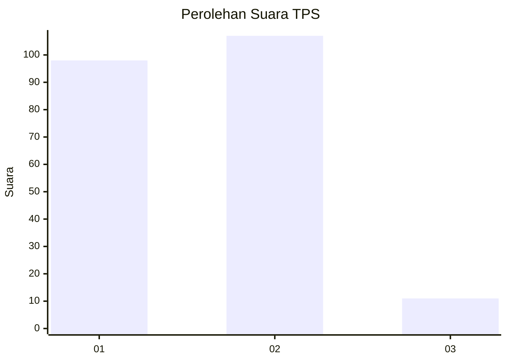
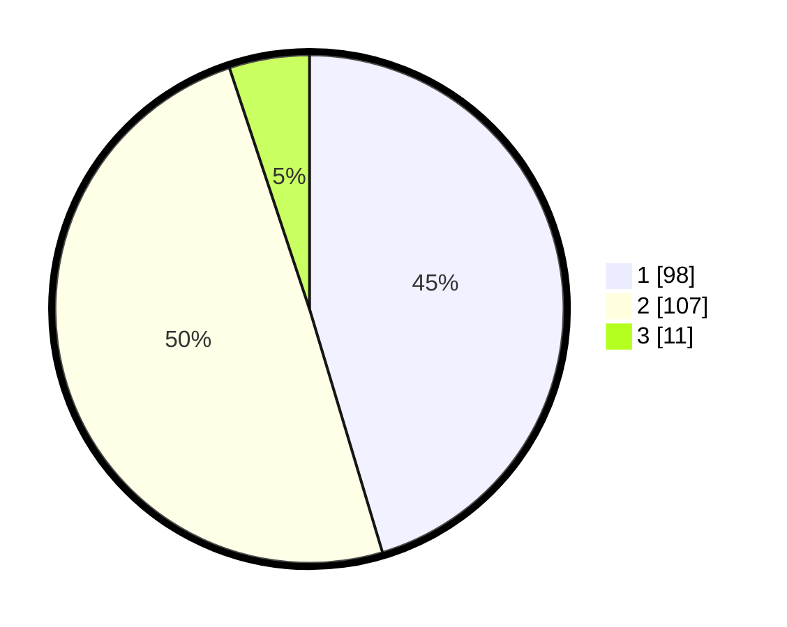

# Hasil

## Grafik

## Tabel

| No. | Nama Paslon    | Suara | Suara (raw) | Persentase |
|:--- |:-------------- | -----:| -----------:| ----------:|
| 1   | ANIES MUHAIMIN | 98    | [98][p-1]   | 45,37      |
| 2   | PRABOWO GIBRAN | 107   | [107][p-2]  | 49,54      |
| 3   | GANJAR MAHFUD  | 11    | [11][p-3]   | 5,09       |

[p-1]: https://github.com/gigit-pemilu/pemilu-2024-12-sumatera-utara/blob/main/pilpres/hitung-suara/sub/12-sumatera-utara/sub/20-padang-lawas-utara/sub/04-padang-bolak/sub/1001-pasar-gunung-tua/sub/005-tps/sub/paslon-1.txt
[p-2]: https://github.com/gigit-pemilu/pemilu-2024-12-sumatera-utara/blob/main/pilpres/hitung-suara/sub/12-sumatera-utara/sub/20-padang-lawas-utara/sub/04-padang-bolak/sub/1001-pasar-gunung-tua/sub/005-tps/sub/paslon-2.txt
[p-3]: https://github.com/gigit-pemilu/pemilu-2024-12-sumatera-utara/blob/main/pilpres/hitung-suara/sub/12-sumatera-utara/sub/20-padang-lawas-utara/sub/04-padang-bolak/sub/1001-pasar-gunung-tua/sub/005-tps/sub/paslon-3.txt

## Foto C Plano

https://sirekap-obj-formc.kpu.go.id/7457/pemilu/ppwp/12/20/04/10/01/1220041001005-20240215-020043--1057acec-1514-43b4-900f-6937a417b28e.jpg

https://sirekap-obj-formc.kpu.go.id/7457/pemilu/ppwp/12/20/04/10/01/1220041001005-20240215-015954--862dfd76-ba67-45b1-a6d0-8a9d15996fec.jpg

https://sirekap-obj-formc.kpu.go.id/7457/pemilu/ppwp/12/20/04/10/01/1220041001005-20240215-015810--35639a40-4e7d-4fed-b94e-b15b3de243ab.jpg

## Metadata

| Key        | Value               |
| ---------- | ------------------- |
| Time Stamp | 2024-02-15 18:00:26 |

