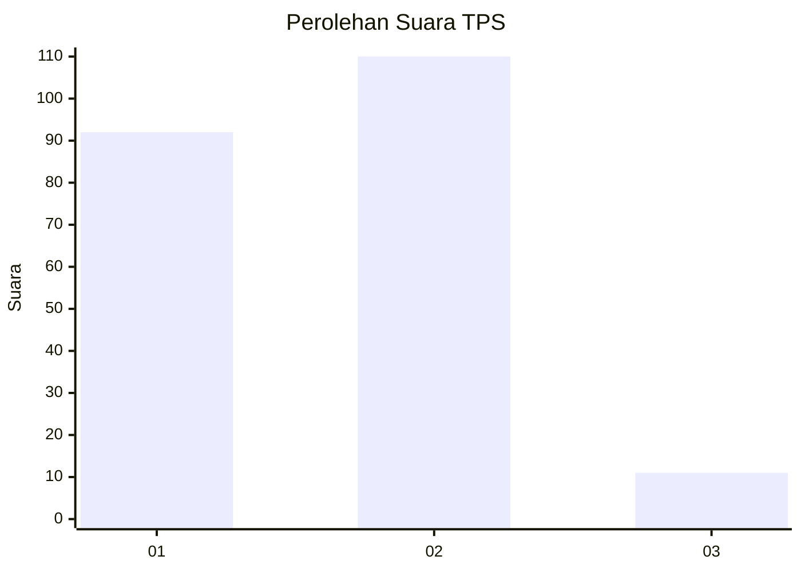
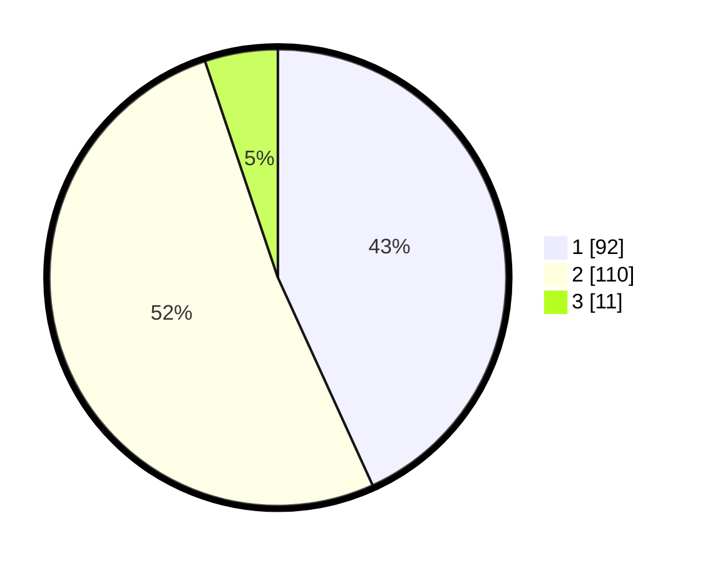

# Hasil

## Grafik

## Tabel

| No. | Nama Paslon    | Suara | Suara (raw) | Persentase |
|:--- |:-------------- | -----:| -----------:| ----------:|
| 1   | ANIES MUHAIMIN | 92    | [92][p-1]   | 43,19      |
| 2   | PRABOWO GIBRAN | 110   | [110][p-2]  | 51,64      |
| 3   | GANJAR MAHFUD  | 11    | [11][p-3]   | 5,16       |

[p-1]: https://github.com/gigit-pemilu/pemilu-2024/blob/main/pilpres/hitung-suara/sub/12-sumatera-utara/sub/20-padang-lawas-utara/sub/04-padang-bolak/sub/1001-pasar-gunung-tua/sub/008-tps/sub/paslon-1.txt
[p-2]: https://github.com/gigit-pemilu/pemilu-2024/blob/main/pilpres/hitung-suara/sub/12-sumatera-utara/sub/20-padang-lawas-utara/sub/04-padang-bolak/sub/1001-pasar-gunung-tua/sub/008-tps/sub/paslon-2.txt
[p-3]: https://github.com/gigit-pemilu/pemilu-2024/blob/main/pilpres/hitung-suara/sub/12-sumatera-utara/sub/20-padang-lawas-utara/sub/04-padang-bolak/sub/1001-pasar-gunung-tua/sub/008-tps/sub/paslon-3.txt

## Foto C Plano

https://sirekap-obj-formc.kpu.go.id/a40e/pemilu/ppwp/12/20/04/10/01/1220041001008-20240215-024838--a2d59038-4131-44a7-8b49-0512bcee15a2.jpg

https://sirekap-obj-formc.kpu.go.id/a40e/pemilu/ppwp/12/20/04/10/01/1220041001008-20240215-021356--32dc99c8-f71c-44e7-9bd2-32d670937bd8.jpg

https://sirekap-obj-formc.kpu.go.id/a40e/pemilu/ppwp/12/20/04/10/01/1220041001008-20240215-020643--48205203-05a7-4620-8f32-fc804d747a39.jpg

## Metadata

| Key        | Value               |
| ---------- | ------------------- |
| Time Stamp | 2024-02-15 22:30:27 |

