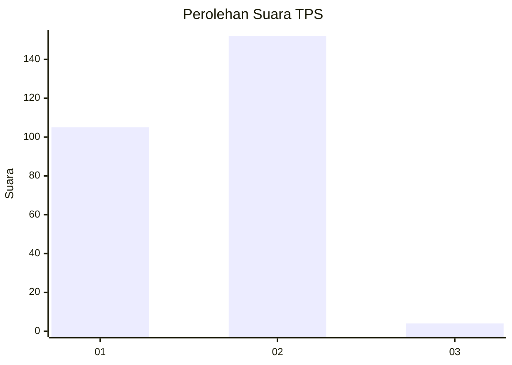
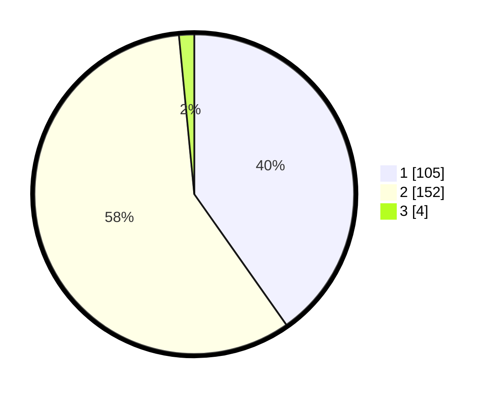

# Hasil

## Grafik

## Tabel

| No. | Nama Paslon    | Suara | Suara (raw) | Persentase |
|:--- |:-------------- | -----:| -----------:| ----------:|
| 1   | ANIES MUHAIMIN | 105   | [105][p-1]  | 40,23      |
| 2   | PRABOWO GIBRAN | 152   | [152][p-2]  | 58,24      |
| 3   | GANJAR MAHFUD  | 4     | [4][p-3]    | 1,53       |

[p-1]: https://github.com/gigit-pemilu/pemilu-2024/blob/main/pilpres/hitung-suara/sub/12-sumatera-utara/sub/20-padang-lawas-utara/sub/04-padang-bolak/sub/1001-pasar-gunung-tua/sub/009-tps/sub/paslon-1.txt
[p-2]: https://github.com/gigit-pemilu/pemilu-2024/blob/main/pilpres/hitung-suara/sub/12-sumatera-utara/sub/20-padang-lawas-utara/sub/04-padang-bolak/sub/1001-pasar-gunung-tua/sub/009-tps/sub/paslon-2.txt
[p-3]: https://github.com/gigit-pemilu/pemilu-2024/blob/main/pilpres/hitung-suara/sub/12-sumatera-utara/sub/20-padang-lawas-utara/sub/04-padang-bolak/sub/1001-pasar-gunung-tua/sub/009-tps/sub/paslon-3.txt

## Foto C Plano

https://sirekap-obj-formc.kpu.go.id/605b/pemilu/ppwp/12/20/04/10/01/1220041001009-20240215-030549--da332ae6-5d67-413a-a767-edb3aee560d4.jpg

https://sirekap-obj-formc.kpu.go.id/605b/pemilu/ppwp/12/20/04/10/01/1220041001009-20240215-030647--563e6d62-1470-41e2-91c8-16cbe8a88ee8.jpg

https://sirekap-obj-formc.kpu.go.id/605b/pemilu/ppwp/12/20/04/10/01/1220041001009-20240215-030748--7c8a365b-aed4-4d47-adb8-4a5c2111ae1a.jpg

## Metadata

| Key        | Value               |
| ---------- | ------------------- |
| Time Stamp | 2024-02-15 22:30:27 |

