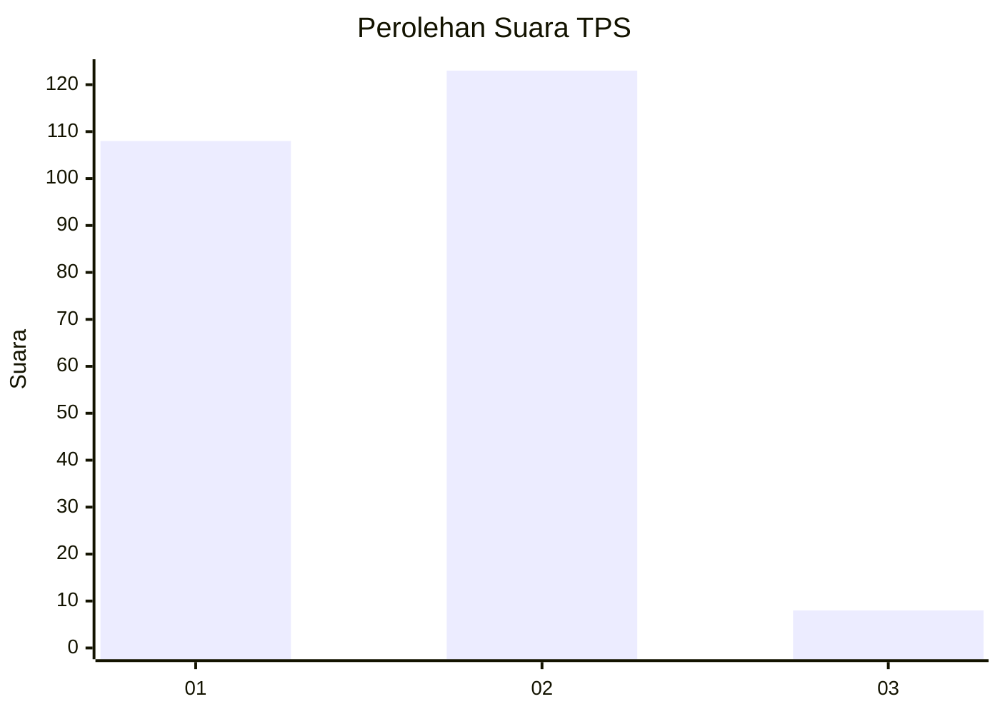
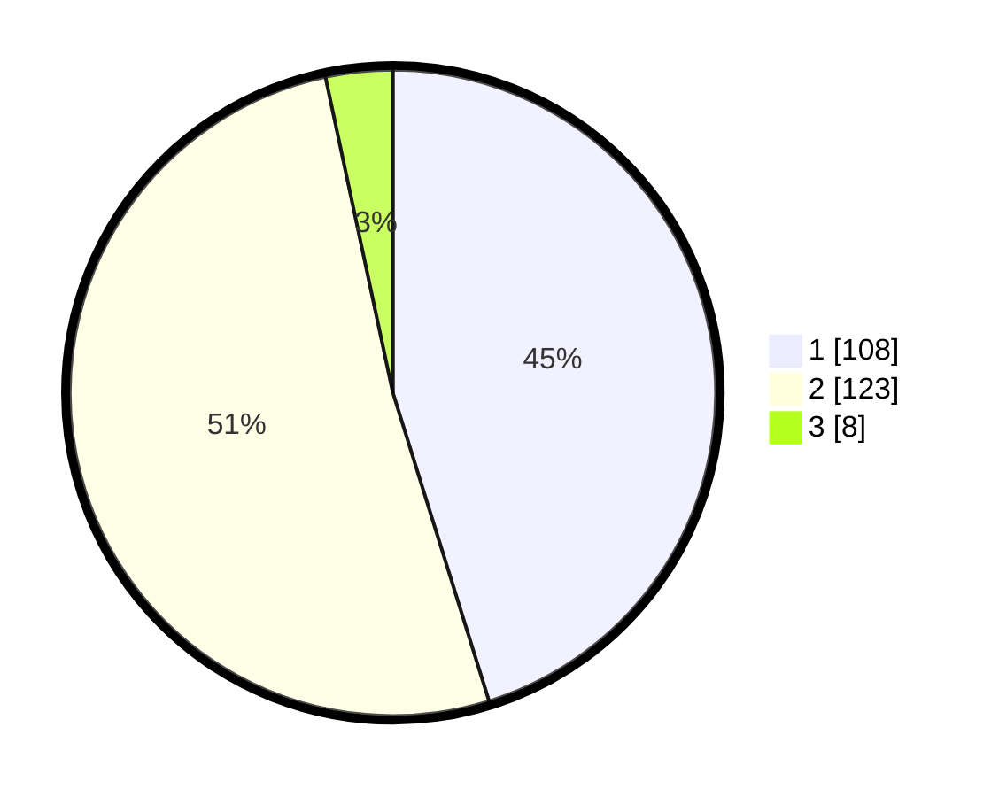

# Hasil

## Grafik

## Tabel

| No. | Nama Paslon    | Suara | Suara (raw) | Persentase |
|:--- |:-------------- | -----:| -----------:| ----------:|
| 1   | ANIES MUHAIMIN | 108   | [108][p-1]  | 45,19      |
| 2   | PRABOWO GIBRAN | 123   | [123][p-2]  | 51,46      |
| 3   | GANJAR MAHFUD  | 8     | [8][p-3]    | 3,35       |

[p-1]: https://github.com/gigit-pemilu/pemilu-2024-12-sumatera-utara/blob/main/pilpres/hitung-suara/sub/12-sumatera-utara/sub/20-padang-lawas-utara/sub/04-padang-bolak/sub/1001-pasar-gunung-tua/sub/010-tps/sub/paslon-1.txt
[p-2]: https://github.com/gigit-pemilu/pemilu-2024-12-sumatera-utara/blob/main/pilpres/hitung-suara/sub/12-sumatera-utara/sub/20-padang-lawas-utara/sub/04-padang-bolak/sub/1001-pasar-gunung-tua/sub/010-tps/sub/paslon-2.txt
[p-3]: https://github.com/gigit-pemilu/pemilu-2024-12-sumatera-utara/blob/main/pilpres/hitung-suara/sub/12-sumatera-utara/sub/20-padang-lawas-utara/sub/04-padang-bolak/sub/1001-pasar-gunung-tua/sub/010-tps/sub/paslon-3.txt

## Foto C Plano

https://sirekap-obj-formc.kpu.go.id/4e08/pemilu/ppwp/12/20/04/10/01/1220041001010-20240215-042457--f33ca143-16d0-4f5f-8733-d70da46ce795.jpg

https://sirekap-obj-formc.kpu.go.id/4e08/pemilu/ppwp/12/20/04/10/01/1220041001010-20240215-042541--bb45dabf-bfa2-4edb-b192-bc516c2b0e58.jpg

https://sirekap-obj-formc.kpu.go.id/4e08/pemilu/ppwp/12/20/04/10/01/1220041001010-20240215-042633--b6718eac-d6ab-43d1-ae26-cd4a02b3bb6c.jpg

## Metadata

| Key        | Value               |
| ---------- | ------------------- |
| Time Stamp | 2024-02-15 22:30:27 |

