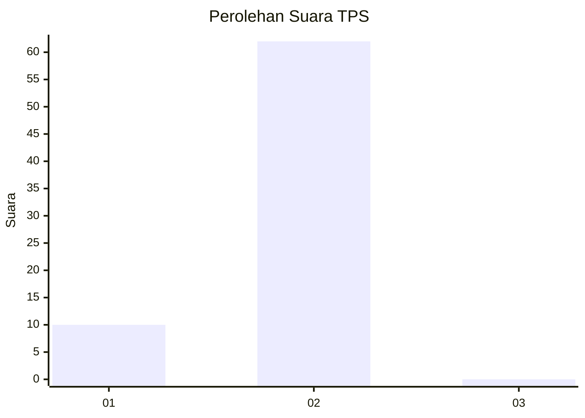
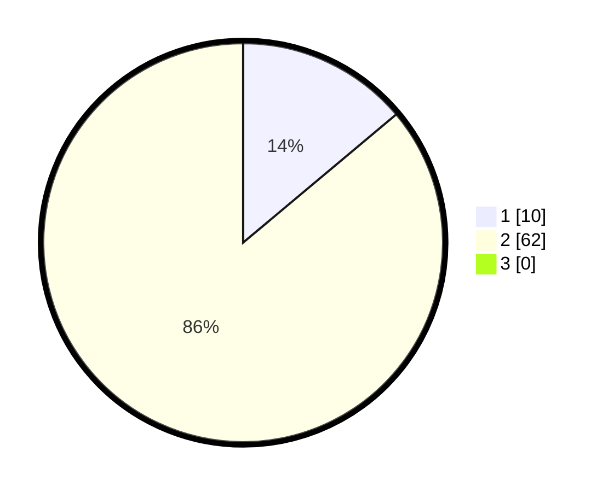

# Hasil

## Grafik

## Tabel

| No. | Nama Paslon    | Suara | Suara (raw) | Persentase |
|:--- |:-------------- | -----:| -----------:| ----------:|
| 1   | ANIES MUHAIMIN | 10    | [10][p-1]   | 13,89      |
| 2   | PRABOWO GIBRAN | 62    | [62][p-2]   | 86,11      |
| 3   | GANJAR MAHFUD  | 0     | [0][p-3]    | 0,00       |

[p-1]: https://github.com/gigit-pemilu/pemilu-2024-12-sumatera-utara/blob/main/pilpres/hitung-suara/sub/12-sumatera-utara/sub/20-padang-lawas-utara/sub/04-padang-bolak/sub/2015-rampa-jae/sub/001-tps/sub/paslon-1.txt
[p-2]: https://github.com/gigit-pemilu/pemilu-2024-12-sumatera-utara/blob/main/pilpres/hitung-suara/sub/12-sumatera-utara/sub/20-padang-lawas-utara/sub/04-padang-bolak/sub/2015-rampa-jae/sub/001-tps/sub/paslon-2.txt
[p-3]: https://github.com/gigit-pemilu/pemilu-2024-12-sumatera-utara/blob/main/pilpres/hitung-suara/sub/12-sumatera-utara/sub/20-padang-lawas-utara/sub/04-padang-bolak/sub/2015-rampa-jae/sub/001-tps/sub/paslon-3.txt

## Foto C Plano

https://sirekap-obj-formc.kpu.go.id/85cd/pemilu/ppwp/12/20/04/20/15/1220042015001-20240219-155130--38a9db00-74b3-42b1-bd51-f5027ec4a12c.jpg

https://sirekap-obj-formc.kpu.go.id/85cd/pemilu/ppwp/12/20/04/20/15/1220042015001-20240219-155633--abf9db56-331f-4471-94b0-d5d020e855a9.jpg

https://sirekap-obj-formc.kpu.go.id/85cd/pemilu/ppwp/12/20/04/20/15/1220042015001-20240219-155754--08578f18-ed53-4887-bc00-908b143b53ef.jpg

## Metadata

| Key        | Value               |
| ---------- | ------------------- |
| Time Stamp | 2024-02-25 15:00:00 |

