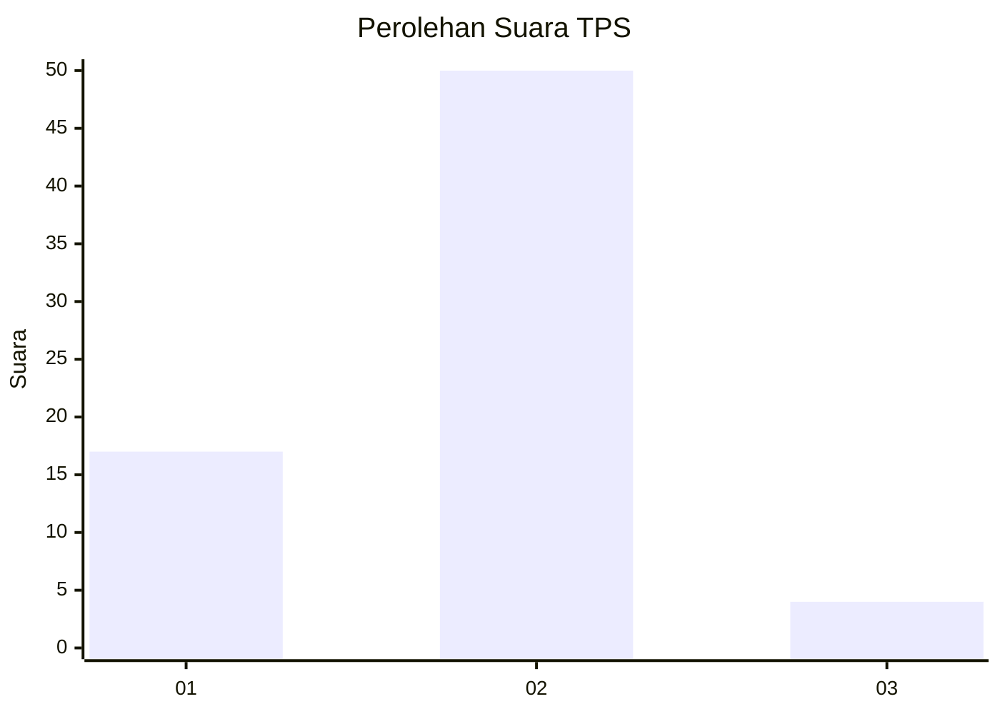
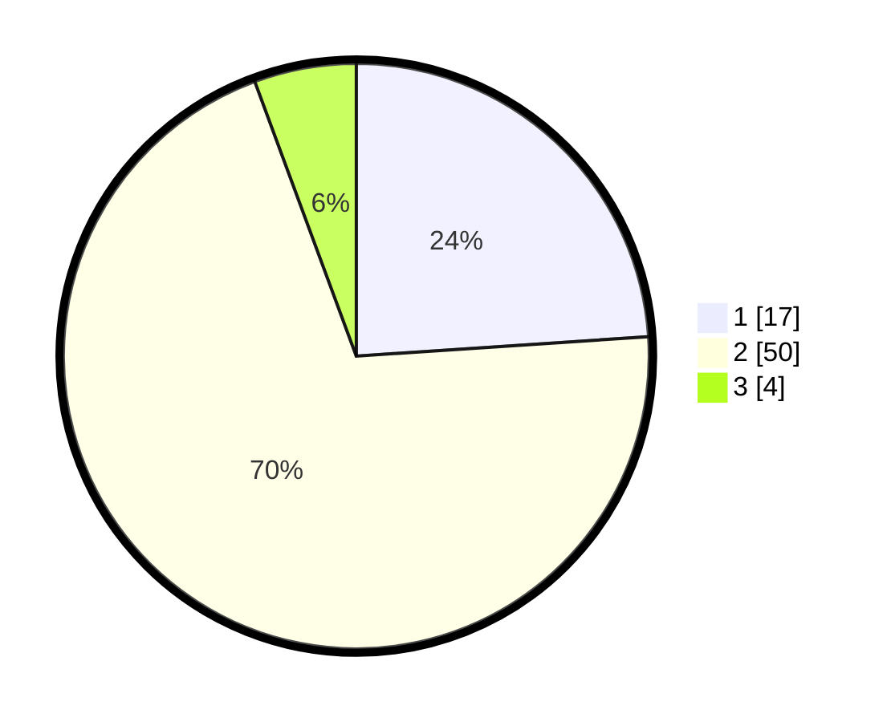

# Hasil

## Grafik

## Tabel

| No. | Nama Paslon    | Suara | Suara (raw) | Persentase |
|:--- |:-------------- | -----:| -----------:| ----------:|
| 1   | ANIES MUHAIMIN | 17    | [17][p-1]   | 23,94      |
| 2   | PRABOWO GIBRAN | 50    | [50][p-2]   | 70,42      |
| 3   | GANJAR MAHFUD  | 4     | [4][p-3]    | 5,63       |

[p-1]: https://github.com/gigit-pemilu/pemilu-2024/blob/main/pilpres/hitung-suara/sub/12-sumatera-utara/sub/20-padang-lawas-utara/sub/04-padang-bolak/sub/2017-mananti/sub/001-tps/sub/paslon-1.txt
[p-2]: https://github.com/gigit-pemilu/pemilu-2024/blob/main/pilpres/hitung-suara/sub/12-sumatera-utara/sub/20-padang-lawas-utara/sub/04-padang-bolak/sub/2017-mananti/sub/001-tps/sub/paslon-2.txt
[p-3]: https://github.com/gigit-pemilu/pemilu-2024/blob/main/pilpres/hitung-suara/sub/12-sumatera-utara/sub/20-padang-lawas-utara/sub/04-padang-bolak/sub/2017-mananti/sub/001-tps/sub/paslon-3.txt

## Foto C Plano

https://sirekap-obj-formc.kpu.go.id/8d9e/pemilu/ppwp/12/20/04/20/17/1220042017001-20240219-102533--ca3e5528-53d9-410d-b607-ce0236878173.jpg

https://sirekap-obj-formc.kpu.go.id/8d9e/pemilu/ppwp/12/20/04/20/17/1220042017001-20240219-102627--15a32bd9-011b-43b9-85ea-3ab32ce88ed8.jpg

https://sirekap-obj-formc.kpu.go.id/8d9e/pemilu/ppwp/12/20/04/20/17/1220042017001-20240219-102719--9a88225f-ce53-4482-8956-bca37b17ad1f.jpg

## Metadata

| Key        | Value               |
| ---------- | ------------------- |
| Time Stamp | 2024-02-25 00:00:00 |

