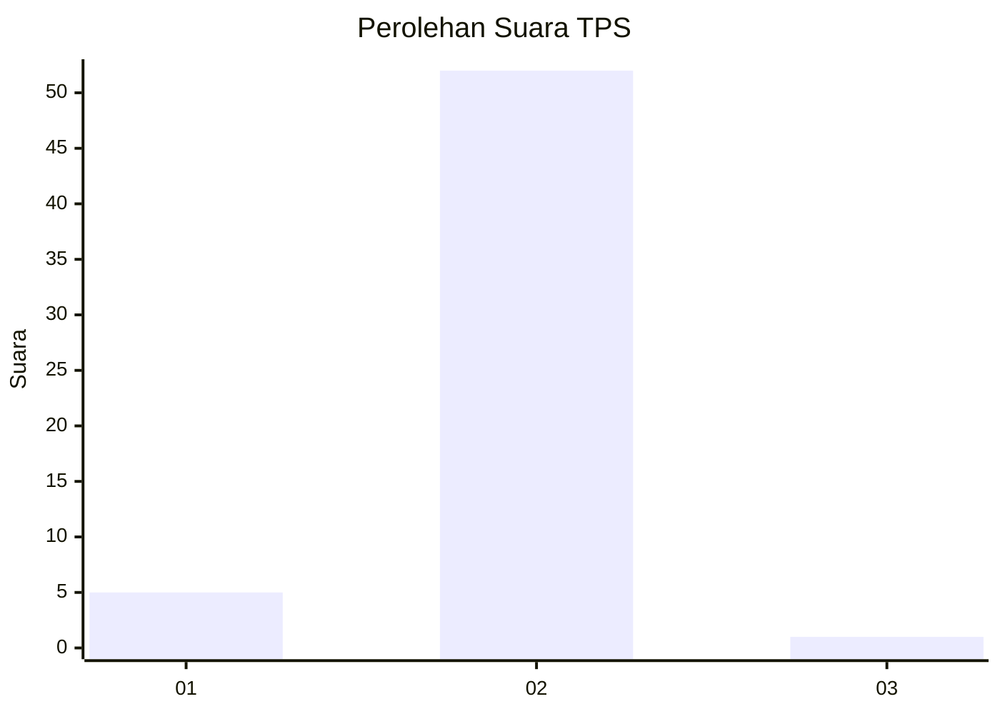
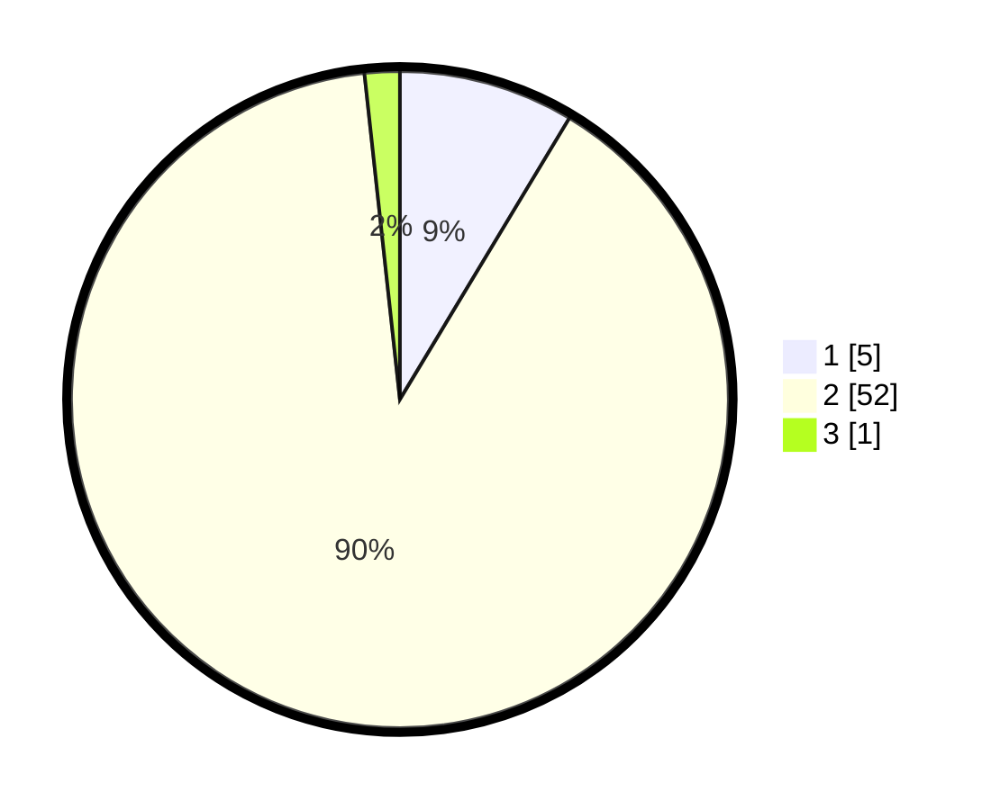

# Hasil

## Grafik

## Tabel

| No. | Nama Paslon    | Suara | Suara (raw) | Persentase |
|:--- |:-------------- | -----:| -----------:| ----------:|
| 1   | ANIES MUHAIMIN | 5     | [5][p-1]    | 8,62       |
| 2   | PRABOWO GIBRAN | 52    | [52][p-2]   | 89,66      |
| 3   | GANJAR MAHFUD  | 1     | [1][p-3]    | 1,72       |

[p-1]: https://github.com/gigit-pemilu/pemilu-2024-12-sumatera-utara/blob/main/pilpres/hitung-suara/sub/12-sumatera-utara/sub/20-padang-lawas-utara/sub/04-padang-bolak/sub/2020-botung/sub/001-tps/sub/paslon-1.txt
[p-2]: https://github.com/gigit-pemilu/pemilu-2024-12-sumatera-utara/blob/main/pilpres/hitung-suara/sub/12-sumatera-utara/sub/20-padang-lawas-utara/sub/04-padang-bolak/sub/2020-botung/sub/001-tps/sub/paslon-2.txt
[p-3]: https://github.com/gigit-pemilu/pemilu-2024-12-sumatera-utara/blob/main/pilpres/hitung-suara/sub/12-sumatera-utara/sub/20-padang-lawas-utara/sub/04-padang-bolak/sub/2020-botung/sub/001-tps/sub/paslon-3.txt

## Foto C Plano

https://sirekap-obj-formc.kpu.go.id/85c6/pemilu/ppwp/12/20/04/20/20/1220042020001-20240218-153541--9159b1c7-bdea-49c6-87cc-1e49c2de9fb4.jpg

https://sirekap-obj-formc.kpu.go.id/85c6/pemilu/ppwp/12/20/04/20/20/1220042020001-20240218-153608--a4727740-877d-417b-9327-34f0e0f5b45e.jpg

https://sirekap-obj-formc.kpu.go.id/85c6/pemilu/ppwp/12/20/04/20/20/1220042020001-20240218-153659--815ff136-d996-427a-9300-dfe31420fe1a.jpg

## Metadata

| Key        | Value               |
| ---------- | ------------------- |
| Time Stamp | 2024-02-25 22:00:00 |

