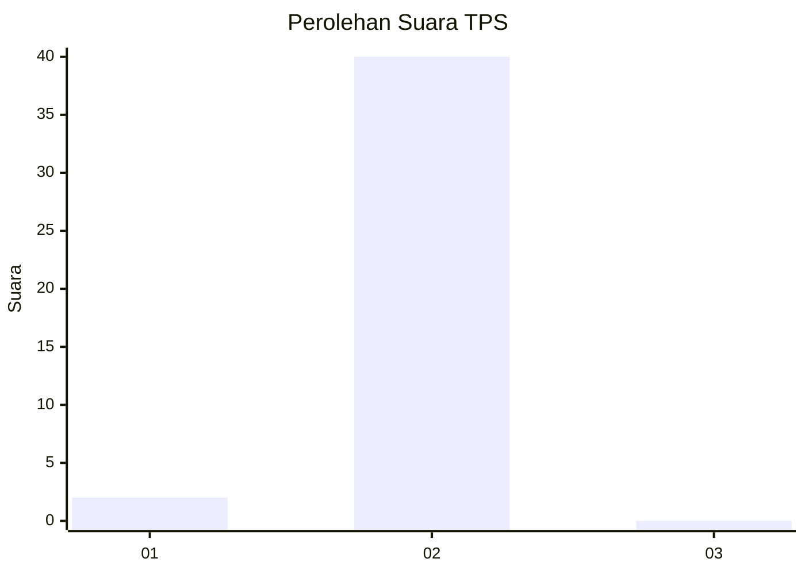
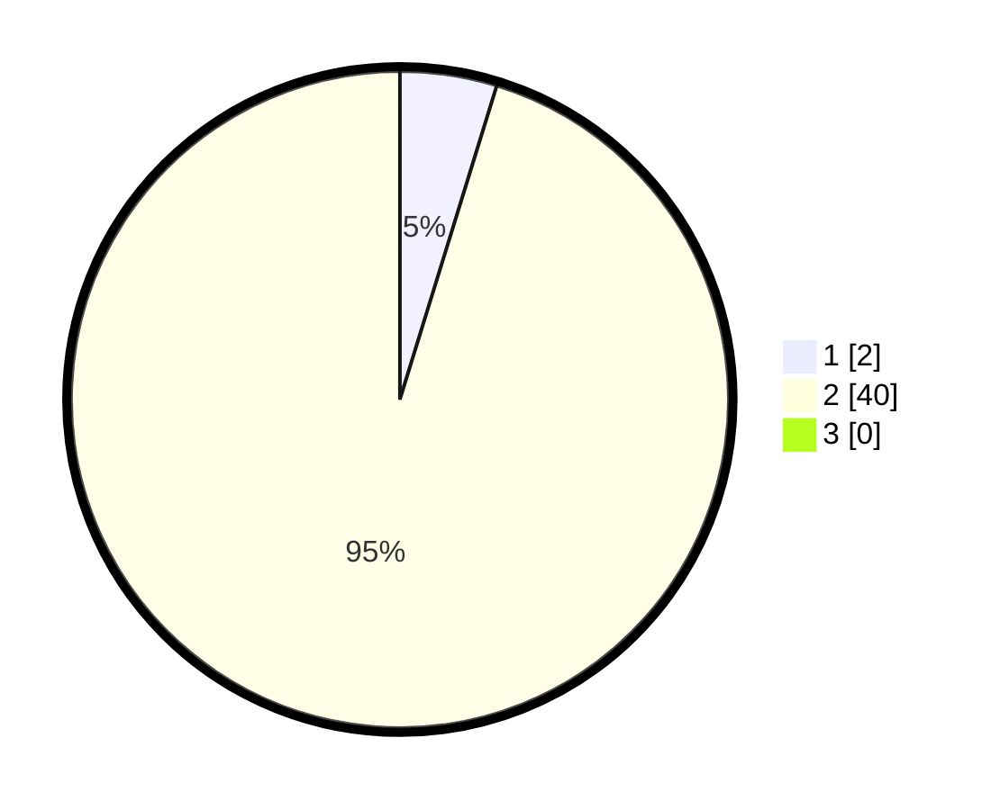

# Hasil

## Grafik

## Tabel

| No. | Nama Paslon    | Suara | Suara (raw) | Persentase |
|:--- |:-------------- | -----:| -----------:| ----------:|
| 1   | ANIES MUHAIMIN | 2     | [2][p-1]    | 4,76       |
| 2   | PRABOWO GIBRAN | 40    | [40][p-2]   | 95,24      |
| 3   | GANJAR MAHFUD  | 0     | [0][p-3]    | 0,00       |

[p-1]: https://github.com/gigit-pemilu/pemilu-2024-12-sumatera-utara/blob/main/pilpres/hitung-suara/sub/12-sumatera-utara/sub/20-padang-lawas-utara/sub/04-padang-bolak/sub/2027-batu-mamak/sub/001-tps/sub/paslon-1.txt
[p-2]: https://github.com/gigit-pemilu/pemilu-2024-12-sumatera-utara/blob/main/pilpres/hitung-suara/sub/12-sumatera-utara/sub/20-padang-lawas-utara/sub/04-padang-bolak/sub/2027-batu-mamak/sub/001-tps/sub/paslon-2.txt
[p-3]: https://github.com/gigit-pemilu/pemilu-2024-12-sumatera-utara/blob/main/pilpres/hitung-suara/sub/12-sumatera-utara/sub/20-padang-lawas-utara/sub/04-padang-bolak/sub/2027-batu-mamak/sub/001-tps/sub/paslon-3.txt

## Foto C Plano

https://sirekap-obj-formc.kpu.go.id/cdd6/pemilu/ppwp/12/20/04/20/27/1220042027001-20240218-143302--f9ac1962-819a-41de-a388-9a3305157cf8.jpg

https://sirekap-obj-formc.kpu.go.id/cdd6/pemilu/ppwp/12/20/04/20/27/1220042027001-20240218-143457--11afc7ea-9c65-4e75-a2ad-ba3fa437de50.jpg

https://sirekap-obj-formc.kpu.go.id/cdd6/pemilu/ppwp/12/20/04/20/27/1220042027001-20240218-143541--33873e5f-501e-4a26-a4e3-5558815c700a.jpg

## Metadata

| Key        | Value               |
| ---------- | ------------------- |
| Time Stamp | 2024-02-24 22:31:28 |

