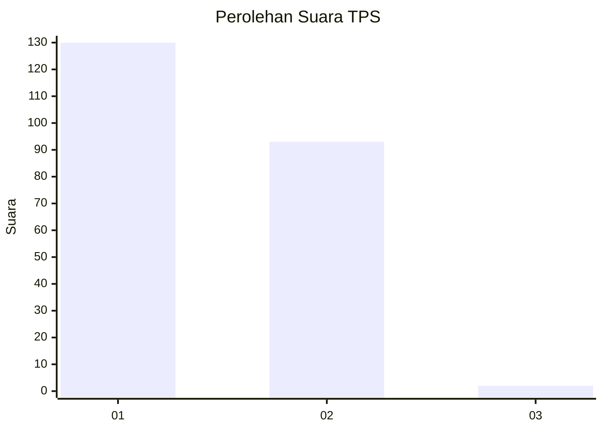
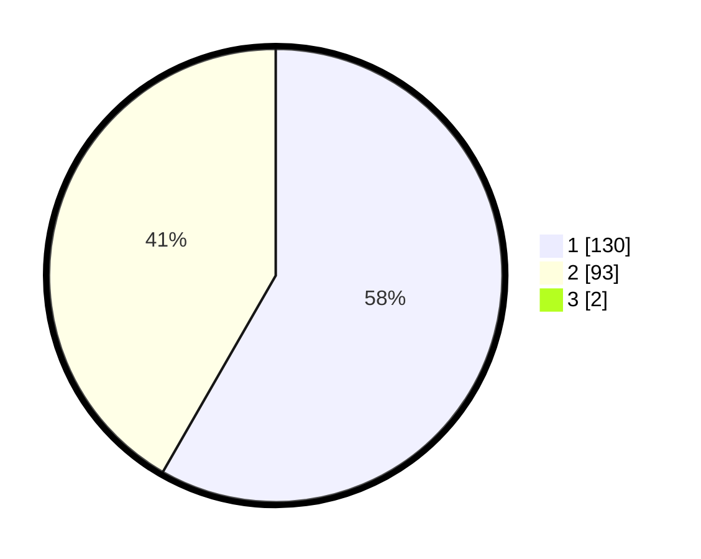

# Hasil

## Grafik

## Tabel

| No. | Nama Paslon    | Suara | Suara (raw) | Persentase |
|:--- |:-------------- | -----:| -----------:| ----------:|
| 1   | ANIES MUHAIMIN | 130   | [130][p-1]  | 57,78      |
| 2   | PRABOWO GIBRAN | 93    | [93][p-2]   | 41,33      |
| 3   | GANJAR MAHFUD  | 2     | [2][p-3]    | 0,89       |

[p-1]: https://github.com/gigit-pemilu/pemilu-2024/blob/main/pilpres/hitung-suara/sub/12-sumatera-utara/sub/20-padang-lawas-utara/sub/04-padang-bolak/sub/2065-saba-sitahul-tahul/sub/004-tps/sub/paslon-1.txt
[p-2]: https://github.com/gigit-pemilu/pemilu-2024/blob/main/pilpres/hitung-suara/sub/12-sumatera-utara/sub/20-padang-lawas-utara/sub/04-padang-bolak/sub/2065-saba-sitahul-tahul/sub/004-tps/sub/paslon-2.txt
[p-3]: https://github.com/gigit-pemilu/pemilu-2024/blob/main/pilpres/hitung-suara/sub/12-sumatera-utara/sub/20-padang-lawas-utara/sub/04-padang-bolak/sub/2065-saba-sitahul-tahul/sub/004-tps/sub/paslon-3.txt

## Foto C Plano

https://sirekap-obj-formc.kpu.go.id/a6c3/pemilu/ppwp/12/20/04/20/65/1220042065004-20240215-034635--ca7d4ca2-73f4-435f-a2b7-9e229e47b4b5.jpg

https://sirekap-obj-formc.kpu.go.id/a6c3/pemilu/ppwp/12/20/04/20/65/1220042065004-20240215-032839--6623c2cf-8b08-415a-89c3-fd6d2a5aaead.jpg

https://sirekap-obj-formc.kpu.go.id/a6c3/pemilu/ppwp/12/20/04/20/65/1220042065004-20240215-033015--da9d9370-e71f-459b-a00c-c40e36049985.jpg

## Metadata

| Key        | Value               |
| ---------- | ------------------- |
| Time Stamp | 2024-02-15 23:29:50 |

