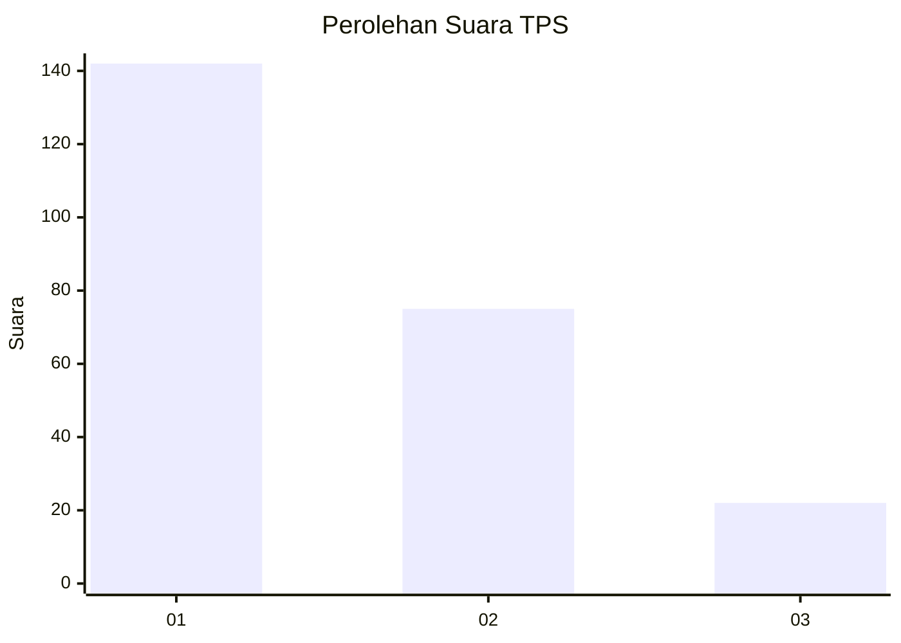
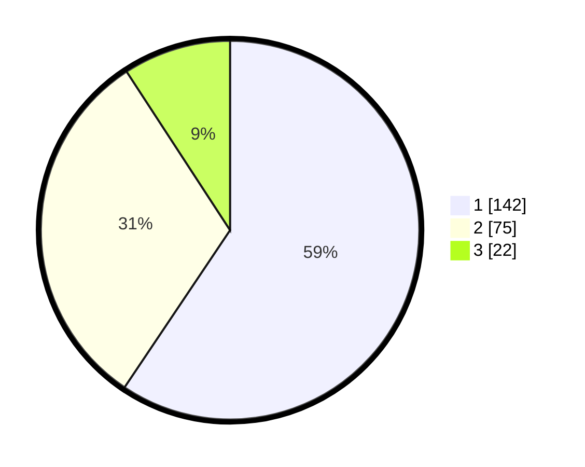

# Hasil

## Grafik

## Tabel

| No. | Nama Paslon    | Suara | Suara (raw) | Persentase |
|:--- |:-------------- | -----:| -----------:| ----------:|
| 1   | ANIES MUHAIMIN | 142   | [142][p-1]  | 59,41      |
| 2   | PRABOWO GIBRAN | 75    | [75][p-2]   | 31,38      |
| 3   | GANJAR MAHFUD  | 22    | [22][p-3]   | 9,21       |

[p-1]: https://github.com/gigit-pemilu/pemilu-2024-12-sumatera-utara/blob/main/pilpres/hitung-suara/sub/12-sumatera-utara/sub/20-padang-lawas-utara/sub/04-padang-bolak/sub/2067-sidingkat/sub/001-tps/sub/paslon-1.txt
[p-2]: https://github.com/gigit-pemilu/pemilu-2024-12-sumatera-utara/blob/main/pilpres/hitung-suara/sub/12-sumatera-utara/sub/20-padang-lawas-utara/sub/04-padang-bolak/sub/2067-sidingkat/sub/001-tps/sub/paslon-2.txt
[p-3]: https://github.com/gigit-pemilu/pemilu-2024-12-sumatera-utara/blob/main/pilpres/hitung-suara/sub/12-sumatera-utara/sub/20-padang-lawas-utara/sub/04-padang-bolak/sub/2067-sidingkat/sub/001-tps/sub/paslon-3.txt

## Foto C Plano

https://sirekap-obj-formc.kpu.go.id/5f69/pemilu/ppwp/12/20/04/20/67/1220042067001-20240215-054614--15b2f6a9-f63e-4530-b609-317846f6ebb8.jpg

https://sirekap-obj-formc.kpu.go.id/5f69/pemilu/ppwp/12/20/04/20/67/1220042067001-20240215-054728--7e40c0ee-1b69-432b-8788-027351ce1545.jpg

https://sirekap-obj-formc.kpu.go.id/5f69/pemilu/ppwp/12/20/04/20/67/1220042067001-20240215-054812--bc43f2ed-5693-4dc9-bf61-7c639d8dc202.jpg

## Metadata

| Key        | Value               |
| ---------- | ------------------- |
| Time Stamp | 2024-02-16 10:00:28 |

