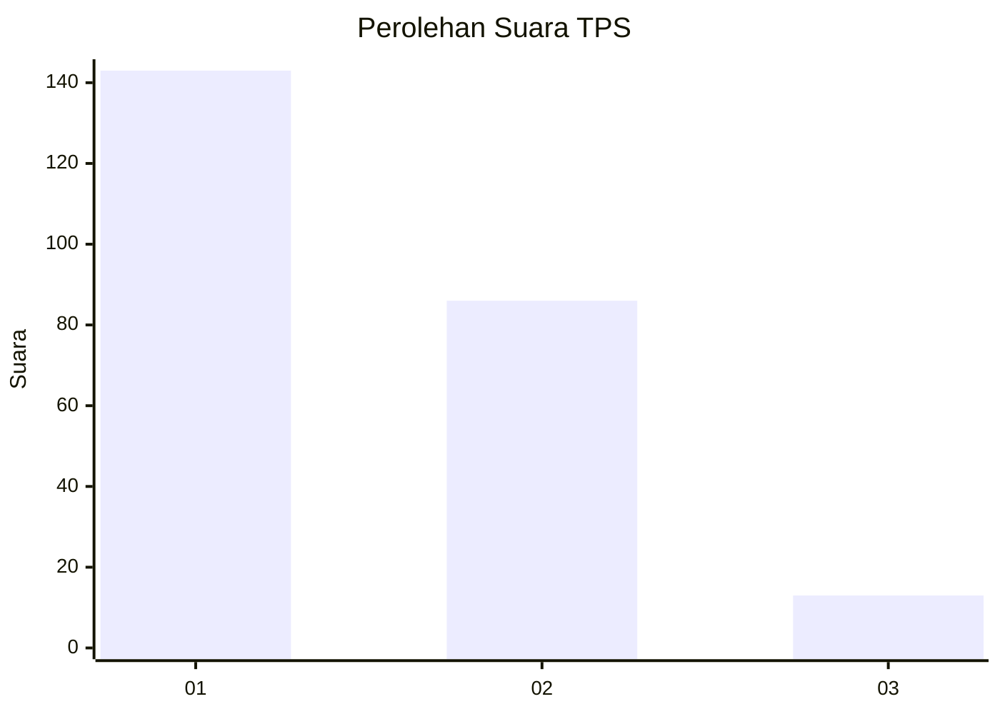
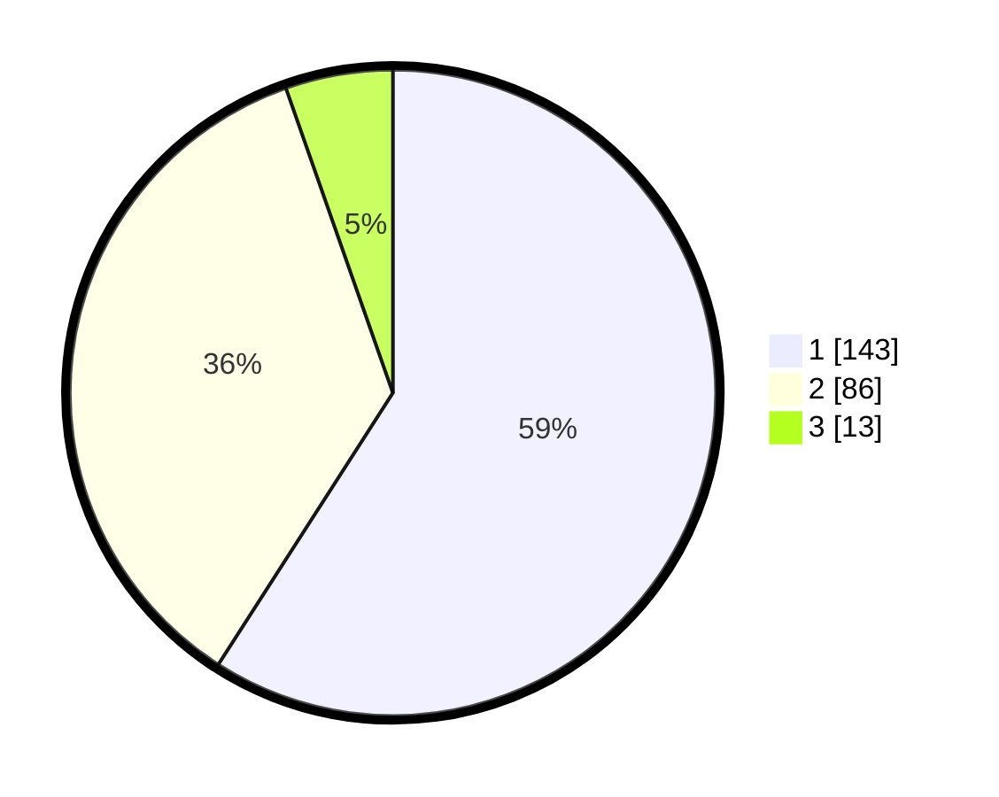

# Hasil

## Grafik

## Tabel

| No. | Nama Paslon    | Suara | Suara (raw) | Persentase |
|:--- |:-------------- | -----:| -----------:| ----------:|
| 1   | ANIES MUHAIMIN | 143   | [143][p-1]  | 59,09      |
| 2   | PRABOWO GIBRAN | 86    | [86][p-2]   | 35,54      |
| 3   | GANJAR MAHFUD  | 13    | [13][p-3]   | 5,37       |

[p-1]: https://github.com/gigit-pemilu/pemilu-2024-12-sumatera-utara/blob/main/pilpres/hitung-suara/sub/12-sumatera-utara/sub/20-padang-lawas-utara/sub/04-padang-bolak/sub/2067-sidingkat/sub/002-tps/sub/paslon-1.txt
[p-2]: https://github.com/gigit-pemilu/pemilu-2024-12-sumatera-utara/blob/main/pilpres/hitung-suara/sub/12-sumatera-utara/sub/20-padang-lawas-utara/sub/04-padang-bolak/sub/2067-sidingkat/sub/002-tps/sub/paslon-2.txt
[p-3]: https://github.com/gigit-pemilu/pemilu-2024-12-sumatera-utara/blob/main/pilpres/hitung-suara/sub/12-sumatera-utara/sub/20-padang-lawas-utara/sub/04-padang-bolak/sub/2067-sidingkat/sub/002-tps/sub/paslon-3.txt

## Foto C Plano

https://sirekap-obj-formc.kpu.go.id/6bd2/pemilu/ppwp/12/20/04/20/67/1220042067002-20240218-101226--99ec6dd8-0826-494d-93d2-b1a17f971307.jpg

https://sirekap-obj-formc.kpu.go.id/6bd2/pemilu/ppwp/12/20/04/20/67/1220042067002-20240218-101300--299ef4c1-f535-45f6-9c92-04a7f9e3a8d0.jpg

https://sirekap-obj-formc.kpu.go.id/6bd2/pemilu/ppwp/12/20/04/20/67/1220042067002-20240218-101909--aa7a7fd8-4fb6-4b01-8285-2929464f0ba2.jpg

## Metadata

| Key        | Value               |
| ---------- | ------------------- |
| Time Stamp | 2024-02-24 22:31:28 |

