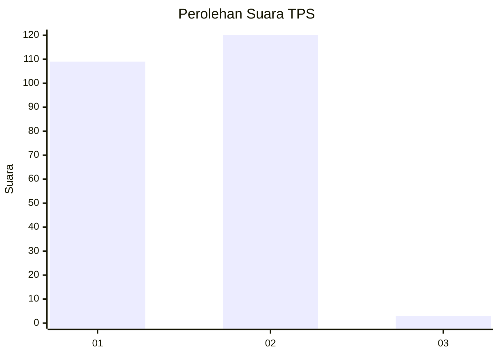
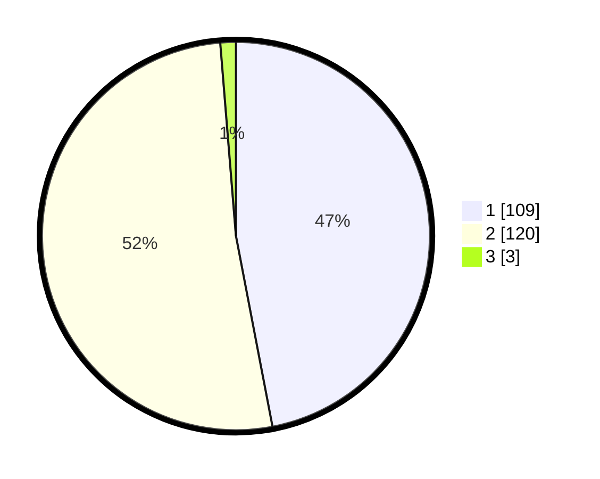

# Hasil

## Grafik

## Tabel

| No. | Nama Paslon    | Suara | Suara (raw) | Persentase |
|:--- |:-------------- | -----:| -----------:| ----------:|
| 1   | ANIES MUHAIMIN | 109   | [109][p-1]  | 46,98      |
| 2   | PRABOWO GIBRAN | 120   | [120][p-2]  | 51,72      |
| 3   | GANJAR MAHFUD  | 3     | [3][p-3]    | 1,29       |

[p-1]: https://github.com/gigit-pemilu/pemilu-2024/blob/main/pilpres/hitung-suara/sub/12-sumatera-utara/sub/20-padang-lawas-utara/sub/06-portibi/sub/2002-sitopayan/sub/002-tps/sub/paslon-1.txt
[p-2]: https://github.com/gigit-pemilu/pemilu-2024/blob/main/pilpres/hitung-suara/sub/12-sumatera-utara/sub/20-padang-lawas-utara/sub/06-portibi/sub/2002-sitopayan/sub/002-tps/sub/paslon-2.txt
[p-3]: https://github.com/gigit-pemilu/pemilu-2024/blob/main/pilpres/hitung-suara/sub/12-sumatera-utara/sub/20-padang-lawas-utara/sub/06-portibi/sub/2002-sitopayan/sub/002-tps/sub/paslon-3.txt

## Foto C Plano

https://sirekap-obj-formc.kpu.go.id/69a3/pemilu/ppwp/12/20/06/20/02/1220062002002-20240216-151101--526b43f7-7b20-4c97-9907-4cb4c801bc74.jpg

https://sirekap-obj-formc.kpu.go.id/69a3/pemilu/ppwp/12/20/06/20/02/1220062002002-20240216-150037--4cfb41c0-a51f-426e-9392-73d5e2e41805.jpg

https://sirekap-obj-formc.kpu.go.id/69a3/pemilu/ppwp/12/20/06/20/02/1220062002002-20240216-145846--af693b77-0ae9-4700-9e53-64959afa03b2.jpg

## Metadata

| Key        | Value               |
| ---------- | ------------------- |
| Time Stamp | 2024-02-16 22:01:00 |

