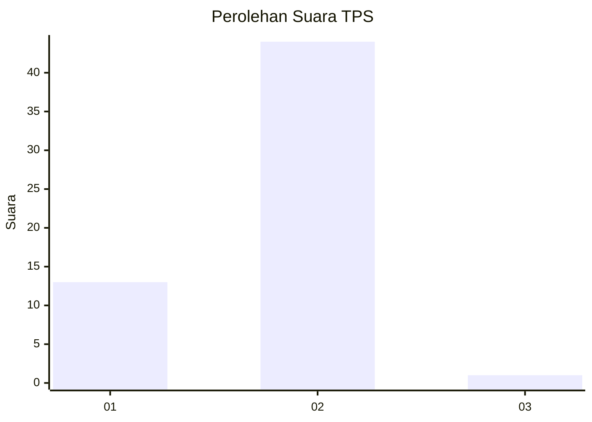
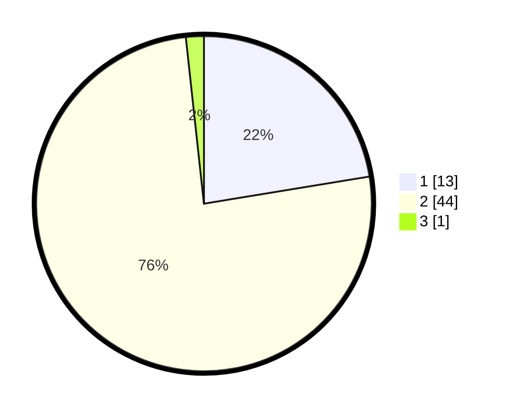

# Hasil

## Grafik

## Tabel

| No. | Nama Paslon    | Suara | Suara (raw) | Persentase |
|:--- |:-------------- | -----:| -----------:| ----------:|
| 1   | ANIES MUHAIMIN | 13    | [13][p-1]   | 22,41      |
| 2   | PRABOWO GIBRAN | 44    | [44][p-2]   | 75,86      |
| 3   | GANJAR MAHFUD  | 1     | [1][p-3]    | 1,72       |

[p-1]: https://github.com/gigit-pemilu/pemilu-2024/blob/main/pilpres/hitung-suara/sub/12-sumatera-utara/sub/20-padang-lawas-utara/sub/06-portibi/sub/2019-simandiangin/sub/001-tps/sub/paslon-1.txt
[p-2]: https://github.com/gigit-pemilu/pemilu-2024/blob/main/pilpres/hitung-suara/sub/12-sumatera-utara/sub/20-padang-lawas-utara/sub/06-portibi/sub/2019-simandiangin/sub/001-tps/sub/paslon-2.txt
[p-3]: https://github.com/gigit-pemilu/pemilu-2024/blob/main/pilpres/hitung-suara/sub/12-sumatera-utara/sub/20-padang-lawas-utara/sub/06-portibi/sub/2019-simandiangin/sub/001-tps/sub/paslon-3.txt

## Foto C Plano

https://sirekap-obj-formc.kpu.go.id/5700/pemilu/ppwp/12/20/06/20/19/1220062019001-20240215-002622--96b96056-bc81-465b-b825-c663cb99b031.jpg

https://sirekap-obj-formc.kpu.go.id/5700/pemilu/ppwp/12/20/06/20/19/1220062019001-20240215-002636--9389efda-23fc-429b-9e83-6b9372932b29.jpg

https://sirekap-obj-formc.kpu.go.id/5700/pemilu/ppwp/12/20/06/20/19/1220062019001-20240215-002643--815694ea-a4c1-48c6-a553-0200d82a6daf.jpg

## Metadata

| Key        | Value               |
| ---------- | ------------------- |
| Time Stamp | 2024-02-15 23:29:50 |

