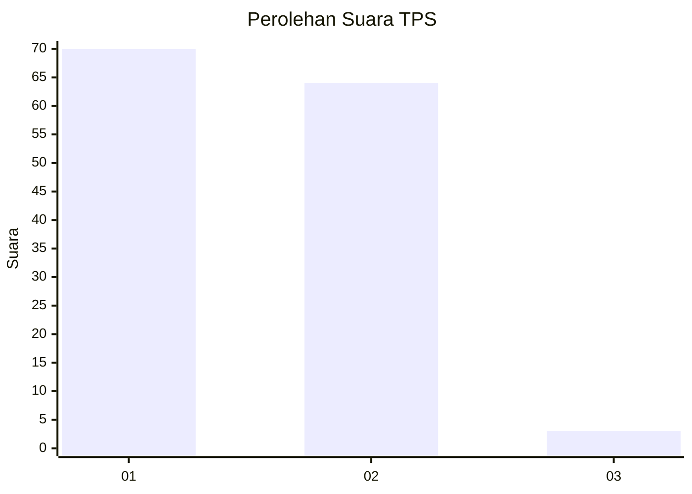
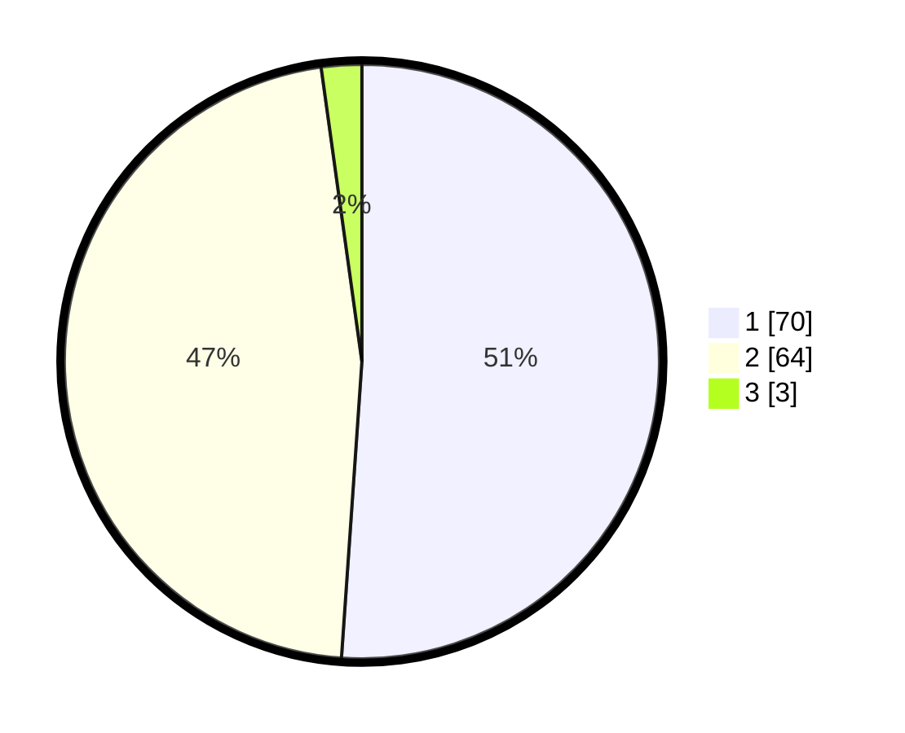

# Hasil

## Grafik

## Tabel

| No. | Nama Paslon    | Suara | Suara (raw) | Persentase |
|:--- |:-------------- | -----:| -----------:| ----------:|
| 1   | ANIES MUHAIMIN | 70    | [70][p-1]   | 51,09      |
| 2   | PRABOWO GIBRAN | 64    | [64][p-2]   | 46,72      |
| 3   | GANJAR MAHFUD  | 3     | [3][p-3]    | 2,19       |

[p-1]: https://github.com/gigit-pemilu/pemilu-2024-12-sumatera-utara/blob/main/pilpres/hitung-suara/sub/12-sumatera-utara/sub/20-padang-lawas-utara/sub/07-batang-onang/sub/1001-sayur-matinggi/sub/001-tps/sub/paslon-1.txt
[p-2]: https://github.com/gigit-pemilu/pemilu-2024-12-sumatera-utara/blob/main/pilpres/hitung-suara/sub/12-sumatera-utara/sub/20-padang-lawas-utara/sub/07-batang-onang/sub/1001-sayur-matinggi/sub/001-tps/sub/paslon-2.txt
[p-3]: https://github.com/gigit-pemilu/pemilu-2024-12-sumatera-utara/blob/main/pilpres/hitung-suara/sub/12-sumatera-utara/sub/20-padang-lawas-utara/sub/07-batang-onang/sub/1001-sayur-matinggi/sub/001-tps/sub/paslon-3.txt

## Foto C Plano

https://sirekap-obj-formc.kpu.go.id/5494/pemilu/ppwp/12/20/07/10/01/1220071001001-20240215-015014--9b05b514-871c-40e7-b8ae-d4ee4e734042.jpg

https://sirekap-obj-formc.kpu.go.id/5494/pemilu/ppwp/12/20/07/10/01/1220071001001-20240215-015034--b93a9b1c-94f3-4b13-80ab-692f717237b2.jpg

https://sirekap-obj-formc.kpu.go.id/5494/pemilu/ppwp/12/20/07/10/01/1220071001001-20240215-015103--35c51b6f-9318-4c28-9df7-73cab34c413e.jpg

## Metadata

| Key        | Value               |
| ---------- | ------------------- |
| Time Stamp | 2024-02-15 18:30:25 |

