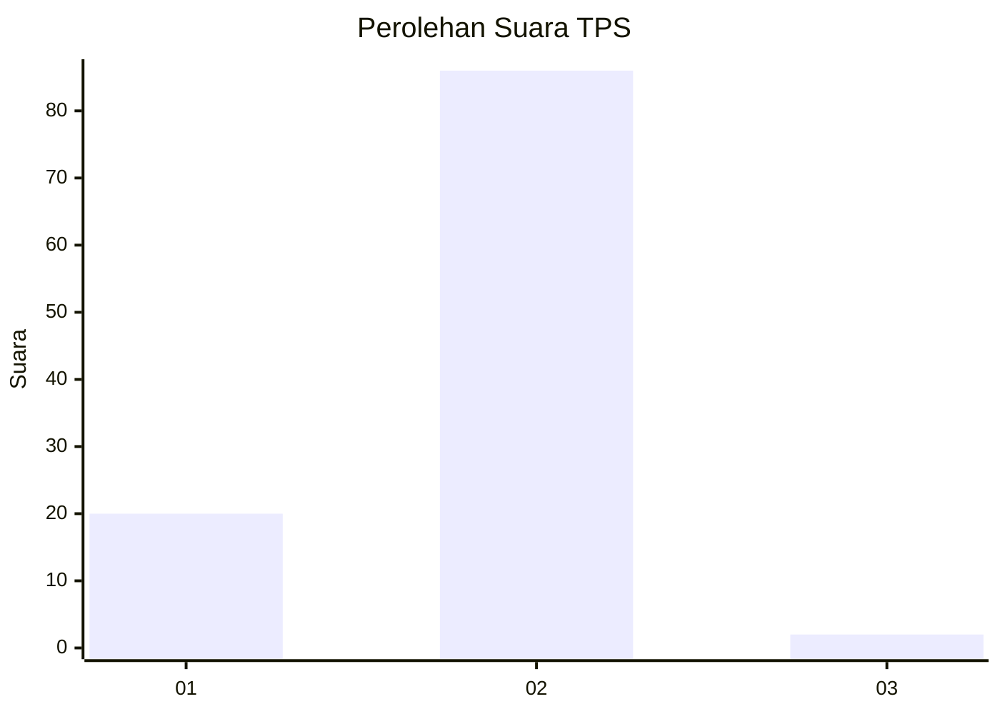
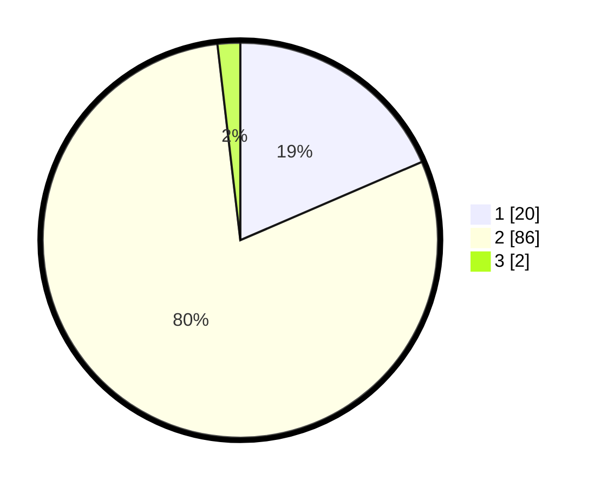

# Hasil

## Grafik

## Tabel

| No. | Nama Paslon    | Suara | Suara (raw) | Persentase |
|:--- |:-------------- | -----:| -----------:| ----------:|
| 1   | ANIES MUHAIMIN | 20    | [20][p-1]   | 18,52      |
| 2   | PRABOWO GIBRAN | 86    | [86][p-2]   | 79,63      |
| 3   | GANJAR MAHFUD  | 2     | [2][p-3]    | 1,85       |

[p-1]: https://github.com/gigit-pemilu/pemilu-2024/blob/main/pilpres/hitung-suara/sub/12-sumatera-utara/sub/20-padang-lawas-utara/sub/07-batang-onang/sub/2002-pangkal-dolok-lama/sub/001-tps/sub/paslon-1.txt
[p-2]: https://github.com/gigit-pemilu/pemilu-2024/blob/main/pilpres/hitung-suara/sub/12-sumatera-utara/sub/20-padang-lawas-utara/sub/07-batang-onang/sub/2002-pangkal-dolok-lama/sub/001-tps/sub/paslon-2.txt
[p-3]: https://github.com/gigit-pemilu/pemilu-2024/blob/main/pilpres/hitung-suara/sub/12-sumatera-utara/sub/20-padang-lawas-utara/sub/07-batang-onang/sub/2002-pangkal-dolok-lama/sub/001-tps/sub/paslon-3.txt

## Foto C Plano

https://sirekap-obj-formc.kpu.go.id/709e/pemilu/ppwp/12/20/07/20/02/1220072002001-20240215-095505--429d46a7-81a1-4d7e-b91f-673d3235147d.jpg

https://sirekap-obj-formc.kpu.go.id/709e/pemilu/ppwp/12/20/07/20/02/1220072002001-20240215-095538--a1dc7338-4022-4885-be14-60ef900020d4.jpg

https://sirekap-obj-formc.kpu.go.id/709e/pemilu/ppwp/12/20/07/20/02/1220072002001-20240215-095529--5812d06a-9248-4438-ad84-3da62e7c8dec.jpg

## Metadata

| Key        | Value               |
| ---------- | ------------------- |
| Time Stamp | 2024-02-15 16:00:26 |

