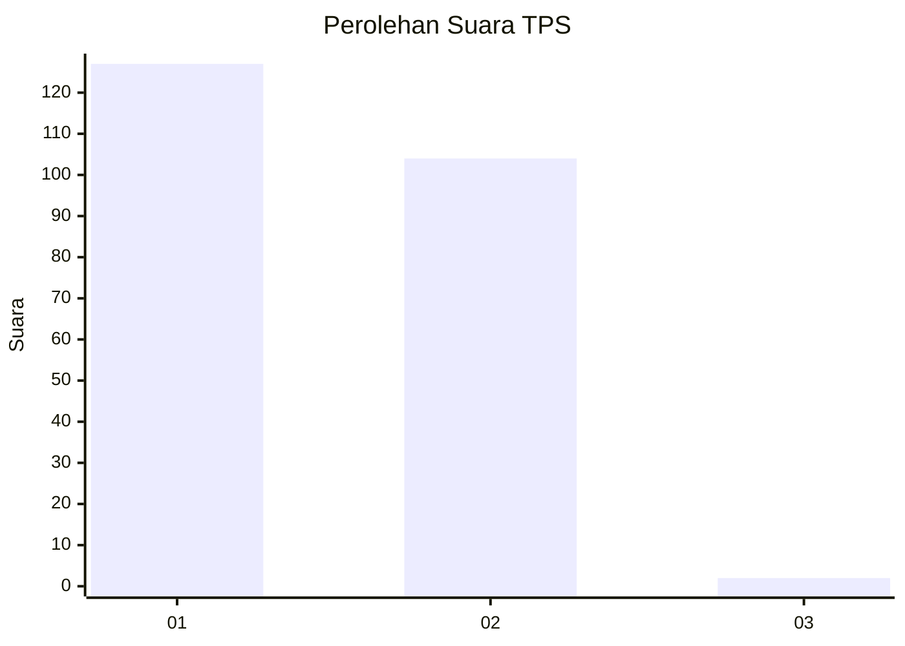
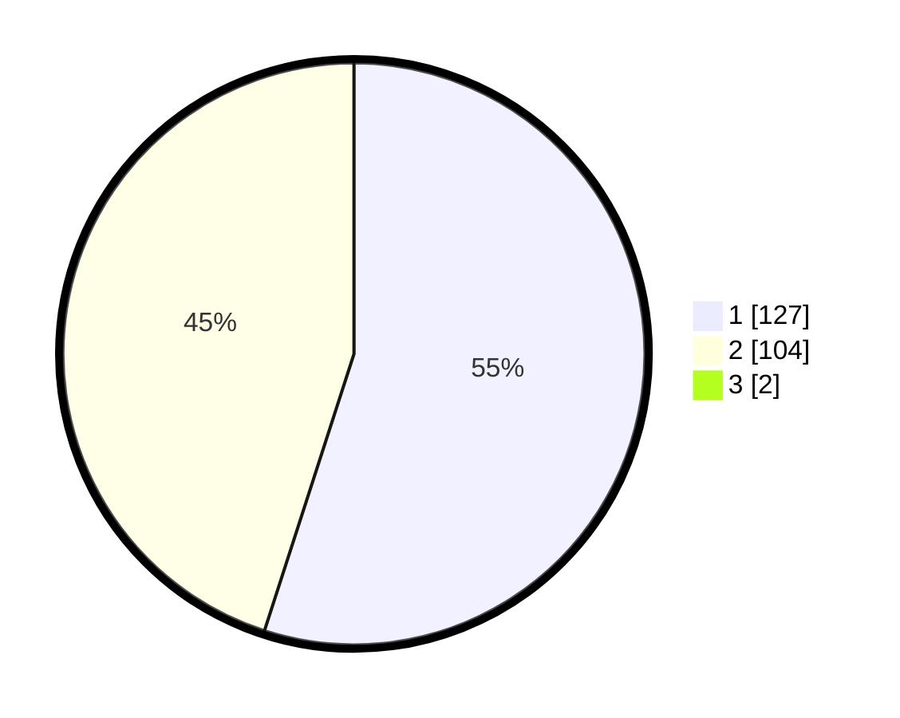

# Hasil

## Grafik

## Tabel

| No. | Nama Paslon    | Suara | Suara (raw) | Persentase |
|:--- |:-------------- | -----:| -----------:| ----------:|
| 1   | ANIES MUHAIMIN | 127   | [127][p-1]  | 54,51      |
| 2   | PRABOWO GIBRAN | 104   | [104][p-2]  | 44,64      |
| 3   | GANJAR MAHFUD  | 2     | [2][p-3]    | 0,86       |

[p-1]: https://github.com/gigit-pemilu/pemilu-2024/blob/main/pilpres/hitung-suara/sub/12-sumatera-utara/sub/20-padang-lawas-utara/sub/08-simangambat/sub/2014-ulak-tano/sub/001-tps/sub/paslon-1.txt
[p-2]: https://github.com/gigit-pemilu/pemilu-2024/blob/main/pilpres/hitung-suara/sub/12-sumatera-utara/sub/20-padang-lawas-utara/sub/08-simangambat/sub/2014-ulak-tano/sub/001-tps/sub/paslon-2.txt
[p-3]: https://github.com/gigit-pemilu/pemilu-2024/blob/main/pilpres/hitung-suara/sub/12-sumatera-utara/sub/20-padang-lawas-utara/sub/08-simangambat/sub/2014-ulak-tano/sub/001-tps/sub/paslon-3.txt

## Foto C Plano

https://sirekap-obj-formc.kpu.go.id/9c01/pemilu/ppwp/12/20/08/20/14/1220082014001-20240215-032038--24b2007f-470b-4f11-a014-76d897f22737.jpg

https://sirekap-obj-formc.kpu.go.id/9c01/pemilu/ppwp/12/20/08/20/14/1220082014001-20240215-032409--d56d428e-fd29-48b6-ae82-5765909ae6fb.jpg

https://sirekap-obj-formc.kpu.go.id/9c01/pemilu/ppwp/12/20/08/20/14/1220082014001-20240215-032826--2d3db236-1e0e-468a-874d-10a829169689.jpg

## Metadata

| Key        | Value               |
| ---------- | ------------------- |
| Time Stamp | 2024-02-15 18:30:25 |

