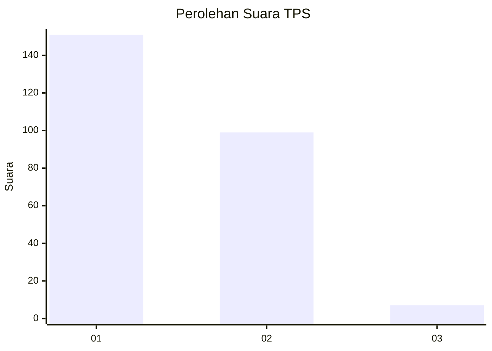
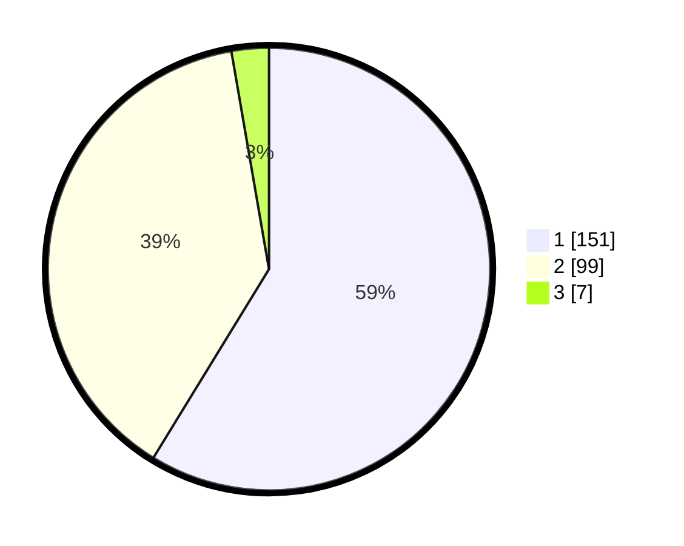

# Hasil

## Grafik

## Tabel

| No. | Nama Paslon    | Suara | Suara (raw) | Persentase |
|:--- |:-------------- | -----:| -----------:| ----------:|
| 1   | ANIES MUHAIMIN | 151   | [151][p-1]  | 58,75      |
| 2   | PRABOWO GIBRAN | 99    | [99][p-2]   | 38,52      |
| 3   | GANJAR MAHFUD  | 7     | [7][p-3]    | 2,72       |

[p-1]: https://github.com/gigit-pemilu/pemilu-2024/blob/main/pilpres/hitung-suara/sub/12-sumatera-utara/sub/20-padang-lawas-utara/sub/08-simangambat/sub/2014-ulak-tano/sub/002-tps/sub/paslon-1.txt
[p-2]: https://github.com/gigit-pemilu/pemilu-2024/blob/main/pilpres/hitung-suara/sub/12-sumatera-utara/sub/20-padang-lawas-utara/sub/08-simangambat/sub/2014-ulak-tano/sub/002-tps/sub/paslon-2.txt
[p-3]: https://github.com/gigit-pemilu/pemilu-2024/blob/main/pilpres/hitung-suara/sub/12-sumatera-utara/sub/20-padang-lawas-utara/sub/08-simangambat/sub/2014-ulak-tano/sub/002-tps/sub/paslon-3.txt

## Foto C Plano

https://sirekap-obj-formc.kpu.go.id/3519/pemilu/ppwp/12/20/08/20/14/1220082014002-20240215-023432--64fac457-b7e6-4e62-bd51-5814182fa906.jpg

https://sirekap-obj-formc.kpu.go.id/3519/pemilu/ppwp/12/20/08/20/14/1220082014002-20240215-023630--31b7a26f-952c-4fe5-98ba-18fd769e09a1.jpg

https://sirekap-obj-formc.kpu.go.id/3519/pemilu/ppwp/12/20/08/20/14/1220082014002-20240215-023745--199adaab-fc7e-4ece-b157-f9b7c9af0b52.jpg

## Metadata

| Key        | Value               |
| ---------- | ------------------- |
| Time Stamp | 2024-02-16 10:30:29 |

